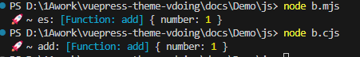

### 概述

**ESM** 和 **CommonJS** 是前端非常常见的两种规范或模块标准，本文将重点讲述这两者的定义、适用范围以及区别。

### ESM

**ESM**即 _ECMAScript Modules_,是 Javascript 的官方模块化标准，旨在统一 Javascript 的模块化机制。

#### ESM 的导出和导入

- 导出：使用 `export` 关键词导出模块内容，可以是命名导出或默认导出

```js
/** a.js */
export const obj = () => {
  console.log(5);
};

//默认导出
const greet = () => {
  console.log("Hello World");
};
export default greet;
```

- 导入：使用`import`语法来加载模块

```js
/** b.js */
import greet, { obj } from "../a.js";
```

#### 特点

- **异步加载**：支持异步加载，适合浏览器环境，与 Javascript 的动态加载功能兼容良好
- **静态分析**：支持静态分析，意味着在编译时可以检查模块的依赖关系，对于优化和工具链支持如`tree-shaking`很有帮助
- **浏览器支持**：ESM 可以直接在浏览器中使用，只需要写成`<script type='module'>`即可
- **严格模式**：默认在严格模式下运行

### **CommonJS**

**CommonJS**是一个 Javascript 模块标准，主要用于 Node.js 环境

#### 模块的导入导出

- 导出：使用`module.exports`或`exports`对象来导出模块内容

```js
/** a.js */
module.exports = () => {
  console.log("commonjs");
};
```

- 导入：使用`require()`函数来加载模块

```js
/** b.js */
const greet = require("./a.js");
greet();
```

#### 特点

- **同步加载**：CommonJS 是同步加载的，所以模块正在代码执行时会被即时加载，这可以用`SSR`
- **文件系统**：CommonJS 模块依赖于 Node.js 的文件系统，因此不适用于浏览器
- **模块缓存**：CommonJS 在第一次加载模块后，会缓存模块导出的结果，因此如果后续加载相同的模块时会使用缓存，避免重复加载

### **ESM**和**CommonJS**对比

- **ESM**使用`import`加载模块时，必须放在文件的最顶部，而**CommonJS**使用`require`则没有这个限制
- **ESM**规范对应的标准文件后缀名是`.mjs`，而**CommonJS**则是`.cjs`

#### 符号绑定(Live Binding)

**ESM**中有个**Live Binding**的概念，有的人称之为符号绑定。在开发中，定义的变量在程序编译之后都会被转化为地址，而执行变量就是**符号**。所谓的**符号绑定**就是将程序中使用到的变量名等，换成对应的地址，方便查找相应的数据。

前面提到**ESM**是在编译阶段就可以确定好模块间的依赖关系，因此对于变量也可以在这个时间进行确定地址，进行替换，这就是**静态绑定**。

而**CommonJS**是运行时，它不存在符号绑定这个概念，因此只有在程序运行时进行地址查找和替换，这就称为**动态绑定**。

举例说明：
**ESM**

```mjs
/** a.mjs */
export const obj = {
  number: 0,
};

const add = () => {
  obj.number += 1;
};

export default add;
```

```mjs
/** b.mjs */
import es, { obj } from "./a.mjs";

es();
console.log("🚀 ~ es:", es, obj);
```

**CommonJS**

```cjs
/** a.cjs */
const obj = {
  number: 0,
};

const add = () => {
  obj.number += 1;
};

module.exports = { add, obj };
```

```cjs
/** b.cjs */
const { add, obj } = require("./a.cjs");

add();
console.log("🚀 ~ add:", add, obj);
```

分别定义导出文件`a.mjs`、`a.cjs`和导入文件`b.mjs`、`b.cjs`,通过执行`node b.mjs`和`node b.cjs`，得到如下结果：



这说明无论是**ESM**还是**CommonJS**，都会进行内存地址共享，引用的是同一个数据
