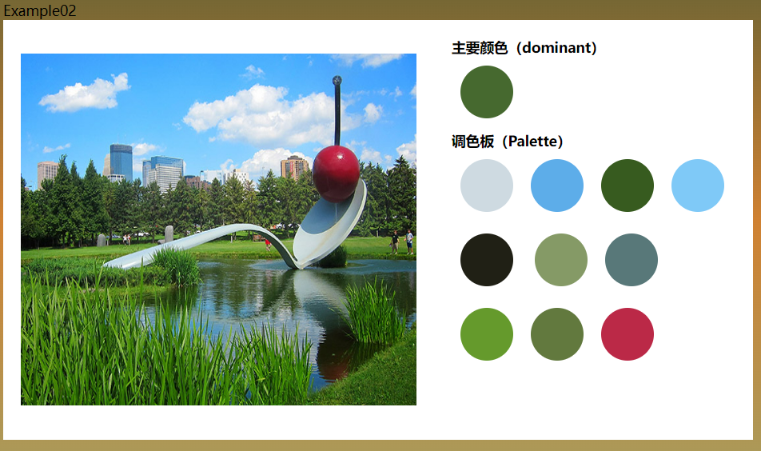
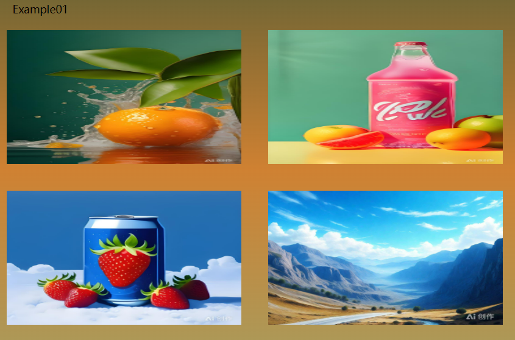

## 概述

`colorThief`是一个 Javascript 插件，支持在浏览器端或 Node 环境中使用。`Thief`的中文意思是偷窃、小偷。`colorThief`的作用就是通过算法去获取图片的色源。

## API 介绍与示例

`colorThief`提供两个方法，`getColor`和`getPalette`，这两个方法在 Node 环境中都是返回`Promise`。

### `getColor`方法

`getColor`方法接受两个参数`img`和`quality`。

- `img`：图像源，在浏览器环境中 `img` 需要传 `HTML` 元素节点，而在 Node 中,`img`是图像路径

- `quality`：可选参数，数值类型，1 或者更大的数字。默认是 10，决定采样时跳过多少像素。值越大，返回速度越快。

- 效果
  
- 示例

```js
doms.imgList.forEach((img) => {
  img.addEventListener("click", async (e) => {
    console.log("🚀 ~ img1.addEventListener ~ e:", e.target);

    const p = await colorThief.getPalette(e.target, 3);

    console.log("🚀 ~ doms.img1.addEventListener ~ p:", p);
    let colorArr = [];
    p.forEach((item, index) => {
      const [r, g, b] = item;
      colorArr[index] = `rgb(${r},${g},${b})`;
    });
    colorArr.forEach((color, i) => {
      document.documentElement.style.setProperty(`--color${i + 1}`, color);
    });
  });
});
```

### `getPalette`方法

`getPalette`方法也是接受 3 个参数，通过聚类相似颜色从图像中获取调色板。返回值为一个数组。它比`getColor`方法多了第二个参数，其第二个参数是返回多少个颜色

- 效果
  
- 示例

  ```js
  const p = await colorThief.getColor(doms.img);
  console.log("🚀 ~ initExample2 ~ p:", p);
  doms.colorSpan[0].style.setProperty(
    "--color",
    `rgb(${p[0]},${p[1]},${p[2]})`
  );

  const count = doms.colorSpan.length;
  const q = await colorThief.getPalette(doms.img, count);

  q.forEach((item, index) => {
    const [r, g, b] = item;
    doms.colorSpan[index + 1].style.setProperty(
      "--color",
      `rgb(${r},${g},${b})`
    );
  });
  ```

### 参考地址

 - [`ColorThief官网`](https://lokeshdhakar.com/projects/color-thief/)
 - [文章示例](https://github.com/Jinuss/blog/blob/main/docs/Demo/20.colorThief.html)