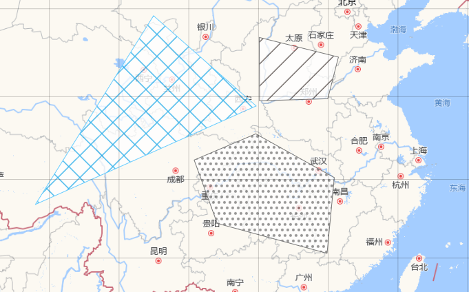

### 概述

我们知道`Openlayers`通常设置`feature`要素的方式主要是通过`ol.style.stroke`描边和`ol.style.fill`填充,这对比较简单的样式设置十分有效。如果要设置`feature`的图标，还可以通过`ol.style.Icon`加载外部图片资源，但是如果要设置面的填充，就需要稍微复杂的设置。

#### 效果



### 解决方案

#### `colorlike`

`Openlayers`中定义了`colorlike`类型, 通过`ol.colorlike`可以加载图片资源，返回的是一个`CanvasPattern`,而`ol.style.fill`的`color`属性可以接受这个值，从而实现图片的填充。
`colorlike`提供一个方法`asColorLike`，参数可以是一个图片，返回一个 `color`,其类型为`Color`|`ColorLike`|`Patttern`

#### `CanvasPattern`

但是在开发中，用到比较多的是`CanvasPattern`,它是`canvas`中的类型，在 MDN 中的描述如下

> `CanvasPattern`接口表示一个不透明对象，描述了一个基于图像、画布或视频的模板，该模板通过`CanvasRenderContext2D.createPattern`方法创建。
> 它们可用作`fillStyle`或`strokeStyle`

`CanvasRenderContext2D`就是通过`canvas.getContext("2d")`获取的`canvas` 2d 的上下文环境

但是如果我们需要动态改变填充图片的透明度，单纯依靠`CanvasPattern`是无法实现，因为如上的定义中已经提及它是表示一个不透明对象，如果外部资源图片是一个透明图片呢，那样也只能保证初始是透明，而无法动态修改。这时就需要用到`canvas`中的 API 了。

#### `canvas`的魔力

先看看如下示例

```js
export const getImagePattern = (imgUrl, opacity = 1) => {
  return new Promise((resolve, reject) => {
    var img = new Image();
    img.src = imgUrl;
    img.onload = function () {
      var cnv = document.createElement("canvas");
      var ctx = cnv.getContext("2d");
      cnv.width = img.width;
      cnv.height = img.height;
      ctx.drawImage(img, 0, 0);

      var imageData = ctx.getImageData(0, 0, cnv.width, cnv.height);
      var data = imageData.data;

      for (var i = 3; i < data.length; i += 4) {
        data[i] = opacity * 255;
      }
      ctx.putImageData(imageData, 0, 0);
      var pattern = ctx.createPattern(cnv, "repeat");
      resolve(pattern);
    };
    img.onerror = function (error) {
      reject(error);
    };
  });
};
```

示例中定义一个获取图片`Pattern`的方法，返回的是一个`Promise`对象，接受两个参数

- `img`:资源图片
- `opacity`:透明度 （0~1）

在图片加载成功后，创建一个`canvas`画布，调用`drawImage`方法将图片渲染到画布上，再通过`getImageData`方法拿到图片数据，改变每个像素的透明度，再次渲染到画布上，最后调用`createPattern`方法创建`pattern`

##### `getImageData`方法

`getImageData`方法可以实现对图像的像素操作，其语法：`ctx.getImageData(x,y,w,h)`

**参数**

`x`:被提取图像矩形区域的左上角 x 坐标
`y`:被提取图像矩形区域的左上角 x 坐标
`w`:被提取图像矩形区域的宽度
`h`:被提取图像矩形区域的高度

补充一点：`canvas`画布的原点坐标:（0，0）位于画布的左上角

**返回值**

`getImageData`会返回一个`ImageData`对象，它包含`canvas`给定的也是被提取图像的矩形区域的数据。该对象的`height`和`width`分别对应参数`h`和`w`,而示例中用到的`imageData.data`则是一个一维数组，包含以`RGBA`顺序的数据，大小为 0 —— 255 的整数表示


示例中的 for 循环就是处理`RGBA`中`A`即`alpha`:透明度

**所以这会引发一个新的问题，如果图片很大，这种遍历的操作会带来性能的问题**

##### `putImageData`方法

`putImageData`顾名思义就是将`ImageData`对象绘制到画布中，示例中只写了必传的参数，其语法为

```js
putImageData(imageData, dx, dy);
putImageData(imageData, dx, dy, dirtyX, dirtyY, dirtyWidth, dirtyHeight);
```

**参数**

`imageData`：上面提到的`ImageData`对象
`dx`和`dy`就是要绘制到`canvas`的起始位置
`dirtyX`和`dirtyY`对应`ImageData`中的左上角的坐标，默认均为 0
`dirtyWidth`:要绘制的矩形的宽度，默认为`imageData`的宽度
`dirtyHeight`:要绘制的矩形的宽度，默认为`imageData`的高度

#### 调用

调用`getImagePattern`方法时，动态改变参数`opacity`获取到`pattern`赋值就可以实现`Openlayers`的`fetaure`填充图像的透明度改变

```js
const pattern = await getImagePattern(img, opacity / 100);
newStyle = new Style({
  stroke: new Stroke({
    color: color,
    width: width,
  }),
  fill: new Fill({
    color: pattern,
  }),
});
fetaure.setStyle(newStyle);
```
