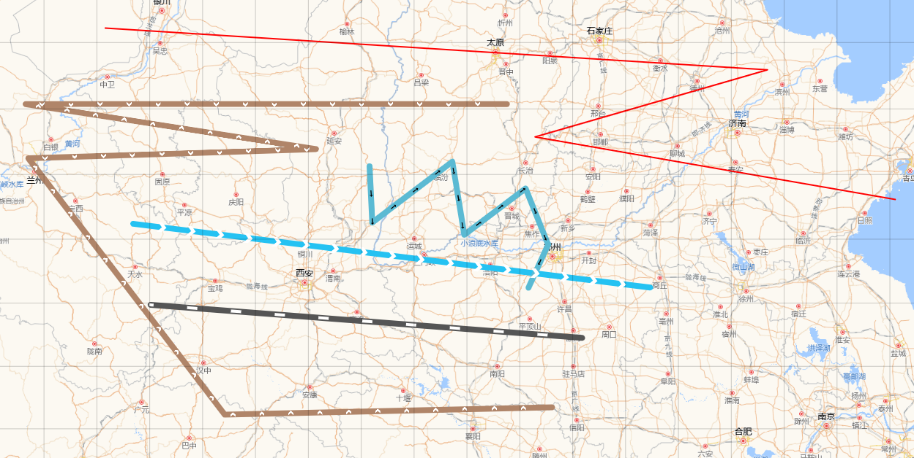

### 概述

上文中提过`Openlayers`如何用图片填充面，那么我们如何用图片或图标去填充线条呢？在面的填充，我们是平铺的，没有方向，在水平垂直方向重复就完事，但是在线的填充就没有这么简单粗暴了，因为线往往是首尾两端有方向的，比如当线条表示线路图时，`pattern`就有些力不从心了。

### 效果



### 解决方案

#### `StyleFunction`

`Openlayers`中设置样式除了`Style`的`stroke`和`fill`往，还提供了另一种方式，即`StyleFunction`。

`StyleFunction`不是属性名,确切来说是一种类型，比如通过`feature.setStyle(styleFunction)` 设置样式时，如果参数是一个函数，那么它就是`StyleFunction`

`Openlayers`官网中是这样定义的：

> A function that takes a Feature and a {number} representing the view's resolution. The function should return a Style or an array of them. This way e.g. a vector layer can be styled. If the function returns undefined, the feature will not be rendered.

翻译过来就是`StyleFunction`接受两个参数`Feature`和`Number`类型的值，分别表示`feature`本身和视图范围内地图的分辨率。这个函数应该返回一个`Style`类型或者`Style`类型的数组，通过这种方式，可以设置矢量图层（要素）的样式，如果函数没有返回值，则要素`feature`不会被渲染。

经过测试在`StyleFunction`中拿到的第二个参数即分辨率`number`是会动态变化的，当我们拖动地图时，这个值会跟着变化。

由此，我们可以在在其中做文章。

#### 示例代码

示例如下：

```js
export const getStyleFunction = ({
  steps,
  color,
  width,
  imgsrc,
  scale,
  wrapperRotation,
}) => {
  steps = steps || 40; //其值越大，填充的图片越稀疏
  scale = scale || 0.5;
  return (feature, resolution) => {
    const geometry = feature.getGeometry();
    var styles = [
      new Style({
        stroke: new Stroke({
          color: color,
          width: width,
        }),
      }),
    ];
    let length = geometry.getLength();
    let geo_steps = steps * resolution;
    let num = parseInt(length / geo_steps);
    for (let i = 1; i <= num; i++) {
      let fraction = i / (num + 1);
      let arraw_coor = geometry.getCoordinateAt(fraction);
      let previousCoordinate = geometry.getCoordinateAt(fraction - 0.001);
      let nextCoordinate = geometry.getCoordinateAt(fraction + 0.001);
      let rotation = Math.atan2(
        nextCoordinate[1] - previousCoordinate[1],
        nextCoordinate[0] - previousCoordinate[0]
      );
      styles.push(
        new Style({
          geometry: new Point(arraw_coor),
          image: new Icon({
            src: imgsrc,
            scale: scale,
            anchor: [0.5, 0.5],
            anchorXUnits: "fraction",
            anchorYUnits: "fraction",
            rotation: wrapperRotation(rotation),
          }),
        })
      );
    }
    return styles;
  };
};
```

示例中定义了一个函数`getStylefunction`,它接受 6 个参数，分别为`steps`：步长, `color`：颜色, `width`：宽度，`scale`：缩放比例，`wrapperRotation`：包装`rotation`函数。它会返回一个函数，作为`StyleFunction`。

这个示例代码的核心之处就在于如何获取当前线条的方向，如此才好设置图片的旋转角度，因为绘制线条时，其方向是任意的，变化不变，可是我们的图片是静态资源，无法修改图片本身，因此需要遍历`geometry`的每一个需要贴图的像素点，通过其前后的坐标，和数学方法`Math.atan2`计算出方向，进而设置旋转角度`rotation`
