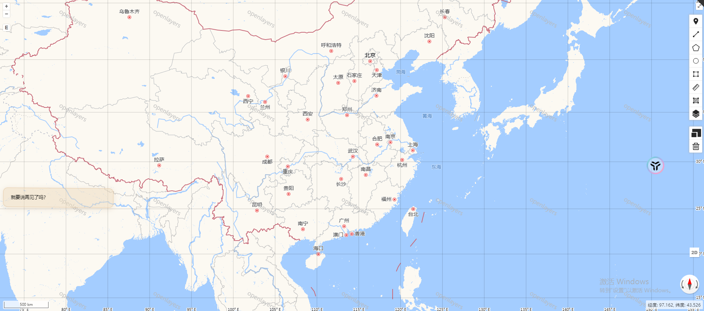

### 概述

本文主要介绍如何在 Openlayers 地图中实现水印效果，并动态修改水印文字内容。

### 效果

Openlayers 水印效果如下：


### 实现

Openlayers 水印主要是通过`Tile`瓦片图层实现，可以高效地加载和显示大量的瓦片，可以基于这个特点，在每个瓦片中显示问题内容。

`Tile`图层可以加载使用`ol.source.XYZ`自定义瓦片数据源，`ol.source.XYZ`有个`tileUrlFunction`函数，该函数可以用于动态生成瓦片 URL。

#### `tileUrlFunction`函数

- **函数参数**

`tileUrlFunction`接受三个参数：`tileCoord`（瓦片坐标，是一个包含 `z`（缩放级别）、`x`（列号）、`y`（行号）的对象）、`pixelRatio`（像素比）、`proj`（投影对象）。

- **返回值**

该函数应返回一个字符串，表示瓦片的 URL，而这个 URL 可以是一个图片。

#### 水印文字

水印文字可以是图片，也可以是`canvas`生成的图片，`canvas`方式生成的图片源定制性更高

#### 代码示例

```js
// 创建canvas
const createCanvasContext2D = (opt_width, opt_height) => {
  const canvas = document.createElement("canvas");
  if (opt_width) {
    canvas.width = opt_width;
  }
  if (opt_height) {
    canvas.height = opt_height;
  }
  return canvas.getContext("2d");
};

//获取瓦片图层源
const getSource = () => {
  return new XYZ({
    tileUrlFunction: (t) => {
      var tileSize = [512, 512];
      const half = tileSize[0] / 2;
      var tileSize = [512, 512];

      const context = createCanvasContext2D(tileSize[0], tileSize[0]);

      context.fillStyle = "rgba(184, 184, 184, 0.8)";

      context.textAlign = "center";
      context.textBaseline = "middle";

      context.font = "32px microsoft yahei";

      context.rotate((Math.PI / 180) * 30);

      context.fillText(waterMarkText.value, half, half);

      return context.canvas.toDataURL();
    },
    extent: transformExtent([-180, -85, 180, 85], "EPSG:4326", "EPSG:3857"),
  });
};

//水印瓦片图层
const getWaterMarkLayer = () => {
  let tiles = new Tile({
    source: getSource(),
    className: "water_marker",
  });
  return tiles;
};
```

最后在合适时机调用`map.addLayer(getWaterMarkerLayer())`即可，如果需要动态修改文字内容，需要移除图层，再重新添加图层，`canvas`生成水印图片时用最新的文字作为填充。其实，通过`layer.setSource(getSource())`方式也可以，但是这种不能改变当前地图视图范围内的水印文字内容，拖动地图才能看到其它瓦片上的水印是最新的文字。

前者代码如下：

```js
const map = mapTool.value.map;
let layer = map
  .getLayers()
  .getArray()
  .find((i) => i.getClassName() == "water_marker"); //从图层数组中通过 className 获取水印图层
if (layer) {
  map.removeLayer(layer);
}

layer = getWaterMarkLayer();
map.addLayer(layer);
```
