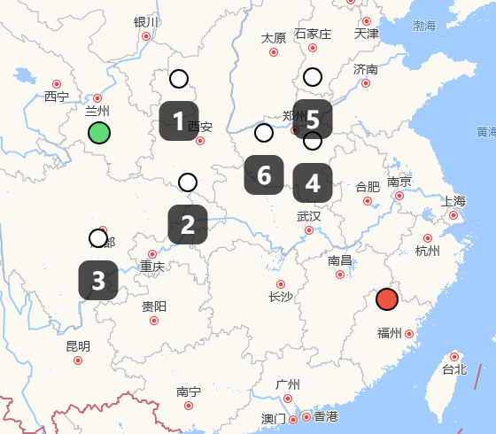
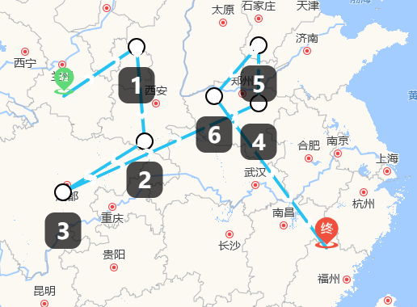

### 概述

本文主要讲述如何在 Openlayers 上选择点，并且将这些点连成一条线作为一条路径。

### 效果展示

- **选点**



- **连点成线**



### 实现方案

实现步骤也是按照两个思路，先选点，后连线。其中主要涉及到 Openlayers 中`Draw`、`Feature`和`Overlay`等概念，以及动态修改`Feature`的样式，涉及到调整线填充图片时的角度调整。

#### 选点

选点成线需要明确路径是带有方向的，它的点一般分为三种路线，即起点、途径点和终点。起点和终点就是路径的首末两端，途径点就是起点和终点之间的点，上图中带有数字标识的点，可以有任意个。

因此可以如下定义变量`PointFeature`，用于保存调用`Draw`方法绘制的`feature`。

```js
const PointFeature = ref({
  start_point: null,
  route_points: [],
  end_point: null,
});
```

**选点核心逻辑**

选点主要通过`ol/interaction`的`Draw`方法实现。用一个变量`activeIndex`来标识当前绘制点的类型，（UI 上可以用一个按钮组），如下：

```js
const drawStart = () => {
  exitDraw();

  draw = new Draw({
    source: vectorLayer.getSource(),
    type: "Point",
    style: styles.selectPointStyle,
  });

  mapInstance.addInteraction(draw);

  draw.on("drawend", function (event) {
    const feature = event.feature;
    console.log(feature.getGeometry().getCoordinates(), event);
    if (activeIndex.value == listChildren[0].value) {
      //起点
      if (PointFeature.value.start_point) {
        vectorLayer.getSource().removeFeature(PointFeature.value.start_point);
      }

      PointFeature.value.start_point = feature;
    } else if (activeIndex.value == listChildren[1].value) {
      //途径点
      PointFeature.value.route_points.push(feature);
      const coordinates = feature.getGeometry().getCoordinates();
      addOverlay({
        coordinates,
        index: PointFeature.value.route_points.length,
      });
    } else {
      //终点
      if (PointFeature.value.end_point) {
        vectorLayer.getSource().removeFeature(PointFeature.value.end_point);
      }

      PointFeature.value.end_point = feature;
    }
    feature.setStyle(getPointsStyle());
  });
};
```

绘制结束时会触发 Openlayers 的`drawend`事件，通过判断`activeIndex`类型来区分点类型，将绘制的`feature`即`event.feature`保存到`PointFeature`中去。这段代码涉及到`vectorLayer.getSource().removeFeature()`方法的调用，就是保证起点和终点的唯一性。

最后调用`feature.setStyle()`方法就是给不同点的渲染不同的样式。

#### 连点成线

在上面提到`PointFeature`变量中保存了选点生成的`feature`，可以通过`feature.getGeometry().getCoordinates()`方法来获取点的坐标信息。

实现如下:

```js
const lineFeature = new Feature({
  geometry: new LineString(PathResult.value),
});

const lineStyle = getStyleFunction({
  color: "#25C2F2",
  width: 4,
  imgsrc: rightImg,
  wrapperRotation: (r) => -r,
});

lineFeature.setStyle(lineStyle);

vectorLayer.getSource().addFeature(lineFeature);
```

这段代码就是生成一个线要素，值得一提的是自定义方法`getStyleFunction` ,该方法在[Openlayers用图片填充点](https://jinuss.github.io/blog/pages/964x5xcd/)有介绍过，主要就是加载一个图片，然后自动计算线条是否有角度，并且将图片旋转一定的角度，与线条方向保持一致。