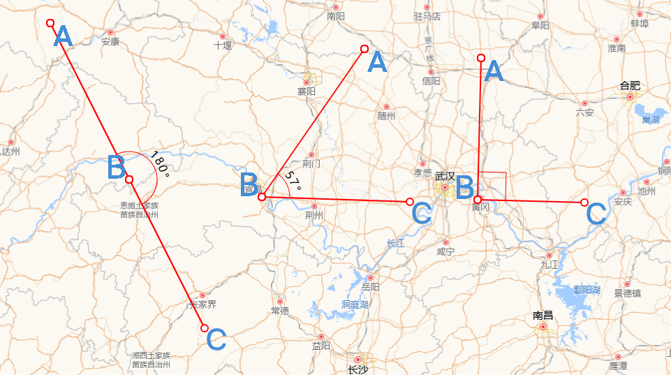
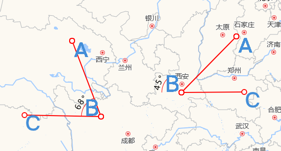

## 概述

在前面介绍了如何在 Openlayers 中进行长度和面积的测量，可以参考：[《Openlayers 实现长度测量》](https://jinuss.github.io/blog/pages/ef42bc/),[《openlayers 实现面积测量》](https://jinuss.github.io/blog/pages/25acbb/)。

那么如何在 Openlayers 中进行角度的测量呢？很遗憾`ol/sphere`模块中没有提供对应角度测量的 API 或方法，但是我们可以自己实现。

## 实践

### 效果展示

**角度量测绘制**


**结果**


### 实现思路

实现思路主要有两点：一是**计算夹角的度数**；二则是**夹角的圆弧表示**，上图中表示角度的圆弧，可以是 0 - 180° 中的任意一个角度，且它总是包裹在夹角内，连接夹角的两边。

#### 夹角的度数计算

- **确定夹角**

数学常识可知，夹角度数的区间必定是[0°，180°]，而且，夹角是由三个坐标点的位置确定大小的，如上图中的顶点**A**、**B**、**C**。因此，我们可以内定顶点 **∠ABC**是我们需要测量的夹角。

- **确定顶点坐标位置**

可以在地图上随机取三个点作为顶点，但是这样并不科学，这样无法满足绘制特定角度的需求。选点还是通过`ol/interaction`模块的`Draw` API 进行拾取。

但`geom.getCoordinates()`返回的坐标个数达到四个时，就调用`this.draw.finishDrawing()`方法结束绘制。因为它的返回值倒数的两个坐标都是一样的，因此即使我们只需要三个点的坐标，也需要等到它的返回值长度是**4**。

实现代码如下：

```js
this.draw.on(
  "drawstart",
  (evt: { feature: Feature<Geometry>, coordinate: Coordinate }) => {
    const { feature, coordinate } = evt;

    this.listenGeometryChange = feature.getGeometry().on("change", (evt) => {
      const geom = evt.target;

      let startPoint = geom.getFirstCoordinate();

      this.addMarker({ coordinate: startPoint, symbolId: "A", anchor: [0, 0] });

      const coordinates = geom.getCoordinates().slice(0, -1);

      if (coordinates.length > 1) {
        this.addMarker({
          coordinate: coordinates[1],
          symbolId: "B",
          anchor: [1, 1],
        });
      }
      const pointscount = geom.getCoordinates();
      if (pointscount.length >= 4) {
        this.addMarker({
          coordinate: coordinates[2],
          symbolId: "C",
          anchor: [0, 0],
        });
        this.addAngleMark({
          coordinate: coordinates[1],
          Angles: calculateAngle(coordinates),
        });
        this.draw.finishDrawing();
      }
    });
  }
);
```

- **如何计算夹角**

两点的坐标位置决定了两点之间的距离，即当我们知道**A**、**B**和**C**的坐标后，就可以知道线段**AB**和**BC**的长度了，然后通过数据计算就可以知道 **∠ABC**的大小了。前面提到夹角的区间范围，因为在电脑中，夹角也可以是负值，这个取决于它对应的方向是顺时针还是逆时针方向，因此要保证夹角的范围在区间[0°，180°]内。

封装的计算夹角的方法`calculateAngle`如下：

```js
const calculateAngle = (points: Coordinate[]) => {
  // 提取坐标点 A, B, C
  const [A, B, C] = points;

  // 计算向量 AB 和 BC
  const AB = { x: B[0] - A[0], y: B[1] - A[1] };
  const BC = { x: C[0] - B[0], y: C[1] - B[1] };

  // 计算点积
  const dotProduct = AB.x * BC.x + AB.y * BC.y;

  // 计算向量的模
  const magnitudeAB = Math.sqrt(AB.x ** 2 + AB.y ** 2);
  const magnitudeBC = Math.sqrt(BC.x ** 2 + BC.y ** 2);

  // 计算余弦值
  const cosTheta = dotProduct / (magnitudeAB * magnitudeBC);

  // 确保 cosTheta 在 -1 和 1 之间
  const clippedCosTheta = Math.max(-1, Math.min(1, cosTheta));

  // 计算夹角（弧度转换为度）
  const angleInRadians = Math.acos(clippedCosTheta);
  const angleInDegrees = angleInRadians * (180 / Math.PI);

  // 计算方向（使用叉积）
  const crossProduct = AB.x * BC.y - AB.y * BC.x;

  // 如果叉积为负
  const angle = crossProduct < 0 ? angleInDegrees - 180 : 180 - angleInDegrees;

  return angle;
};
```

#### 夹角的圆弧

通过上面可以计算得到 **∠ABC**夹角的度数了，因为是自由绘制选点，因此无法保证**BA**或者**BC**是否与水平方向平行一致。小学时代，用量角器测量时，第一步就是需要保证量角器的底边与夹角的一边对齐，这样的测量结果才准确。但是在 Openlayers 中，我们就是需要去实现这样一个量角器，无论在地图上选择哪三个顶点，圆弧都能准确表示角度。并且这个圆弧的长度不固定。

这个需求可以使用`canvas`或者`svg`实现，例子中是使用`svg`实现的。

- **svg 画一个圆弧**

效果如下：


拖动滑块，可以动态绘制任意一段圆弧，其代码如下：

```html
<svg width="200" height="200">
  <path id="arc" fill="none" stroke="blue" stroke-width="2" />
  <line
    id="radial1"
    x1="100"
    y1="100"
    stroke="red"
    stroke-width="2"
    stroke-dasharray="5,5"
  />
  <line
    id="radial2"
    x1="100"
    y1="100"
    stroke="red"
    stroke-width="2"
    stroke-dasharray="5,5"
  />
  <text fill="black" font-size="16" text-anchor="middle">
    <textPath href="#arc" startOffset="50%" side="left">
      <tspan dy="-5" id="text"></tspan>
    </textPath>
  </text>
</svg>
```

```js
function drawArc(adjustedAngle) {
  const endY = centerY + radius * Math.cos((adjustedAngle * Math.PI) / 180);
  const endX = centerX - radius * Math.sin((adjustedAngle * Math.PI) / 180);
  const startY = centerX;
  const startX = centerY - radius;

  const largeArcFlag = adjustedAngle > 180 ? 0 : 1;

  const d_1 = `M ${startX} ${startY} A ${radius} ${radius} 0 ${largeArcFlag} 1 ${endX} ${endY}`; //表示非直角

  const d_2 = `M ${endX} ${endY} L ${startX} ${endY}  L${startX} ${startY}`; //表示直角
  const angle = Math.abs(adjustedAngle);

  let lastD = d_1;
  if (angle == 540) {
    lastD = d_2;
  }
  arcPath.setAttribute("d", lastD);

  radial1.setAttribute("x2", startX);
  radial1.setAttribute("y2", startY);
  radial2.setAttribute("x2", endX);
  radial2.setAttribute("y2", endY);
}
```

- **圆弧贴图**

现在需要将圆弧以`Overlay`的方式添加到 **∠ABC**处就完事了，结果如下：



上面的情形就很诡异，因为圆弧始终是在水平位置，而我们选点是随意的，因此圆弧需要旋转一定的角度，使得圆弧的两边与夹角的两边对齐。但是具体旋转多少角度，逆时针旋转还是顺时针旋转？这个就取决于线段**BA**与**BC**的倾斜角度，准确来说是以顶点**B**为原点建立坐标系，水平方向为**X**轴且向右为**X**轴正半轴，垂直方向为**Y**轴且向上为**Y**轴正半轴。那么圆弧的旋转角度和方向就取决于**BA**和**BC**与**X 轴**负半轴的夹角。

和 CSS 中`transform`的`rotate`规则报纸一致，规定圆弧逆时针旋转为负，顺时针旋转为正。因此，我们可以规定如果**BA**（或者**BC**）在第三象限或者是第四象限，则它与**X**轴负半轴的夹角为负值；反之，如果在第一象限则为正数钝角，第二象限则为正数锐角

- **计算 BA 或者 BC 与 X 轴负半轴夹角**
  主要还是用到数学知识，代码如下：

```js
function calculateAnglePoint(points) {
  const [A, B, C] = points;
  const [Ax, Ay] = A;
  const [Bx, By] = B;
  const [Cx, Cy] = C;

  // 计算向量 BA 和 BC
  const BA = { x: Ax - Bx, y: Ay - By }; // BA 向量（从 B 到 A）
  const BC = { x: Cx - Bx, y: Cy - By }; // BC 向量（从 B 到 C）

  // 计算 BA 和 BC 向量与 X 轴的夹角（单位：度）
  let angleBA = Math.atan2(BA.y, BA.x) * (180 / Math.PI); // [-180, 180] 范围
  let angleBC = Math.atan2(BC.y, BC.x) * (180 / Math.PI); // [-180, 180] 范围

  // 计算 BA 向量与 X 轴负半轴的夹角
  if (angleBA >= 0 && angleBA < 90) {
    // 第一象限，夹角为正钝角
    angleBA = 180 - angleBA;
  } else if (angleBA >= 90 && angleBA <= 180) {
    // 第二象限，夹角为正锐角
    angleBA = 180 - angleBA;
  } else if (angleBA < 0 && angleBA >= -90) {
    // 第四象限，夹角为负钝角
    angleBA = Math.abs(angleBA) - 180;
  } else {
    // 第三象限，夹角为负锐角
    angleBA = Math.abs(angleBA) - 180;
  }

  // 计算 BC 向量与 X 轴负半轴的夹角
  if (angleBC >= 0 && angleBC < 90) {
    // 第一象限，夹角为正钝角
    angleBC = 180 - angleBC;
  } else if (angleBC >= 90 && angleBC <= 180) {
    // 第二象限，夹角为正锐角
    angleBC = 180 - angleBC;
  } else if (angleBC < 0 && angleBC >= -90) {
    // 第四象限，夹角为负钝角
    angleBC = Math.abs(angleBC) - 180;
  } else {
    // 第三象限，夹角为负锐角
    angleBC = Math.abs(angleBC) - 180;
  }

  return {
    angleBA: angleBA, // BA 向量与 X 轴负半轴的夹角
    angleBC: angleBC, // BC 向量与 X 轴负半轴的夹角
  };
}
```

- **确定旋转角度**

由上得到了`angleBA`和`angleBC`，毫无疑问，如果**BA**和**BC**在第一二象限，则圆弧需要顺时针旋转，且旋转角度为`Math.min(angleBA,angleBC)`，反之都在第三四象限，则旋转角度为`- Math.max(Math.abs(angleBa),Math.abs(angleBC))`,如果**BA**和**BC**在不同象限，那就要分情况讨论了，具体判断规则如下：

```js
let rotate = 0;
if (angleBA < 0 && angleBC < 0) {
  rotate = -Math.max(Math.abs(angleBA), Math.abs(angleBC));
}
if (angleBA > 0 && angleBC > 0) {
  rotate = Math.min(Math.abs(angleBA), Math.abs(angleBC));
}

//第一二三象限 不同象限

if (angleBA >= 135 && angleBA <= 180 && angleBC <= -45 && angleBC >= -90) {
  rotate = angleBA;
}
if (angleBC >= 135 && angleBC <= 180 && angleBA <= -45 && angleBA >= -90) {
  rotate = angleBC;
}

if (angleBA >= 135 && angleBA <= 180 && angleBC <= 0 && angleBC >= -45) {
  rotate = angleBC;
}
if (angleBC >= 135 && angleBC <= 180 && angleBA <= 0 && angleBA >= -45) {
  rotate = angleBA;
}

if (angleBA >= 90 && angleBA <= 135 && angleBC <= 0 && angleBC >= -45) {
  rotate = angleBC;
}
if (angleBC >= 90 && angleBC <= 135 && angleBA <= 0 && angleBA >= -45) {
  rotate = angleBA;
}
if (angleBA >= 90 && angleBA <= 135 && angleBC >= -90 && angleBC <= -45) {
  rotate = angleBA;
}

if (angleBC >= 90 && angleBC <= 135 && angleBA >= -90 && angleBA <= -45) {
  rotate = angleBC;
}

if (angleBA >= 0 && angleBA <= 90 && angleBC <= 0 && angleBC >= -90) {
  rotate = angleBC;
}

if (angleBC >= 0 && angleBC <= 90 && angleBA <= 0 && angleBA >= -90) {
  rotate = angleBA;
}

//第一二四象限不同象限
if (angleBC >= -180 && angleBC <= -90 && angleBA <= 180 && angleBA >= 90) {
  rotate = angleBA;
}

if (angleBA >= -180 && angleBA <= -90 && angleBC <= 180 && angleBC >= 90) {
  rotate = angleBC;
}

if (angleBC >= -135 && angleBC <= -90 && angleBA >= 0 && angleBA <= 45) {
  rotate = angleBC;
}

if (angleBC >= -135 && angleBC <= -90 && angleBA >= 45 && angleBA <= 90) {
  rotate = angleBA;
}

if (angleBA >= -135 && angleBA <= -90 && angleBC >= 0 && angleBC <= 45) {
  rotate = angleBA;
}

if (angleBA >= -135 && angleBA <= -90 && angleBC >= 45 && angleBC <= 90) {
  rotate = angleBC;
}

if (angleBC >= -180 && angleBC <= -135 && angleBA >= 0 && angleBA <= 45) {
  rotate = angleBC;
}

if (angleBC >= -180 && angleBC <= -135 && angleBA >= 45 && angleBA <= 90) {
  rotate = angleBA;
}

if (angleBA >= -180 && angleBA <= -135 && angleBC >= 0 && angleBC <= 45) {
  rotate = angleBA;
}
if (angleBA >= -180 && angleBA <= -135 && angleBC >= 45 && angleBC <= 90) {
  rotate = angleBC;
}
```

## 总结

在 Openlayers 中测量角度主要还是要用到一些数据的基础知识，重难点就是圆弧的旋转表示，理解基本原理后发现也就那么一回事。
