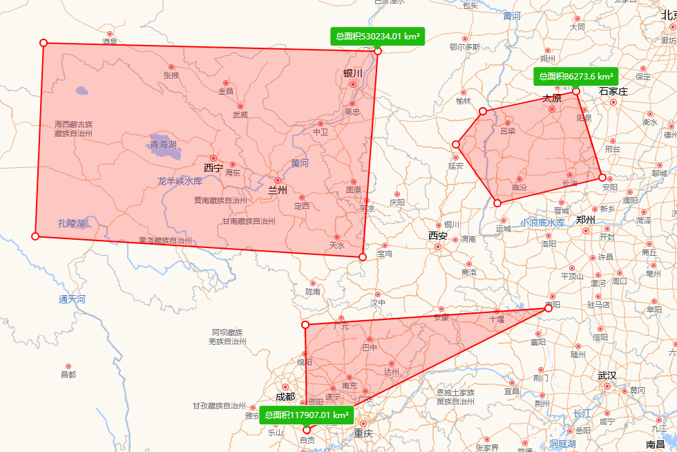

## 概述

在 Openlayers 中面积的量测和长度的测量大同小异，都需要借助于`ol/sphere`模块，不同的是长度计算是调用`ol/sphere`模块的`getLength`方法，而面积则需要调用`getArea`方法。

如果还不清楚如何在 Openlayers 中计算长度，可以参考

## 实践

### 效果



### 代码分析

同长度测量一样，监听`draw`类的实例对象的`drawstart`方法，然后监听当前绘制的几何对象的`change`事件，在这个监听回调函数中调用`ol/sphere`的`getArea`方法获取经纬度

```js
this.draw.on("drawstart", ({ feature }) => {
  this.listener = feature.getGeometry().on("change", (evt) => {
    const geom = evt.target;
    const area = getArea(geom);
  });
});
```

### `ol/sphere`的`getArea`方法

`getArea`方法用于计算地球表面上几何形状的面积，并且考虑了球体的曲率，这意味着它并不是计算平面上的面积，而是计算球面上闭合路径所围成的面积。

**参数**
**`geometry`** (`ol/geom/Polygon` | `ol/geom/MultiPolygon`):

- `geometry` 是一个几何对象，通常是 `Polygon`（多边形）或者 `MultiPolygon`（多个多边形的集合）。
- 对于 `Polygon`，它表示一个闭合的区域，`getArea` 计算的是该区域的球面面积。
- 对于 `MultiPolygon`，计算的是多个多边形的总球面面积。

**返回值**
`getArea`方法返回的是一个数值，其单位是平方米。

## `ol/sphere`实用 API 介绍

除了已经提到的`getLength`、`getArea`和`getDistance`方法外，`ol/sphere`模块还提供了许多其它实用的 API 方法。如下介绍：

- **`getClosestPoint`**
  计算一点到球面上某几何形状的最近点。

  ```js
  Sphere.getClosestPoint(geometry, point);
  ```

- **`containsCoordinate`**
  判断一个点是否在球面上某几何形状内。

  ```js
  Sphere.containsCoordinate(geometry, point);
  ```

- **`getBearing`**
  计算从一个点到另一个点的方位角（即从第一个点到第二个点的航向角）。方位角是指沿着大圆航线，连接这两个点的方向。

  ```js
  Sphere.getBearing([lon1, lat1], [lon2, lat2]);
  ```

- **`getIntersection`**
  计算两条大圆弧（球面上的两条最短路径）之间的交点。如果相交，则返回交点，否则返回`null`
  ```js
  Sphere.getIntersection(
    [lon1, lat1],
    [lon2, lat2],
    [lon3, lat3],
    [lon4, lat4]
  );
  ```
- **`isFlat`**
  判断一个几何对象是否为平面（即判断其是否位于球面的某个平面上）。如果几何对象包含任何曲率，`isFlat` 返回 `false`；如果对象的坐标位于平面上，返回 `true`。
  ```js
  Sphere.isFlat(geometry);
  ```
- **`isValid`**
  判断一个几何对象是否有效。这对于确保几何对象在球面坐标系中是有效的非常有用。

  ```js
  Sphere.isValid(geometry);
  ```

- **`getEnvelope`**
  获取几何对象的包围盒（`Bounding Box`），即可以包围该几何对象的最小矩形框。对于球面几何，返回的是一个近似的矩形包围盒。返回几何对象的包围盒，表示为最小的经纬度矩形。

  ```js
  Sphere.getEnvelope(geometry);
  ```
