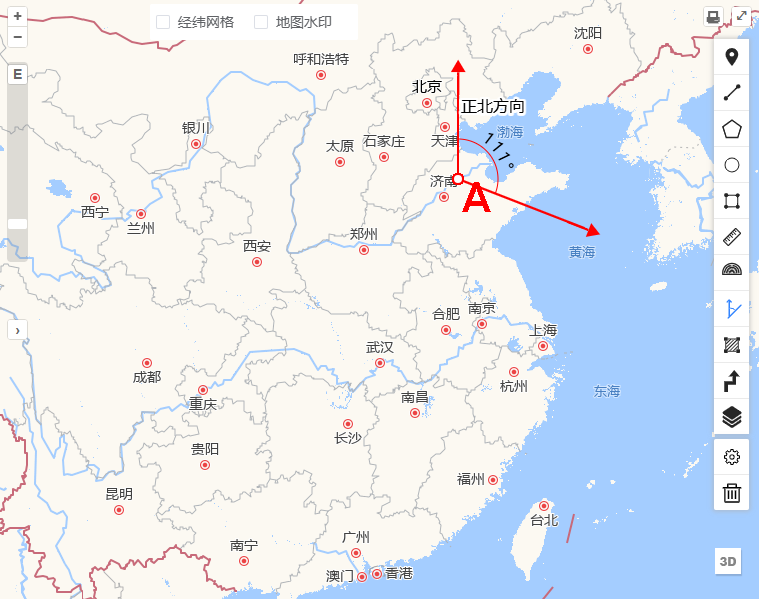
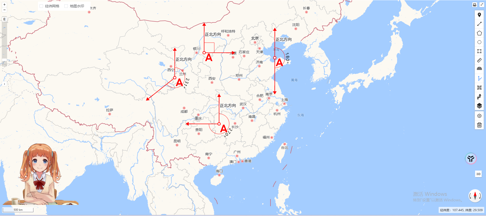

### 概述

在前面[《Openlayers 实现角度测量》](https://jinuss.github.io/blog/pages/af1c7c/)中提到了角度的测量,本文会介绍如何实现在 Openlayers 中进行方位角测量.

### 方位角

在 OpenLayers 中，方位角（`Azimuth`） 通常指的是某一点的方向相对于北方的角度。它是描述从某个位置出发的线与北方之间的角度关系，通常以度为单位，范围从 **0°** 到 **360°**。方位角通常在地图上用于指示某个方向、航向或目标的位置，特别是在涉及导航、路径规划、或定位应用时非常常见。

**方位角的概念**：

- 北方（0°）： 通常，方位角的起点为北方。也就是说，方位角为 **0°** 表示指向正北方。
- 顺时针方向： 方位角是以顺时针方向计算的，因此 **90°** 是正东方向，**180°** 是正南方，**270°** 是正西方。
- 角度范围： 方位角的取值范围通常是 **0°** 到 **360°**，**0°** 和 **360°** 都指向正北方，**90°** 是东，**180°** 是南，**270°** 是西。

### 实践

#### 效果展示

**绘制**


**结果**



#### 具体实现

其实方位角测量的实现和角度的测量大同小异,不过角度的测量需要选定三个点,而方位角其中有一个线段始终是与地图的正北方向平行,因此测量方位角只需要选两个点.其步骤如下:

- **选起点指向正北方向**

监听当前几何对象的`change`事件,获取第一个点作为起点,并将该点保存在全局变量`this.Points`变量中.

```js
this.listenGeometryChange = feature.getGeometry().on("change", (evt) => {
  const geom = evt.target;

  let startPoint = geom.getFirstCoordinate();

  this.addMarker({ coordinate: startPoint, symbolId: "A", anchor: [0, 0] });
  this.formatPonit(startPoint);
  if (this.Points.length == 0) {
    this.Points[0] = startPoint;
    this.drawNorLine();
  }
});
```

绘制指向正北方向的线段,即函数`drawNorLine`的实现如下, 我们假定线段的另一端距离起点(**A 点**)上方**500km**,因为当前地图的参考坐标系为 Openlayers 默认的`EPSG:3857`,因此另一端之间在纬度上相加距离,经度保持不变即可.如果地图的参考坐标系为`EPSG:4326`,相同距离都为**500km**,则其纬度是在**A 点**的纬度上加**5°**差不多,获取该点后,将其放在`this.Points`的首部.

```js
  drawNorLine() {
    const [lon, lat] = this.Points[0];
    const distance = 500000; //500km
    const norPoint = [lon, lat + distance];

    const lineFeature = new Feature({
      geometry: new LineString([this.Points[0], norPoint]),
    });

    this.Points.unshift(norPoint);
    const textStyle = new Style({
      text: new Text({
        text: "正北方向",
        font: "16px Arial",
        fill: new Fill({
          color: "#000",
        }),
        stroke: new Stroke({
          color: "#fff",
          width: 4,
        }),
        offsetX: 35,
        offsetY: -20,
        rotation: 0,
        rotateWithView: true,
      }),
    });

    lineFeature.setStyle([this.lineStyle, textStyle]);

    this.vectorLayer?.getSource().addFeature(lineFeature);

    //箭头
    this.addMarker({
      coordinate: norPoint,
      symbolId: "icon-arrow",
      anchor: [0.51, 0.5],
    });
  }
```

- **选第二个点**

继续选择第二个点,并将其保存在`this.Points`变量中.

```js
const coordinates = geom.getCoordinates().slice(0, -1);

const pointscount = geom.getCoordinates();
if (pointscount.length >= 3) {
  let Angles = calculateAngle({ points: this.Points, azimuth: true });
  this.addMarker({
    coordinate: coordinates[1],
    symbolId: "icon-arrow",
    anchor: [0.51, 0.5],
    rotation: Angles.rotation,
  });

  this.Points[2] = coordinates[1];

  this.addAngleMark({
    coordinate: coordinates[0],
    Angles: Angles,
  });
  this.draw.finishDrawing();
}
```

如此,我们获取到了三个点的坐标,计算**A 点**处的夹角即为所求方位角,但是这里方位角的计算和角度的测量中计算夹角有所不同,因为方位角是有方向的,且其区间是[0°,360°],因此需要改造`calculateAngle`方法,如下:

```js
// 如果叉积为负
let angle = crossProduct < 0 ? angleInDegrees - 180 : 180 - angleInDegrees;

//计算的夹角是方位角
if (azimuth) {
  angle = angle < 0 ? angle + 360 : angle;
}
```

最终效果如下:



### 总结

上述介绍了方位角的测量,主要是用到和角度测量的类似的实现,我们也可以通过`turf.js`计算方位角,后面会有一篇文章专门介绍`turf.js`.
`turf.js`计算方位角,需要先将坐标转换为`EPSG:4326`,再进行计算.

```js
const startP = transform(this.Points[1], "EPSG:3857", "EPSG:4326");
const endP = transform(this.Points[2], "EPSG:3857", "EPSG:4326");
const azimuthInDegrees = turf.rhumbBearing(startP, endP);
console.log("Azimuth (in degrees):", azimuthInDegrees); //和calculateAngle方法返回的值一样
```
