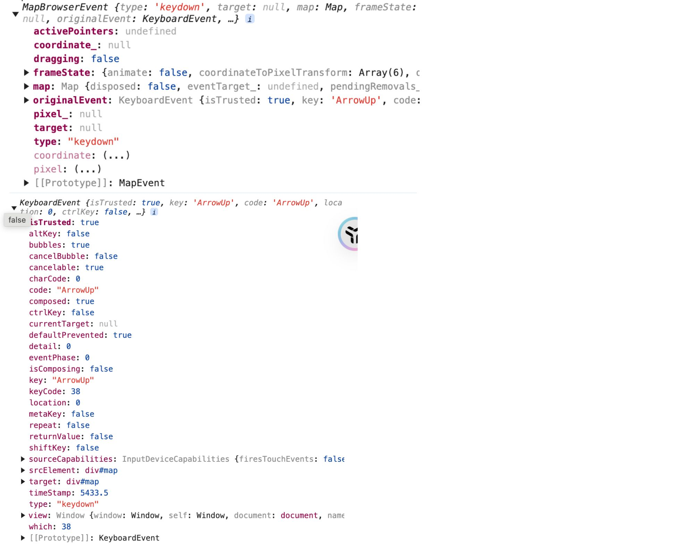

## 概述

在[源码分析 Openlayers 默认键盘交互实现](https://jinuss.github.io/blog/pages/b72d77/)文中介绍了`KeyboardZoom`和 `KeyboardPan`的实现，它们都是继承`Interaction`类，封装了自己的`handleEvent`方法，该方法接受一个`mapBrowserEvent`参数，计算出地图视图的变化量，最后调用`view`的`animate`方法实现地图的缩放或平移。

本文将介绍 Openlayers 是如何实现`Interaction`类，以及键盘事件流的全过程即如何映射到 Openlayers 的自定义事件。

## 源码剖析

### `defaultsInteractions`入口函数

当实例化一个地图，即`new Map(options)`时，会调用一个内部方法`createOptionsInternal`，该方法接受`options`参数经过一些处理，返回一个新的变量，如下：

```js
function createOptionsInternal(options) {
  /**.... **/
  let interactions;
  if (options.interactions !== undefined) {
    if (Array.isArray(options.interactions)) {
      interactions = new Collection(options.interactions.slice());
    } else {
      assert(
        typeof (/** @type {?} */ (options.interactions).getArray) ===
          "function",
        "Expected `interactions` to be an array or an `ol/Collection.js`"
      );
      interactions = options.interactions;
    }
  }

  return {
    controls: controls,
    interactions: interactions,
    keyboardEventTarget: keyboardEventTarget,
    overlays: overlays,
    values: values,
  };
}
```

由此可知，如果参数`options`对象的`interactions`值为空，则`createOptionsInternal`内部不对其有任何处理，在`Map`的构造函数里会有如下的判断：

```js
const optionsInternal = createOptionsInternal(options);
this.interactions =
  optionsInternal.interactions ||
  defaultInteractions({
    onFocusOnly: true,
  });
```

在构造内部给`optionsInternal`变量赋值后，会判断它的`interactions`是否存在，如果不存在，则调用`defaultsInteractions`，这个方法就是决定了 Openlayers 采用默认的交互事件的入口函数。

### 键盘`keydown`事件的回调

构造函数`Map`内部会调用`this.addChangeListener(MapProperty.TARGET, this.handleTargetChanged_);`，这个注册后面会讲到，现在只需要知道，`change:target`变化会执行回调函数`handleTargetChanged_`

#### `handleTargetChanged_`回调函数

`handleTargetChanged_`函数是`Map`类中的一个内部方法，主要用于监听到地图`target`的变化进行一些逻辑处理。在其中有如下一段逻辑：

```js
this.targetChangeHandlerKeys_ = [
  listen(keyboardEventTarget, EventType.KEYDOWN, this.handleBrowserEvent, this),
];
```

上述代码定义了一个数组`targetChangeHandlerKeys_`,数组项是调用了两次`listen()`方法，用于监听键盘按键的`keydown`和`keypress`事件。

##### `listen`方法

`listen`方法本质上就是`element.addEventListener`，其实现如下：

```js
export function listen(target, type, listener, thisArg, once) {
  if (once) {
    const originalListener = listener;
    /**
     * @this {typeof target}
     */
    listener = function () {
      target.removeEventListener(type, listener);
      originalListener.apply(thisArg ?? this, arguments);
    };
  } else if (thisArg && thisArg !== target) {
    listener = listener.bind(thisArg);
  }
  const eventsKey = {
    target: target,
    type: type,
    listener: listener,
  };
  target.addEventListener(type, listener);
  return eventsKey;
}
```

##### `handleBrowserEvent`方法

`handleBrowserEvent`就是对应`listen`方法的第三个参数，执行的那个回调函数。其实现如下:

```js
  handleBrowserEvent(browserEvent, type) {
    type = type || browserEvent.type;
    const mapBrowserEvent = new MapBrowserEvent(type, this, browserEvent);
    this.handleMapBrowserEvent(mapBrowserEvent);
  }
```

`browserEvent`就是原生的事件参数，而`MapBrowserEvent`将原生事件包装一层，多了一些和坐标地图有关的参数信息，它们对比如下图所示：


然后实例对象`mapBrowserEvent`就是会在各个`Interaction`类中`handleEvent`方法接收的参数，在`KeyboardPan`和`KeyboardZoom`的实现中有提到，最后调用`handleMapBrowserEvent`方法。

##### `handleMapBrowserEvent`的核心代码，如下：

```js
if (this.dispatchEvent(mapBrowserEvent) !== false) {
  const interactionsArray = this.getInteractions().getArray().slice();
  for (let i = interactionsArray.length - 1; i >= 0; i--) {
    const interaction = interactionsArray[i];
    if (
      interaction.getMap() !== this ||
      !interaction.getActive() ||
      !this.getTargetElement()
    ) {
      continue;
    }
    const cont = interaction.handleEvent(mapBrowserEvent);
    if (!cont || mapBrowserEvent.propagationStopped) {
      break;
    }
  }
}
```

上述代码会去调用`dispatchEvent`，如果返回值不为`false`，就会遍历`interactions`,执行`interaction.handleEvent(mapBrowserEvent)`,即`KeyboardPan`或`KeyboardZoom`的`handleEvent`方法。

### `Map`类的继承

`dispatchEvent`顾名思义就是派发事件，用于通知所有注册的事件`listener`。在弄清楚这个脉络清，我们先搞清楚`Map`类的继承关系。

- **继承关系**：`Map`类继承`BaseObject`类，`BaseObject`类继承`Observable`类,`Observable`类继承`EventTarget`类.

### 事件注册

在前面提到`this.addChangeListener(MapProperty.TARGET, this.handleTargetChanged_);`是注册了一个`listener`,`MapProperty.TARGET`就是实例化`Map`的参数`target`，对应地图的容器,
`Map`类中注册方法`addChangeListener`实际上就是`Observable`类中定义事件`addChangeListener`，如下：

```js
  addChangeListener(key, listener) {
    this.addEventListener(`change:${key}`, listener);
  }
```

可知，如果地图实例化时容器`target`是`#map`,则注册的事件类型就是`change:target`。`addEventListener`方法实际上是在`EventTarget`中定义的，如下:

```js
  addEventListener(type, listener) {
    if (!type || !listener) {
      return;
    }
    const listeners = this.listeners_ || (this.listeners_ = {});
    const listenersForType = listeners[type] || (listeners[type] = []);
    if (!listenersForType.includes(listener)) {
      listenersForType.push(listener);
    }
  }
```

注册事件最后会放在`this.listeners_`变量中，类似于这种

```js
this.listeners_ = {
  "change:target": this.handleTargetChanged_,
};
```
### `change:target`事件触发
通过`Map`类实例化`map`时，还会执行` this.setProperties(optionsInternal.values);`,而`optionsInternal.values`是在`createOptionsInternal`方法中赋值的，它就包含如下几个值
```js
  values[MapProperty.LAYERGROUP] = layerGroup;

  values[MapProperty.TARGET] = options.target;

  values[MapProperty.VIEW] =
    options.view instanceof View ? options.view : new View();
```
因此可以得知`this.setProperties(optionsInternal.values)`中包含`setProperties({[MapProperty.TARGET]:'#map'})`,这个就和`this.addChangeListener(MapProperty.TARGET, this.handleTargetChanged_);`对应起来了。那么`this.setProperties(optionsInternal.values)`具体是如何执行的呢？

#### `setProperties`方法
`setProperties`方法就是设置事例对象属性，它是在`BaseObject`类中定义的，如下：
```js
  setProperties(values, silent) {
    for (const key in values) {
      this.set(key, values[key], silent);
    }
  }

  set(key, value, silent) {
    const values = this.values_ || (this.values_ = {});
    if (silent) {
      values[key] = value;
    } else {
      const oldValue = values[key];//silent值没传参，进入这步
      values[key] = value;
      if (oldValue !== value) {
        this.notify(key, oldValue);
      }
    }
  }

  notify(key, oldValue) {
    let eventType;
    eventType = `change:${key}`;
    if (this.hasListener(eventType)) {
      this.dispatchEvent(new ObjectEvent(eventType, key, oldValue));
    }
    eventType = ObjectEventType.PROPERTYCHANGE;
    if (this.hasListener(eventType)) {
      this.dispatchEvent(new ObjectEvent(eventType, key, oldValue));
    }
  }
```
由上述源码可知，`setProperties`方法中就是循环遍历参数`values`，调用`set`方法，而在`set`方法中就是进行新值和旧值比较，若二者不等，则调用`notify`方法进行通知。

在`notify`方法中会调用`dispatchEvent`方法，在前面提过`setProperties({[MapProperty.TARGET]:'#map'})`,即`setProperties({taget:'#map'})`所以到`notify`这步的`key`就是`target`,`eventType`就是`change:target`。而在事件注册时，`this.listeners_`变量中保存有`{"change:target": this.handleTargetChanged_,}`,因此在条件判断`this.hasListener('change:target')`是会调用`this.dispatchEvent`方法。

#### `dispatchEvent`方法
`dispatchEvent`的定义如下：

```js
dispatchEvent(event) {
    const isString = typeof event === 'string';
    const type = isString ? event : event.type;
    const listeners = this.listeners_ && this.listeners_[type];
    if (!listeners) {
      return;
    }

    const evt = isString ? new Event(event) : /** @type {Event} */ (event);
    if (!evt.target) {
      evt.target = this.eventTarget_ || this;
    }
    const dispatching = this.dispatching_ || (this.dispatching_ = {});
    const pendingRemovals =
      this.pendingRemovals_ || (this.pendingRemovals_ = {});
    if (!(type in dispatching)) {
      dispatching[type] = 0;
      pendingRemovals[type] = 0;
    }
    ++dispatching[type];
    let propagate;
    for (let i = 0, ii = listeners.length; i < ii; ++i) {
      if ('handleEvent' in listeners[i]) {
        propagate = /** @type {import("../events.js").ListenerObject} */ (
          listeners[i]
        ).handleEvent(evt);
      } else {
        propagate = /** @type {import("../events.js").ListenerFunction} */ (
          listeners[i]
        ).call(this, evt);
      }
      if (propagate === false || evt.propagationStopped) {
        propagate = false;
        break;
      }
    }
    if (--dispatching[type] === 0) {
      let pr = pendingRemovals[type];
      delete pendingRemovals[type];
      while (pr--) {
        this.removeEventListener(type, VOID);
      }
      delete dispatching[type];
    }
    return propagate;
  }
```
`dispatchEvent`方法就是派发事件，满足条件后，执行事件类型对应的注册事件，`handleTargetChanged_`方法中不存在`handleEvent`,因此在循环遍历中执行`(handleTargetChanged_).call(this,evt)`,而在前面`this.dispatchEvent(mapBrowserEvent) !== false`调用`dispatchEvent`方法时，其`type`是`keyDown`,返回值是`undefined`.

`(handleTargetChanged_).call(this.evt)`时会立即执行`handleTargetChanged_`方法，在其中就会调用`listen(keyboardEventTarget,EventType.KEYDOWN,this.handleBrowserEvent,this)`进行键盘按键`keydown`的监听。

## 总结
通过`Map`类实例化地图对象时，会调用`createOptionsInternal`,进行`values[MapProperty.TARGET]`的赋值，然后是`this.interactions`的默认赋值，` this.addChangeListener(MapProperty.TARGET, this.handleTargetChanged_);`注册事件`this.listener={'change:target':handleTargetChanged_}`,紧接着就是调用`setProperties(optionsInternal.values)`方法，这操作会触发`handleTargetChanged_`回调，在`handleTargetChanged_`其中会调用`listen`方法监听键盘的`keydown`事件且当前`target`需要指定默认是地图容器。如此当按下方向键或者`-`/`+`，地图会进行平移或者缩放。