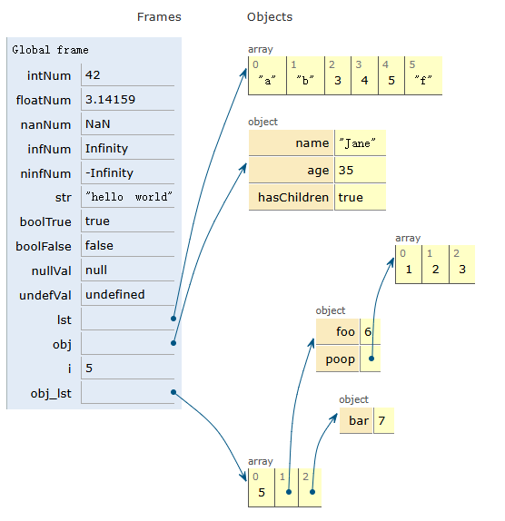
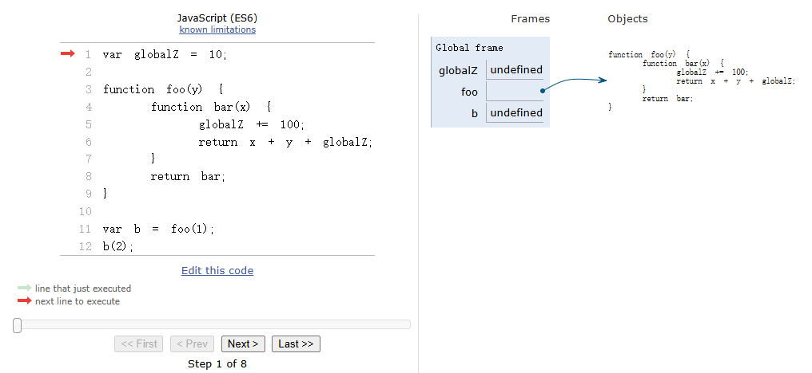
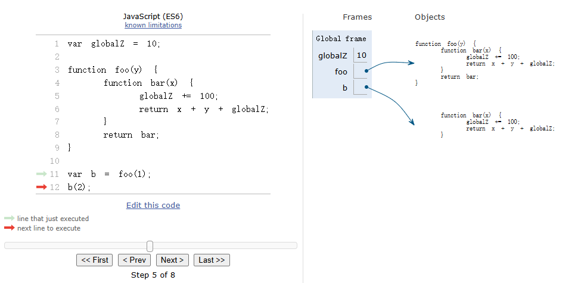
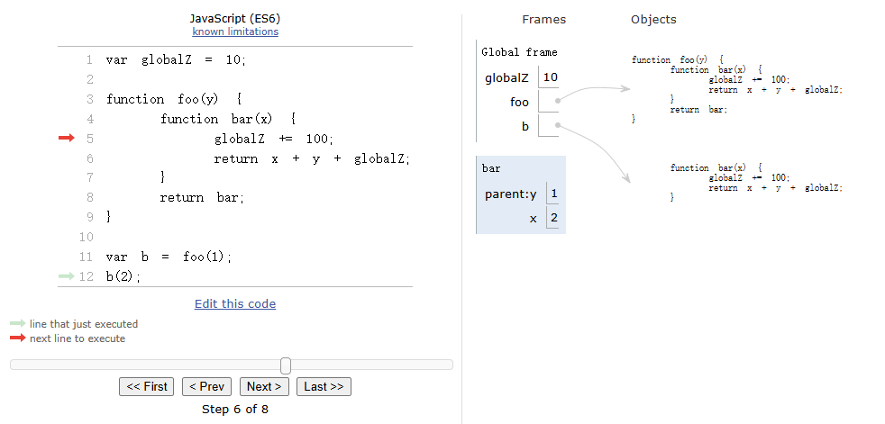

### 概述

本文主要是推荐一个网站:[Python Tutor](https://pythontutor.com/).

网站首页写道：

> > Online Compiler, Visual Debugger, and AI Tutor for Python, Java, C, C++, and JavaScript
> > Python Tutor helps you do programming homework assignments in Python, Java, C, C++, and JavaScript. It contains a unique step-by-step visual debugger and AI tutor to help you understand and debug code.

翻译过来就是

> > Python Tutor 是一个在线编译器、可视化调试器和 AI 辅导工具，支持 `Python`、`Java`、`C`、`C++` 和 `JavaScript`。它帮助你完成 `Python`、`Java`、`C`、`C++` 和 `JavaScript` 编程作业，提供独特的逐步可视化调试功能，并通过 `AI`辅导帮助你理解和调试代码。

### 网站实操

我们以`Javascript`的几个例子讲解下，就会很快明白这个网站的神奇之处。

#### 不同数据的存储方式
代码如下
```js
var intNum = 42;
var floatNum = 3.14159;
var nanNum = NaN;
var infNum = Infinity;
var ninfNum = -Infinity;

var str = "hello world";

var boolTrue = true;
var boolFalse = false;

var nullVal = null;
var undefVal = undefined;

var lst = ['a', 'b', 3, 4, 5, 'f'];

var obj = {name: 'John', age: 35, hasChildren: true};

var i = 5;
var obj_lst = [i, {foo: i+1, poop: [1, 2, 3]}, {bar: i+2}];

obj.name = 'Jane';
```

内存分布如下：


#### **`closure`闭包**

- **代码如下**：

```js
var globalZ = 10;

function foo(y) {
  function bar(x) {
    globalZ += 100;
    return x + y + globalZ;
  }
  return bar;
}

var b = foo(1);
b(2);
```

- **具体执行过程**

  - **第 1 步**：
    初始化状态，初始化了三个变量:`globalZ`、`foo`和`b`,其值分别为`undefined`、指向`Objects`中的某一内存块函数、`undefined`。
    

  - **第 2 步**：
    `globalZ`变量赋值`10`
    

  - **第 3 步**：
    `b`变量赋值，执行`foo(1)`函数，在`Global frame`中开辟一块`foo`的空间，里面定义了`bar`函数以及参数`y`(其值为`1`)
    

  - **第 4 步**：
    定义`foo frame`中函数的返回值，并将其赋值给变量`b`
    

  - **第 5 步**：
    可以看出上面第 4 步的运行结果，变量`b`指向`bar`函数
    

  - **第 6 步**：
    执行`b(2)`
    

  - **第 7 步**：
    执行`b(2)`的内部逻辑，此时参数`x`为`2`,参数`y`是`parent frame`中的值`1`
    

  - **第 8 步**：
    返回运算结果
    

  - **第 9 步**：
    最末状态，`b(2)`执行完返回运算结果后，销毁了`bar frame`
    

### 总结
`Python Tutor`网站上可以实时显示当前代码执行时，各变量函数的指向或者关联情况，对于前端而言，可以很好理解基础数据类型和复杂数据类型的区别和不同。