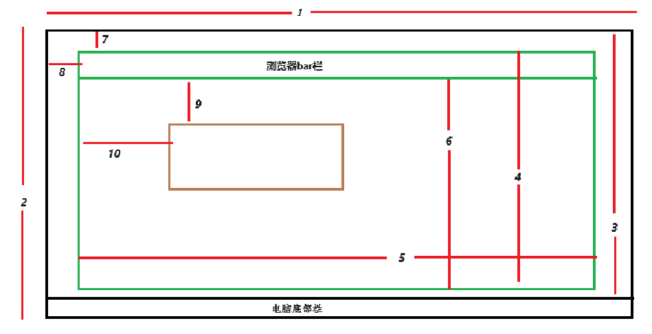

### 概述

研发通常拿到的设计稿会有一个基准，web 端一般是 1920 \* 1080，这是最常见的分辨率，如果要做大屏的适配，视觉效果应该是浏览器的全屏下才能达到设计预期。

通常说的 web 端的分辨率，通常是指电脑显示器的分辨率，表示屏幕上的像素点数量，也称**显示分辨率**，这是指屏幕的整个大小，而不是浏览器的大小，因为浏览器可以进行缩放，所以只有当浏览器全屏时，可视区域的大小即`document.documentElement.clientX`和`document.documentElement.clientX`才等于分辨率的大小

### 说图

上图的示意是：黑色表示电脑显示器或屏幕，绿色框表示浏览器窗口，而灰色框表示浏览器的任意一个盒子元素。

下面说下数字 1-10 分别表示什么，以及如何获得，单位都是`px`

- 1：分辨率的宽，`window.screen.Width`,
- 2：分辨率的高，`window.screen.Height`
- 3：屏幕的实际高度，在非全屏，浏览器窗口的最大化情况下，这个高度等于 `window.outerHeight`, win11 默认电脑任务栏的高度为`48px`，这种情况下，其值= `window.screen.Height` - 48
- 4：浏览器窗口的高度，`window.outerHeight`
- 5：浏览器窗口的宽度，`window.outerWidth`
- 6：浏览器的内部高度，包括滚动条，但是不包括顶部的工具栏标签等`window.innerHeight`，通常情况下`window.innerWidth`和`window.outerWidth`相等
- 7：浏览器上方和屏幕上边缘的距离，`window.screenY`
- 8：浏览器左侧部和屏幕左边缘的距离，`window.screenX`
- 9：元素的上方和浏览器的内部边缘的距离,`element.offsetTop`
- 10：元素的左侧和浏览器的左边缘的距离,`element.offsetLeft`

此外还有浏览器可视区域高度`clientHeight`、宽度`clientWidth`以及内容高度`scrollHeight`和宽度`scrollWidth`也是大同小异
