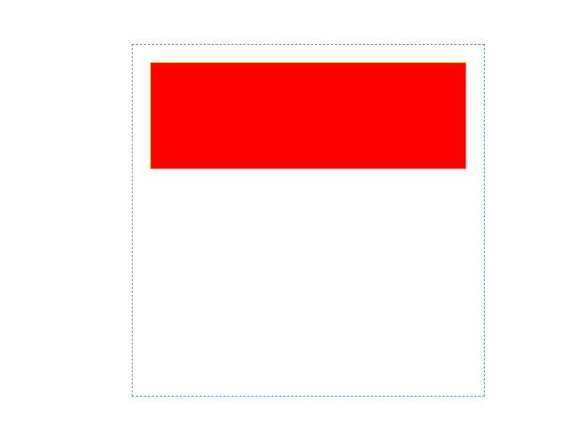
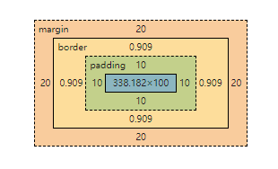

## 概述

在标准盒模型中，元素的总宽度由`height`、`margin`、`border`和`padding`来确定，其计算方式如下：

> 总宽度 = 内容宽度 + 左内边距 + 右内边距 + 左边框宽度 + 右边框宽度 + 左外边距 + 右外边距

那么每次获取元素的宽度就一定是获取这个总宽度吗？

## 以例为证

代码如下：

```html
<style>
  .parent {
    margin: 100px auto;
    width: 400px;
    height: 400px;
    border: 1px dashed #438de8;
  }

  .children {
    height: 100px;
    width: 100px;
    border: 1px solid orange;
    background: red;
    padding: 10px;
    margin: 20px;
  }
</style>
<div class="parent">
  <div class="children" style="width:auto;"></div>
</div>
<script>
  const doms = {
    child: document.querySelector(".children"),
  };
</script>
```

浏览器的渲染结果如下图：


开发工具【元素-样式】显示如下图：


通常情况下，一个元素由浏览器绘制到屏幕上会经历三个阶段，构建 3 个 Tree：`DOM Tree`、`CSS Tree`和`Layout Tree`。在这三个阶段获取元素的宽度是不同的。

### `style.width`

元素的 `style` 属性返回的是一个`CSSStyleDeclaration`对象，是 Javascript 中用于表示元素的样式的对象，它允许读取和修改元素的内联样式。所以上面例子中`style.width`的值不是`100px`，若去掉内敛样式，则返回一个空的字符串

```js
console.log(doms.child.style.width); // 'auto'
```

### `clientWidth`

`clientWidth`表示的是内容宽度+左右的`Padding`,可视区域的宽度

```js
console.log(doms.child.clientWidth); // 358
```

### `scrollWidth`

当元素没有出现滚动条时，`scrollWidth`和`clientWidth`获取的是相同的值，如果元素出现滚动条，则`scrollWidth`表示的是内容实际的宽度

```js
console.log(doms.child.scrollWidth); // 358
```

### `offsetWidth`

`offsetWidth`表示的是内容宽度+Padding+border 的宽度之和。这个宽度对应`DOM Tree`阶段元素的宽度。

```js
console.log(doms.child.offsetWidth); // 360
```

### `getComputedStyle`方法

`getComputedStyle`方法返回的也是一个`CSSStyleDeclaration`对象，但是它是得到计算后的样式，其宽度是内容实际的宽度，不包括边距和边框。这个宽度对应`CSS Tree`阶段元素的宽度。

```js
console.log(getComputedStyle(doms.child).width); // '338px'
```

### `getBoundingClientRect`方法

`getBoundingClientRect()` 方法返回一个 `DOMRect` 对象，其中包含元素的大小和相对于视口的位置。它提供的宽度包含了元素的实际显示区域，包括内边距、边框，但不包括滚动条宽度。这个宽度对应`Layout Tree`阶段元素的宽度。

```js
console.log(doms.child.getBoundingClientReact().width); // 360
```

## 特殊情况

比如元素经过旋转或者放大缩小后呢，其宽度对应的是什么

### 旋转

只会影响`getBoundingClientReact`获取的宽度，因为这个方法本身就是获取包括元素最小的矩形的位置（偏移）和大小

### 放大或缩小

无影响

其它参考