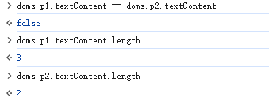

## 概述

零宽字符是一组在文本中没有可见宽度的字符，它们通常用于处理文本的布局、分隔和合成。下面是一些常见的零宽字符及其详细介绍：

## 详细介绍

1. **零宽空格 (Zero Width Space, ZWSP)**

   - Unicode 码位: U+200B
   - HTML 实体: &#8203; 或 &#x200B;
   - 用途:
     - 用于防止文字自动换行。
     - 用于在文本中插入不可见的间隔，以控制排版或进行文本分析。

2. **零宽非连字符 (Zero Width Non-Joiner, ZWNJ)**

   - Unicode 码位: U+200C
   - HTML 实体: &#8204; 或 &#x200C;
   - 用途:
     - 阻止字符连接，例如在某些语言（如阿拉伯语）中阻止字符的连写。
     - 在文本合成中，防止字符之间的连写效果。

3. **零宽连字符 (Zero Width Joiner, ZWJ)**

   - Unicode 码位: U+200D
   - HTML 实体: &#8205; 或 &#x200D;
   - 用途:
     - 强制字符连接，在一些语言或表情符号中使用。
     - 在文本中合成字符，特别是在表情符号（emoji）中组合多个字符。

4. **零宽无断行空格 (Zero Width No-Break Space, ZWNBSP)**

   - Unicode 码位: U+FEFF
   - HTML 实体: &#65279; 或 &#xFEFF;
   - 用途:
     - 用于防止文本中的自动断行。
     - 常用作 BOM（字节顺序标记），用于标记文件的字节顺序。

5. **零宽笔画（Zero Width Correction, ZWC）**
   - Unicode 码位: U+FEFF（在这类应用中也常用于 BOM，但没有单独的代码）
   - 用途:
     - 在某些特定应用中用于文本处理。

## 注意事项

示例如下：

```html
<p class="p1">我&#8203;们</p>
<p class="p2">我们</p>
<script>
  const doms = {
    p1: document.querySelector(".p1"),
    p2: document.querySelector(".p2"),
  };
</script>
```

上面示例中获取`p1`和`p2`的宽度，两者没什么区别，但是获取它们的`textContent`是不同的，如下图所示：

