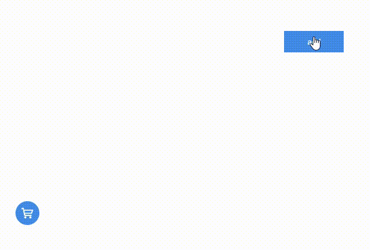

### 概述

小程序商城或者 web 端网站时，我们可以只通过 CSS 的 `animation` 和`transform`，而不需要借助额外的第三方库轻松实现简单的动画效果，丰富页面的表达效果

### 效果

如下图所示，点击按钮就会有个商品进入左下角的购物车内



[购物车动画示例地址](https://codepen.io/jinuss/pen/poXZjVO)

### 代码示例

#### 元素

开始只需要写按钮和购物车两个 `DOM` 节点

```html
<button id="btn">add</button>
<span class="bulk">
  <svg
    t="1724755384446"
    class="icon"
    viewBox="0 0 1028 1024"
    version="1.1"
    xmlns="http://www.w3.org/2000/svg"
    p-id="4635"
    width="20"
    height="20"
  >
    <path
      d="M332.8 790.528q19.456 0 36.864 7.168t30.208 19.968 20.48 30.208 7.68 36.864-7.68 36.864-20.48 30.208-30.208 20.48-36.864 7.68q-20.48 0-37.888-7.68t-30.208-20.48-20.48-30.208-7.68-36.864 7.68-36.864 20.48-30.208 30.208-19.968 37.888-7.168zM758.784 792.576q19.456 0 37.376 7.168t30.72 19.968 20.48 30.208 7.68 36.864-7.68 36.864-20.48 30.208-30.72 20.48-37.376 7.68-36.864-7.68-30.208-20.48-20.48-30.208-7.68-36.864 7.68-36.864 20.48-30.208 30.208-19.968 36.864-7.168zM930.816 210.944q28.672 0 44.544 7.68t22.528 18.944 6.144 24.064-3.584 22.016-13.312 37.888-22.016 62.976-23.552 68.096-18.944 53.248q-13.312 40.96-33.28 56.832t-49.664 15.872l-35.84 0-65.536 0-86.016 0-96.256 0-253.952 0 14.336 92.16 517.12 0q49.152 0 49.152 41.984 0 20.48-9.728 35.84t-38.4 14.336l-49.152 0-94.208 0-118.784 0-119.808 0-99.328 0-55.296 0q-20.48 0-34.304-9.216t-23.04-24.064-14.848-32.256-8.704-32.768q-1.024-6.144-5.632-29.696t-11.264-58.88-14.848-78.848-16.384-87.552q-19.456-103.424-44.032-230.4l-76.8 0q-15.36 0-25.6-7.68t-16.896-18.432-9.216-23.04-2.56-22.528q0-20.48 13.824-33.792t37.376-12.288l103.424 0q20.48 0 32.768 6.144t19.456 15.36 10.24 18.944 5.12 16.896q2.048 8.192 4.096 23.04t4.096 30.208q3.072 18.432 6.144 38.912l700.416 0zM892.928 302.08l-641.024-2.048 35.84 185.344 535.552 1.024z"
      p-id="4636"
      fill="#ffffff"
    ></path>
  </svg>
</span>
```

#### 定义动画

定义两个动画，垂直方向`moveY`和水平方向`moveX`; `moveX`应用图标`<i></i>`，而`moveY`应用于父元素，我们肉眼看到的是两个动画的综合效果就复合动画。

```css
span.add {
  margin-left: var(--left);
  margin-top: var(--top);
  display: inline-block;
  width: 20px;
  height: 20px;
  position: absolute;
  animation: moveY 1s cubic-bezier(0.5, -0.5, 1, 1); /*贝塞尔函数*/
}

span.add i {
  display: inline-block;
  background-color: #438de8;
  width: 20px;
  height: 20px;
  font-size: 16px;
  border-radius: 50%;
  animation: moveX 1s linear;
}

span.bulk {
  display: inline-block;
  border-radius: 50%;
  display: flex;
  justify-content: center;
  align-content: center;
  align-items: center;
  width: 40px;
  height: 40px;
  background-color: #438de8;
  margin-top: 400px;
  margin-left: 50px;
}

@keyframes moveY {
  to {
    transform: translateY(var(--y));
  }
}

@keyframes moveX {
  to {
    transform: translateX(var(--x));
  }
}
```

另外上面中的`css`还用到了自定义变量`--x`,`--y`以及`--top`和`--left`,这样就可以用 Javascript 动态地去赋值修改，提供更多地可能性

### Javascript 代码

动画的运动一定是相对的，既然提到相对，就一定避不开初始位置和目标位置，在[一张图理解浏览器的位置和尺寸](https://blog.csdn.net/m0_46281382/article/details/141352167)一文中讲到元素相对文档的位置。

这段代码的核心分为三步：

1.获取控制按钮和购物车的位置，计算出小球的生成位置和小球动画的偏移量

2.动态创建小球，设置其属性初始位置：`--top`,`--left`以及偏移位置：`--x`,`--y`

3.监听动画，小球动画结束时就移除

```js
const doms = {
  btn: document.querySelector("#btn"),
  bulk: document.querySelector(".bulk"),
};
const w = (h = 10);

doms.btn.onclick = () => {
  const posBtn = doms.btn.getBoundingClientRect();
  console.log("🚀 ~ posBtn:", posBtn);
  let spanPosition = {
    left: posBtn.left + posBtn.width / 2 - w,
    top: posBtn.top - posBtn.height / 2 + h,
  };

  const target = doms.bulk.getBoundingClientRect();
  spanPosition.targetX = -(spanPosition.left - target.left - target.width / 2);
  spanPosition.targetY = target.top - spanPosition.top - target.height / 2;
  let newSpan = document.createElement("span");
  newSpan.className = "add";
  newSpan.style.setProperty("--left", `${spanPosition.left}px`);
  newSpan.style.setProperty("--top", `${spanPosition.top}px`);
  newSpan.style.setProperty("--y", `${spanPosition.targetY}px`);
  newSpan.style.setProperty("--x", `${spanPosition.targetX}px`);
  newSpan.innerHTML = `<i>
                <svg t="1724757674752" class="icon" viewBox="0 0 1024 1024" version="1.1" xmlns="http://www.w3.org/2000/svg" p-id="6405" width="20" height="20">
                    <path
                     d="M810.666667 490.666667v42.666666a21.333333 21.333333 0 0 1-21.333334 21.333334H554.666667v234.666666a21.333333 21.333333 0 0 1-21.333334 21.333334h-42.666666a21.333333 21.333333 0 0 1-21.333334-21.333334V554.666667H234.666667a21.333333 21.333333 0 0 1-21.333334-21.333334v-42.666666a21.333333 21.333333 0 0 1 21.333334-21.333334H469.333333V234.666667a21.333333 21.333333 0 0 1 21.333334-21.333334h42.666666a21.333333 21.333333 0 0 1 21.333334 21.333334V469.333333h234.666666a21.333333 21.333333 0 0 1 21.333334 21.333334z"
                     p-id="6406" fill="#ffffff"> 
                    </path>
                </svg></i>`;

  document.body.prepend(newSpan);

  newSpan.addEventListener("animationend", () => {
    newSpan.remove();
  });
};
```
