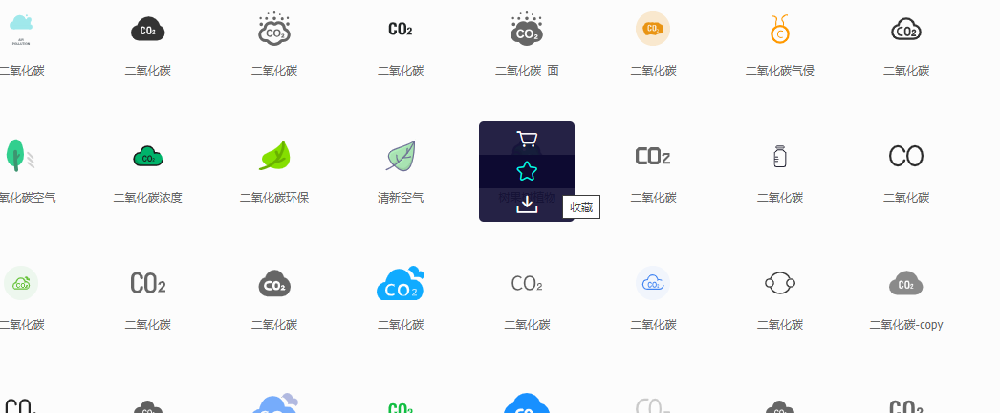
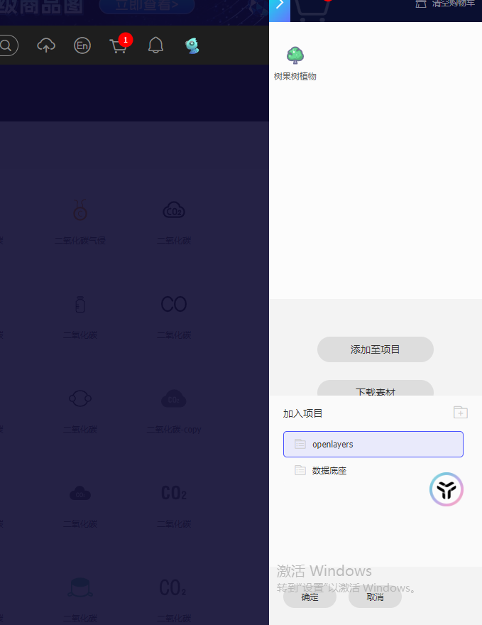
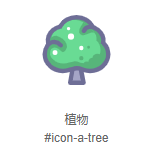
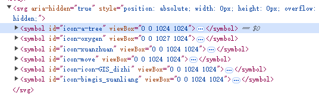

## 概述

图标库在前端开发中应用十分广泛，图标库不仅会丰富美化界面的展示，语义化的图标库更能简洁明了地向用户传达某些信息，比如功能的特性和作用，引导用户，极大提高系统的易用性。在没有 UI 设计师的情况下，作为开发也可以自己打造图标库。而`iconfont`就是一种很好的选择。

## iconfont

### iconfont 介绍

`iconfont`是一个图标字体库，它允许用户将各种图标作为字体进行使用，十分方便地在网页和应用中展示图标。

#### iconfont 的特点

- **图标字体**：将图标作为字体使用，便于调整大小、颜色和样式，且不失真。
- **自定义**：用户可以上传自定义图标，生成自己的图标库。
- **SVG 支持**：提供 SVG 格式图标，支持更高质量的图标显示。
- **跨平台**：兼容多种平台和浏览器，确保图标显示一致。
- **便捷集成**：通过 CSS 或 JavaScript 引入图标，简单易用

### iconfont 使用步骤

`iconfont`的使用和管理也十分方便，使用前提是需要在其官方网站：[iconfont 网站](https://www.iconfont.cn/)上注册一个账号并登录。主要步骤分为 1.制作图标字体库 2.使用图标字体库。

#### 制作图标库

制作图标库过程如下

- 打开网站 ——> 资源管理，先建一个项目，比如我的项目名称叫做 **Openlayers**

 
 

- 可以直接上传本地图片作为图标，也可以去进行搜索，比如搜索 **CO2**

  

- 在搜索结果页面，将想要的图标 添加到购物车

  
  

- 这样就可以在 Openlayers 项目看到港添加的新图标

  

#### 使用图标库

`iconfont`的图标可以单个使用，也可以批量应用到项目中。批量应用又分三种方式：1.unicode 引用 2.font-class 引用 3.symbol 引用。这里以第三种方式为例。

使用前，从上面最后一张中可以看出，通过切换三种方式，在不同的方式下每个图标的名字都不一样，我们根据需要可以编辑每个图标的名称或者`className`。
使用时，需要下载文件到本地，并在项目中引入即可。


使用步骤如下：

- 引入下载文件中的`iconfont.js`文件
- 设置 svg 的样式

```css
.icon {
  width: 1em;
  height: 1em;
  vertical-align: -0.15em;
  fill: currentColor;
  overflow: hidden;
}
```

- 在 html 中写如下代码

```html
<svg class="icon svg-icon" aria-hidden="true">
  <use xlink:href="#icon-a-tree"></use>
</svg>
```

#### 效果如下



### iconfont 的原理

上面采用的第三种方式，和字体编码关系不大。引入的`iconfont.js`中代码比较好理解，主要就干了两件事 1.定义全局变量`window._iconfont_svg_string_xxxxxx`，该变量是一串 svg 代码，包含项目中每个图标的`symbol` 2.使用`IIFE`的模式将该 svg 字符串插入到 DOM 中去



核心代码如下：

```js
((e) => {
  var t = (a = (a = document.getElementsByTagName("script"))[
      a.length - 1
    ]).getAttribute("data-injectcss"),
    a = a.getAttribute("data-disable-injectsvg");
  if (!a) {
    var l,
      i,
      c,
      n,
      o,
      h = function (t, a) {
        a.parentNode.insertBefore(t, a);
      };
    if (t && !e.__iconfont__svg__cssinject__) {
      e.__iconfont__svg__cssinject__ = !0;
      try {
        document.write(
          "<style>.svgfont {display: inline-block;width: 1em;height: 1em;fill: currentColor;vertical-align: -0.1em;font-size:16px;}</style>"
        );
      } catch (t) {
        console && console.log(t);
      }
    }
    (l = function () {
      var t,
        a = document.createElement("div");
      (a.innerHTML = e._iconfont_svg_string_4550938),
        (a = a.getElementsByTagName("svg")[0]) &&
          (a.setAttribute("aria-hidden", "true"),
          (a.style.position = "absolute"),
          (a.style.width = 0),
          (a.style.height = 0),
          (a.style.overflow = "hidden"),
          (a = a),
          (t = document.body).firstChild
            ? h(a, t.firstChild)
            : t.appendChild(a));
    }),
      document.addEventListener
        ? ~["complete", "loaded", "interactive"].indexOf(document.readyState)
          ? setTimeout(l, 0)
          : ((i = function () {
              document.removeEventListener("DOMContentLoaded", i, !1), l();
            }),
            document.addEventListener("DOMContentLoaded", i, !1))
        : document.attachEvent &&
          ((c = l),
          (n = e.document),
          (o = !1),
          s(),
          (n.onreadystatechange = function () {
            "complete" == n.readyState && ((n.onreadystatechange = null), d());
          }));
  }
  function d() {
    o || ((o = !0), c());
  }
  function s() {
    try {
      n.documentElement.doScroll("left");
    } catch (t) {
      return void setTimeout(s, 50);
    }
    d();
  }
})(window);
```
