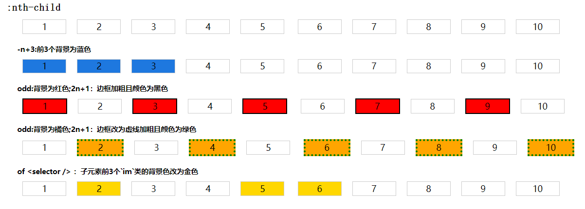

### 概述

本文主要讲述`CSS`的部分伪类选择器第二篇，包括：`:nth-child`、`:nth-last-child`、`:nth-of-type`和`:nth-last-of-type`。

### `:nth-child()`

`:nth-child`伪类是根据父元素的子元素列表中的索引来选择元素。

#### 语法

`:nth-child`是以一个参数`nth`来描述匹配兄弟元素列表中元素索引的模式。元素索引从**1**开始。

```css
:nth-child(nth) {
  /** */
}
```

其中`nth`可以是关键字也可以是函数符号

- **关键字** ：`odd`表示奇数，如 1、3、5...；`even`表示偶数，如 2、4、6。

- **函数符号**

  - `<An+B>`：`A`表示步长；`B`表示偏移量；`n`表示从 0 开始的整数，如 `5n+1`就是包含 1、6、11...

  - `nth of <selector>`：表示选择与`<selector>`选择器匹配的第`nth`个元素，这时的`nth`可以是`<An+B>`的模式或者非负整数

- **非负整数**：`<nth>`也可以就是一个数值，如 1，3，6，8...

#### 示例

- 效果
  
- 代码如下：

```html
<style>
  .first {
    .children.pre span:nth-child(-n + 3) {
      background: rgb(30, 120, 223);
    }

    .children.odd span:nth-child(odd) {
      background: red;
    }

    .children.odd span:nth-child(2n + 1) {
      border: 2px solid #000;
    }

    .children.even span:nth-child(even) {
      background: orange;
    }

    .children.even span:nth-child(2n) {
      border: 4px dotted green;
    }

    .children span:nth-child(-n + 3 of .im) {
      background-color: gold;
    }
  }
</style>
<div class="order">
  <h2><code>:nth-child</code></h2>
  <div class="content first">
    <div class="item">
      <div class="children">
        <span>1</span><span>2</span><span>3</span><span>4</span><span>5</span>
        <span>6</span><span>7</span><span>8</span><span>9</span><span>10</span>
      </div>
    </div>
    <div class="item">
      <h5>-n+3:前3个背景为蓝色</h5>
      <div class="children pre">
        <span>1</span><span>2</span><span>3</span><span>4</span><span>5</span>
        <span>6</span><span>7</span><span>8</span><span>9</span><span>10</span>
      </div>
    </div>
    <div class="item">
      <h5>odd:背景为红色;2n+1：边框加粗且颜色为黑色</h5>
      <div class="children odd">
        <span>1</span><span>2</span><span>3</span><span>4</span><span>5</span>
        <span>6</span><span>7</span><span>8</span><span>9</span><span>10</span>
      </div>
    </div>
    <div class="item">
      <h5>odd:背景为橘色;2n+1：边框改为虚线加粗且颜色为绿色</h5>
      <div class="children even">
        <span>1</span><span>2</span><span>3</span><span>4</span><span>5</span>
        <span>6</span><span>7</span><span>8</span><span>9</span><span>10</span>
      </div>
    </div>
    <div class="item">
      <h5>of &lt;selector /&gt; ：子元素前3个`im`类的背景色改为金色</h5>
      <div class="children of">
        <span>1</span><span class="im">2</span><span>3</span><span>4</span
        ><span class="im">5</span> <span class="im">6</span><span>7</span
        ><span>8</span><span class="im">9</span><span>10</span>
      </div>
    </div>
  </div>
</div>
```

### `:nth-last-child()`

`:nth-last-child()`和`:nth-child`的语法类似，不过`:nth-last-child()`是从最后倒着计数，和后者相反。

#### 示例

- 效果
  
- 代码如下：

```html
<style>
  .last {
    .children.pre span:nth-last-child(-n + 3) {
      background: rgb(30, 120, 223);
    }

    .children.odd span:nth-last-child(odd) {
      background: red;
    }

    .children.odd span:nth-last-child(2n + 1) {
      border: 2px solid #000;
    }

    .children.even span:nth-last-child(even) {
      background: orange;
    }

    .children.even span:nth-last-child(2n) {
      border: 4px dotted green;
    }

    .children span:nth-last-child(-n + 3 of .im) {
      background-color: gold;
    }
  }
</style>
<h2><code>:nth-last-child</code></h2>
<div class="content last">
  <div class="item">
    <div class="children">
      <span>1</span><span>2</span><span>3</span><span>4</span><span>5</span>
      <span>6</span><span>7</span><span>8</span><span>9</span><span>10</span>
    </div>
  </div>
  <div class="item">
    <h5>-n+3:后3个背景为蓝色</h5>
    <div class="children pre">
      <span>1</span><span>2</span><span>3</span><span>4</span><span>5</span>
      <span>6</span><span>7</span><span>8</span><span>9</span><span>10</span>
    </div>
  </div>
  <div class="item">
    <h5>odd:背景为红色;2n+1：边框加粗且颜色为黑色</h5>
    <div class="children odd">
      <span>1</span><span>2</span><span>3</span><span>4</span><span>5</span>
      <span>6</span><span>7</span><span>8</span><span>9</span><span>10</span>
    </div>
  </div>
  <div class="item">
    <h5>odd:背景为橘色;2n+1：边框改为虚线且颜色为绿色</h5>
    <div class="children even">
      <span>1</span><span>2</span><span>3</span><span>4</span><span>5</span>
      <span>6</span><span>7</span><span>8</span><span>9</span><span>10</span>
    </div>
  </div>
  <div class="item">
    <h5>of &lt;selector /&gt; ：子元素后3个`im`类的背景色改为金色</h5>
    <div class="children of">
      <span>1</span><span class="im">2</span><span>3</span><span>4</span
      ><span class="im">5</span> <span class="im">6</span><span>7</span
      ><span>8</span><span class="im">9</span><span>10</span>
    </div>
  </div>
</div>
```

### `:nth-of-type()`

`:nth-of-type()`伪类是基于相同类型（标签名称）的兄弟元素中的位置来匹配元素。

#### 语法

```css
:nth-of-type(nth) {
  /** */
}
```

`nth`表示匹配元素的模式，同上差不多。可以是关键词`odd`或`even`，也可以是`<An+B>`，还可以是非负整数。

#### 示例

- 效果
  
- 代码如下：

```html
<style>
  .first {
    .children.odd span.light:nth-of-type(odd) {
      color: red;
    }

    .children.even span.light:nth-of-type(even) {
      color: rgb(99, 32, 32);
      font-weight: bolder;
    }

    .children.blue span:nth-of-type(2n + 1) {
      color: rgb(14, 53, 224);
      font-weight: bolder;
    }
  }
</style>
<h2><code>:nth-of-type</code></h2>
<div class="content first">
  <div class="item">
    <div class="children">
      <span>1</span><span>2</span><span>3</span><span>4</span><span>5</span>
      <span>6</span><span>7</span><span>8</span><span>9</span><span>10</span>
    </div>
  </div>
  <div class="item">
    <h5>odd:颜色为红色</h5>
    <div class="children odd">
      <span>1</span>
      <span class="light">2</span>
      <span>3</span>
      <span class="dark">4</span>
      <span>5</span>
      <span class="light">6</span>
      <span class="light">7</span>
      <span>8</span>
      <span class="light">9</span>
      <span>10</span>
    </div>
  </div>
  <div class="item">
    <h5>even:颜色为棕色</h5>
    <div class="children even">
      <span>1</span>
      <span class="light">2</span>
      <span>3</span>
      <span class="dark">4</span>
      <span>5</span>
      <span class="light">6</span>
      <span class="light">7</span>
      <span>8</span>
      <span class="light">9</span>
      <span>10</span>
    </div>
  </div>

  <div class="item">
    <h5>2n+1:颜色为蓝色</h5>
    <div class="children blue">
      <span>1</span>
      <span class="light">2</span>
      <span>3</span>
      <span class="dark">4</span>
      <span>5</span>
      <span class="light">6</span>
      <span class="light">7</span>
      <span>8</span>
      <span class="light">9</span>
      <span>10</span>
    </div>
  </div>
</div>
```

### `:nth-last-of-type()`

`:nth-last-of-type()`和`:nth-of-type`的语法类似，不过`:nth-last-of-type()`是从最后倒着计数，和后者相反。

#### 示例

- 效果
  
- 代码如下：

```html
<style>
  .last {
    .children.odd span.light:nth-last-of-type(odd) {
      color: red;
    }

    .children.even span.light:nth-last-of-type(even) {
      color: rgb(99, 32, 32);
      font-weight: bolder;
    }

    .children.blue span:nth-last-of-type(2n + 1) {
      color: rgb(14, 53, 224);
      font-weight: bolder;
    }
  }
</style>
<h2><code>:nth-of-last-type</code></h2>
<div class="content last">
  <div class="item">
    <div class="children">
      <span>1</span><span>2</span><span>3</span><span>4</span><span>5</span>
      <span>6</span><span>7</span><span>8</span><span>9</span><span>10</span>
    </div>
  </div>
  <div class="item">
    <h5>odd:颜色为红色</h5>
    <div class="children odd">
      <span>1</span>
      <span class="light">2</span>
      <span>3</span>
      <span class="dark">4</span>
      <span>5</span>
      <span class="light">6</span>
      <span class="light">7</span>
      <span>8</span>
      <span class="light">9</span>
      <span>10</span>
    </div>
  </div>
  <div class="item">
    <h5>even:颜色为棕色</h5>
    <div class="children even">
      <span>1</span>
      <span class="light">2</span>
      <span>3</span>
      <span class="dark">4</span>
      <span>5</span>
      <span class="light">6</span>
      <span class="light">7</span>
      <span>8</span>
      <span class="light">9</span>
      <span>10</span>
    </div>
  </div>

  <div class="item">
    <h5>2n+1:颜色为蓝色</h5>
    <div class="children blue">
      <span>1</span>
      <span class="light">2</span>
      <span>3</span>
      <span class="dark">4</span>
      <span>5</span>
      <span class="light">6</span>
      <span class="light">7</span>
      <span>8</span>
      <span class="light">9</span>
      <span>10</span>
    </div>
  </div>
</div>
```
