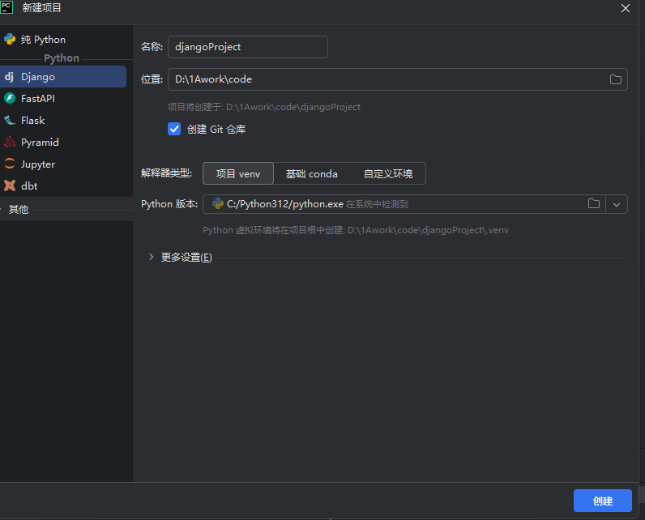
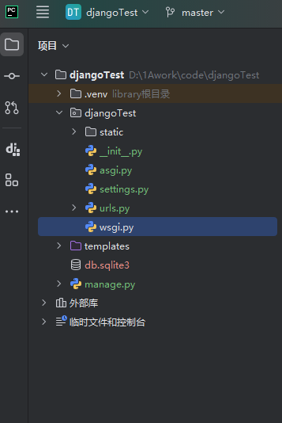
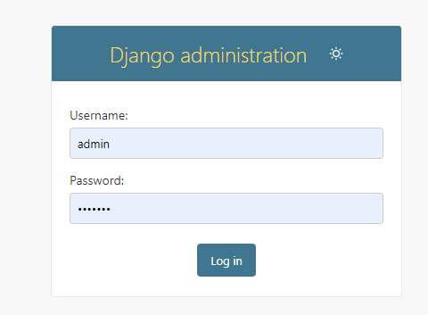
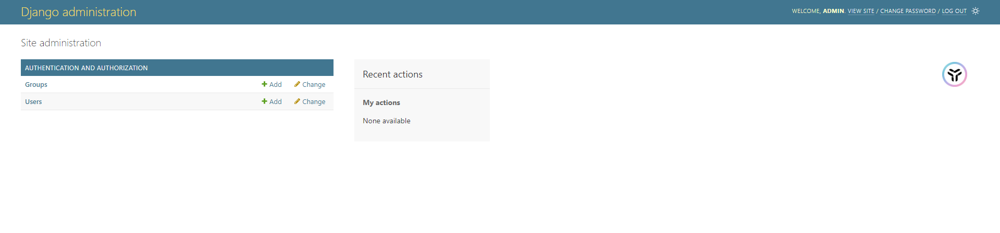

### 概述

`Django` 是后端`Python`的 Web 开发框架，主要任务是处理与服务器和数据库相关的事务，模板渲染动态生成网页内容只是其中一部分。

`Django` 内置了的模板引擎，可以将 `HTML `页面与 `Python` 代码进行分离。模板引擎提供了丰富的模板标签和过滤器，生成动态的 `HTML` 页面。

本文讲介绍`Django`开发项目的基础知识。

### 环境准备

- `python`下载和安装，从[Python 官网](https://www.python.org/downloads/)下载，下载完成后双击安装。安装完毕后在终端运行命令` python -V`,能显示版本号即可。
- 安装`Django`,在终端运行命令:`pip install django==5.1.1`，回车安装。

- 编辑器下载，访问[pycharm](https://pycharm.net.cn/installation-guide.html),下载安装即可。

### 项目介绍

### 项目初始化

- 新建项目，打开 pycharm，新建项目,选择`Django`，如下所示：
  

点击创建后，IDE 会自动生成`Django`的项目模板，如下图所示：

  

- 项目运行，点击 IDE 的运行，项目会运行在`http://localhost:8000/`，复制到浏览器端打开，如下显示：
  

### **Django Admin**介绍

**Django Admin** 是 `Django Web` 框架的一个强大功能，提供了一个易于使用的界面来管理应用程序的数据。

#### 首次访问 **Django Admin**

在项目初始化时，会生成一个`urls.py`文件，如下所示：

```py
from django.contrib import admin
from django.urls import path
from django.shortcuts import HttpResponse
from django.shortcuts import render

urlpatterns = [
    path('admin/', admin.site.urls), //定义admin路由
]
```

在浏览器访问:`http://localhost:8000/admin`，会出现如下界面：



此时是无法进行登录的，因为数据库表格还未创建。

#### 迁移数据库、创建用户

在访问**Django Admin**前，需要进行数据库的迁移和超级用户的创建，因为**Django Admin**是内置的，所以需要运行一些命令

- **迁移数据库**

```py
python manage.py makemigrations
python manage.py migrate

```

- **创建超级用户**

```py
python manage.py createsuperuser
```

创建超级用户时，会要求输入账户和密码以及邮箱。


#### 访问 **Django Admin**

在浏览器再次访问`http://localhost:8000/admin`登录,登录成功后，界面如下：




至此，就可以着手`Django Web`的具体开发工作。