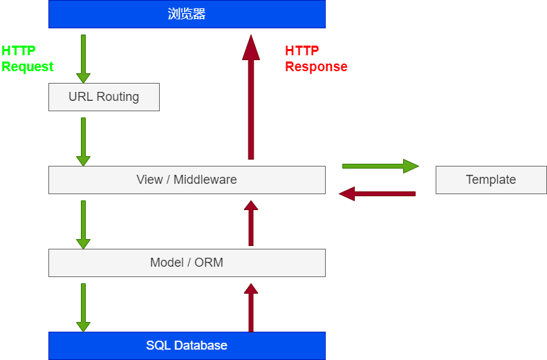

### Django Web 介绍

`Django Web`是一个`Pyhton`高级 Web 框架，实际上 `Django` 也可以做到前后端分离，即主要作为后端框架使用，不用模板渲染也是可行的。

`Django Web` 应用的运行流程，如下图所示：



此外，`Django Web` 在开发环境可以通过自带的服务器进行本地调试。但是该服务器不适用于生产环境，需要选择其它的 Web 服务器，如：

● **Gunicorn**：一个轻量级的 **WSGI HTTP** 服务器。
● **uWSGI**：功能强大的 **WSGI** 服务器，适合高负载应用。
● **Daphne**：用于支持 `WebSocket` 的应用

### Django Web 前后端交互

Django Web 的模板渲染在生成页面时，页面上的内容是静态的，如果涉及到用户交互，比如表单数据的保存以及表格搜索排序会涉及到前后端交互。在模板文件就中需要用到 js 去发送请求，这和一般前端页面的 api 操作别无二致。

#### 原生 Django Web 中实现定义

Django Web 应用中，模板和 api 接口的定义一般都位于 urls.py，通过 path 去匹配路由：

- api 接口路由定义

```py
"""
urls.py
"""
from django.urls import path
from dvadmin.system.views.user import UserViewSet # UserViewSet 是 dvadmin/system/views/user.py 中定义的 class 类，用于后端处理请求
urlpatterns = [
path('user/export/', UserViewSet.as_view({'post': 'export_data', })),
]
```

- 模板路由定义

```py
"""
urls.py
"""
from django.urls import path
from django.shortcuts import render

def web_view(request): # 视图层，可以单独在 views/[视图名称].py 中定义
const context={
message: "Hello World"
}
return render(request, 'web/index.html', context) # render 的第二个参数可以静态文件或者 html 模板的路径，context 为模板渲染时用到的数据

urlpatterns = [
path('web/', web_view, name='web_view'),
]
```

#### Django REST Framework 中实现接口定义

**Django REST Framework**（即 DRF）是一个 Django 的扩展库，用于构建 Web APIs。它为 Django 提供了一系列工具和功能，使得开发 RESTful API 更加高效和便捷。

主要特点如下：

1. **序列化**：DRF 提供了强大的序列化工具，可以轻松地将复杂数据类型（如 Django 模型实例）转换为 JSON 或其他内容类型。

2. **视图集**：DRF 提供了视图集和路由功能，可以简化 API 视图的创建和管理。

3. **认证和权限**：DRF 内置多种认证机制（如 `Token`、`Session` 等）和权限控制功能，方便管理用户访问。

4. **浏览器可浏览的 API**：`DRF` 自动生成一个友好的 API 浏览器，方便开发和测试 API。

通过 DRF 定义接口地址，如下：

```py
from django.urls import path
from rest_framework import routers
from dvadmin.system.views.menu import MenuViewSet # 同上面的 UserViewSet 类一样，实现接口的类

system_url = routers.SimpleRouter() #路由器类，用于自动生成 URL 路径。它会根据你注册的视图集自动创建标准的 RESTful API 路由。
system_url.register(r'menu', MenuViewSet) #注册路由

urlpatterns += system_url.urls
```
