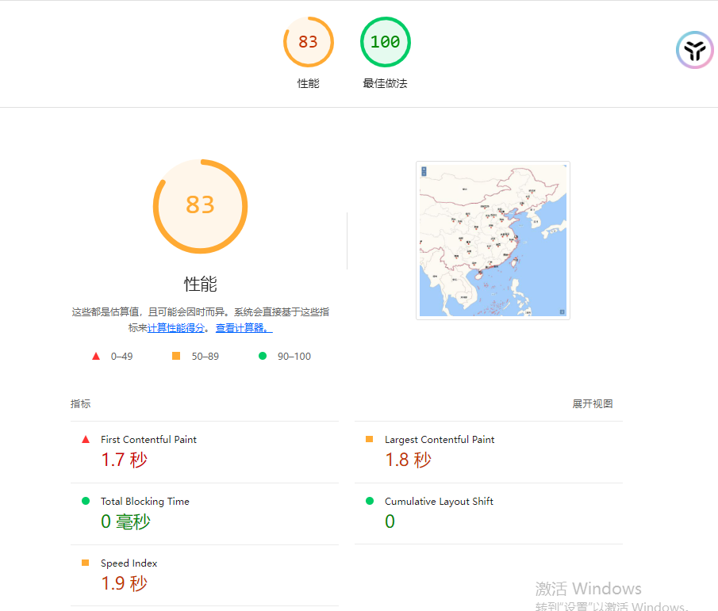
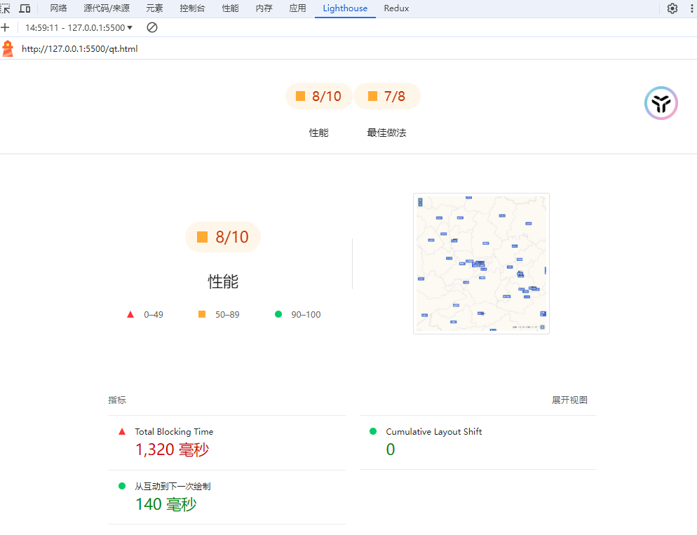
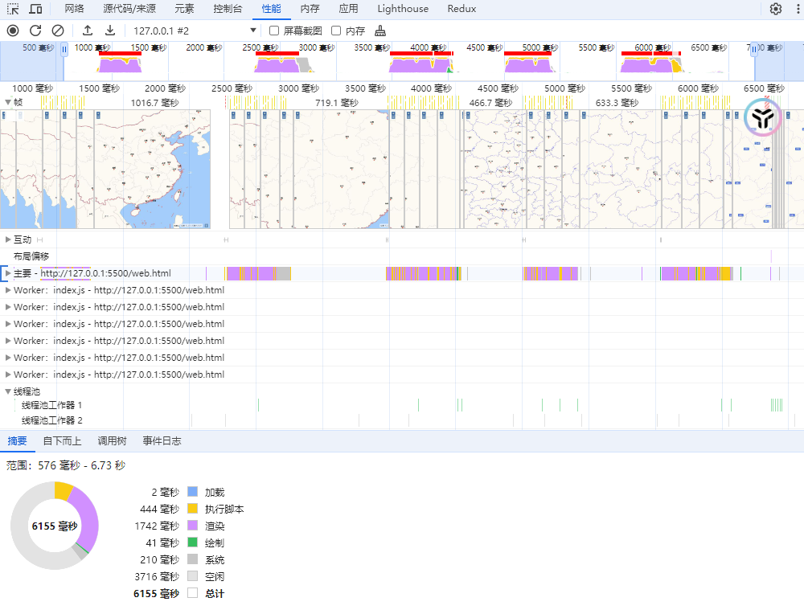

### 概述

在[`Web Worker` 多线程编程](https://jinuss.github.io/blog/pages/847s81edhsbi/)一文中介绍了`Web Worker`的编程思想,碰巧最近工作中某个工程需要加载外部文件，最大的文件大小达到**30MB**，`Web Worker`无疑是不错的选择。

### 编程实现

- **不用 Web Worker**
  加载外部文件使用原生的`fetch`方法读取文件，其核心代码如下：

  ```js
  function loadlandsBound() {
    fetch("./geojson/lands.json")
      .then((response) => response.json())
      .then((data) => {
        /** 业务逻辑处理 */
      })
      .catch((error) => console.error("Error loading GeoJSON:", error));
  }
  ```

  如果需要加载多个文件，可能就需要封装多个函数，调用`fetch`方法去请求文件。

- **使用 Web Worker**
  使用`Web Worker`编程，实现就较为复杂。涉及到多线程之间的数据交互。
  `worker.js`实现如下：

  ```js
  self.onmessage = async function (evt) {
    const { type, url } = evt.data;
    if (type == "load") {
      try {
        const response = await fetch(url);
        if (!response.ok) {
          throw new Error(`加载${url}失败`);
        }

        const reader = response.body.getReader();

        let flag = false;
        while (!flag) {
          const { done, value } = await reader.read();
          flag = done;
          if (!done) {
            //没有读取完，就需要发送数据到主线程
            self.postMessage(value, [value.buffer]);
          }
        }
        self.postMessage({ state: true, data: [] });
      } catch (error) {
        console.error("Fetch error:", error);
        self.postMessage({ error: error.message });
      }
    }
  };
  ```

  上面代码实现了`Worker`的监听，接受一个文件地址`url`和类型`type`。同样地通过`fetch`方法去读取文件。之所以采用读取文件流并传递`arrayBuffer`，是兼容批量数据，因为`Web Worker`的`postMessage`方法参数传值是会拷贝对象，如果之间传递普通`json`对象，会比传递`arrayBuffer`耗时。

此外，还需要在主线程去定义一个`Worker`，接收`Worker`线程中发送的数据。其实现如下：

```js
function loadJSONByWorker({ url, cb }) {
  // cb为回调函数，处理文件
  const worker = new Worker("./js/web/worker/index.js");
  worker.postMessage({ type: "load", url });
  let receivedChunks = [];
  worker.onmessage = function (event) {
    if (event.data.error) {
      console.error("Worker error:", event.data.error);
    } else if (event.data.state) {
      let resBlob = new Blob(receivedChunks.flat());
      let reader = new FileReader();
      reader.readAsText(resBlob, "utf-8");
      reader.onload = () => {
        cb(JSON.parse(reader.result));
      };
    } else {
      receivedChunks.push(event.data); // 存储接收到的块
    }
  };
}
```

`loadJSONByWorker`方法主要就是定义 worker，传递参数，然后监听`Worker`线程的消息。当`Worker`线程`arrayBuffer`数据发送完后，会告诉主线程数据发送完成，主线程就会将`arrayBuffer`数据包装成`Blob`对象，然后通过`FileReader`的实例去读取`Blob`实例对象转换成文本字符串，最后调用`JSON.parse`转化为`JSON`对象。

### 性能对比

通过 Chrome 浏览器开发工具自带的 Lighthouse 和 performance 可以测试网页的性能表现。上述两种加载文件的方式，其数据对比如下

#### **Lighthouse**

**导航模式**
测试类别：性能、最佳做法

- 不使用`Web Worker`
  

- 使用`Web Worker`
  

**时间跨度**

测试类别：性能、最佳做法

- 不使用`Web Worker`
  

- 使用`Web Worker`
  

#### **Performance**

- 不使用`Web Worker`
  

- 使用`Web Worker`
  

#### 结论

从上述对比可以得出，`Web Worker`多线程编程总体上提高了网页的性能指标。
