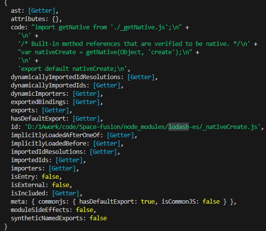

### 概述

`vite` 默认的打包输出目录是`dist/assets/`目录，所有的`js`、`css`、`img`等资源都会默认输出到该目录下，文件名默认是`[name].[hash:8].[filename]`。

对于小型项目来说，采用默认配置无伤大雅，但是如果工程比较大，就可以考虑将打包后的文件分类存放在不同目录下。

### 具体配置

`vite`是基于`Rollup`和`ES Build`的构建工具或者是称为脚手架，而构建那部分就是基于`Rollup`实现的。

在配置文件`vite.config.js`中存在`rollupOptions`属性，其中可以配置`Rollup`相关属性配置。

#### 实践

**`vite.config.js`配置**:

```js
export default defineConfig({
  rollupOptions: {
    output: {
      entryFileNames: "build/js/[name].[hash:6].js",
      chunkFileNames: "build/js/vendor/[name].[hash:8].js",
      manualChunks(id) {
        console.log("🚀 ~ manualChunks ~ id:", id);
        if (id.includes("node_modules")) {
          return "vendor";
        }
      },
      assetFileNames: (assetInfo) => {
        if (assetInfo.name.endsWith(".css")) {
          return "build/css/[name].[hash][extname]";
        }
        if (/\.(png|jpe?g|gif|svg|webp|ico)$/.test(assetInfo.name)) {
          return "build/img/[name].[hash][extname]";
        }
        return "build/assets/[name].[hash][extname]";
      },
    },
  },
});
```

**打包**

终端运行打包命令：`yarn build`

**生成目录**


**生成 index.html** 如下：

```html
<!DOCTYPE html>
<html lang="en">
  <head>
    <meta charset="UTF-8" />
    <link rel="icon" type="image/svg+xml" href="./logo.png" />
    <meta name="viewport" content="width=device-width, initial-scale=1.0" />
    <title>XXXXX</title>
    <script type="module" crossorigin src="./build/js/index.kwbZaR.js"></script>
    <link
      rel="modulepreload"
      crossorigin
      href="./build/js/vendor/vendor.UUNgzk71.js"
    />
    <link rel="stylesheet" crossorigin href="./build/css/vendor.2sixWoO4.css" />
    <link rel="stylesheet" crossorigin href="./build/css/index.SMKkoL_O.css" />
  </head>
  <body>
    <div id="app"></div>
  </body>
</html>
```

#### 分析

#### 配置分析

##### `entryFileNames`

该选项用于指定 chunks 的入口文件模式，其值也可以是一个函数，对每个入口 chunk 调用以返回匹配模式。

**函数模式**
参数为函数的情况下，接受一个参数`chunkInfo`，是一个`PreRenderedChunk`类

```tsx
interface PreRenderedChunk {
  exports: string[];
  facadeModuleId: string | null;
  isDynamicEntry: boolean;
  isEntry: boolean;
  isImplicitEntry: boolean;
  moduleIds: string[];
  name: string;
  type: "chunk";
}
```

##### `chunkFileNames`

该选项用于对代码分割中产生的 chunk 自定义命名，其值也可以是一个函数，对每个 chunk 调用以返回匹配模式。

函数模式下，接受的参数同上。

##### `manualchunks`

该选项允许创建自定义的公共 chunk，该值可以是一个对象或者函数，如果是函数，则其参数为`(id,{getModuleInfo,getModuleIds})`:

- `id`：工程依赖模块的绝对路径，配置中就是判断路径是否是在`node_modules`中

- `getModuleInfo()`: 可以通过`getModuleInfo(moduleId)`获取模块信息，返回一个`ModuleInfo`对象

  `ModuleInfo`对象如下：

   

- `getModuleIds()`：可访问当前图中的所有模块 ID (每一个模块的绝对路径)。

##### `assetFileNames`

该选项的值可以是一个匹配模式的字符串，也可以是一个函数。

**字符串匹配模式**

默认值:`assets/[name]-[hash][extname]`。

- `name`：静态资源的名称，不包含扩展名。
- `hash`：基于内容的哈希值，默认长度是**8**。
- `extname`：包含点的文件扩展名
- `ext`：不包含点的文件扩展名

**函数**
函数的参数`assetInfo`是一个`PreRenderedAsset`类

```tsx
interface PreRenderedAsset {
  names: string[];
  originalFileNames: string[];
  source: string | Uint8Array;
  type: "asset";
}
```

#### index.html 文件分析

#### `crossorigin`

vite 会给引用打包文件的`link`和`script`标签加上`crossorigin`属性，该属性用于控制浏览器在加载跨源资源时的行为，帮助浏览器安全地处理跨域请求。

`crossorigin` 属性可以有以下几个值：

-`anonymous`：表示请求不应带上凭据（如 cookies、HTTP 认证或客户端 SSL 证书）。这通常用于允许跨源请求并确保请求不会受到身份验证的影响。

-`use-credentials`：表示请求应当带上凭据。这适用于需要身份验证的资源，但只有在资源的服务器上也允许此类请求的情况下才会有效。

-`""`（空字符串）：这与 `anonymous` 是等效的，通常不需要设置.

#### `modulepreload`

`modulepreload`是`link` 标签的 `rel` 属性值，用于预加载 JavaScript 模块。这可以确保在执行某个模块之前，该模块已经被下载，从而提高页面的加载速度和响应性。
