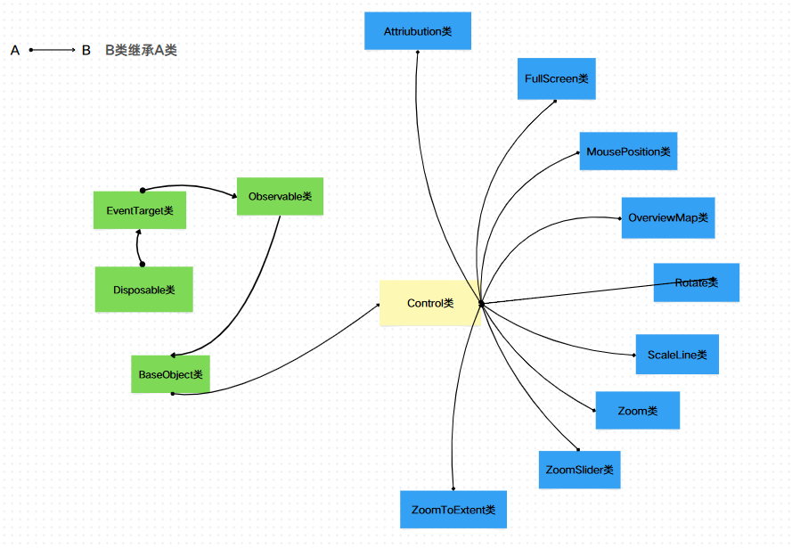

## 概述

Openlayers 中内置了**9**类控件，这**9**类控件都是基于`Control`类，而`Control`类则是继承于`BaseObject`类，如下图所示：



如上，这**9**类控件分别是：

- **`Attribution`**：属性控件
- **`FullScreen`**:全屏控件
- **`MousePosition`**：鼠标位置控件
- **`OverviewMap`**:鹰眼控件
- **`Rotate`**：旋转控件
- **`ScaleLine`**：比例尺控件
- **`Zoom`**:缩放控件
- **`ZoomSlider`**：滑动缩放控件
- **`ZoomToExtent`**：缩放到指定视图范围控件

本文主要介绍控件的基类`Control`类。

## 源码剖析

`Control`类的实现如下：

```js
class Control extends BaseObject {
  constructor(options) {
    super();
    const element = options.element;
    if (element && !options.target && !element.style.pointerEvents) {
      element.style.pointerEvents = "auto";
    }

    this.element = element ? element : null;

    this.target_ = null;
    this.map_ = null;

    this.listenerKeys = [];

    if (options.render) {
      this.render = options.render;
    }

    if (options.target) {
      this.setTarget(options.target);
    }
  }
  disposeInternal() {
    this.element?.remove();
    super.disposeInternal();
  }
  getMap() {
    return this.map_;
  }
  setMap(map) {
    if (this.map_) {
      this.element?.remove();
    }
    for (let i = 0, ii = this.listenerKeys.length; i < ii; ++i) {
      unlistenByKey(this.listenerKeys[i]);
    }
    this.listenerKeys.length = 0;
    this.map_ = map;
    if (map) {
      const target = this.target_ ?? map.getOverlayContainerStopEvent();
      target.appendChild(this.element);
      if (this.render !== VOID) {
        this.listenerKeys.push(
          listen(map, MapEventType.POSTRENDER, this.render, this)
        );
      }
      map.render();
    }
  }

  render(mapEvent) {}
  setTarget(target) {
    this.target_ =
      typeof target === "string" ? document.getElementById(target) : target;
  }
}
```

### `Control`类的构造函数

`Control`类的构造函数接受一个参数对象`options`,先是判断`options.element`、`!element.style.pointerEvents`以及`!options.target`是否存在，若为`true`，则修改`element`元素的样式，`element`对应的就是控件的`HTML Element`;然后初始化`this.element`,若`options.element`不存在，则`this.element`为`null`，反之为`options.element`;初始化`this.target_`和`this.map_`为`null`;初始化`this.listenerKeys`为`[]`;最后判断`options.render`是否存在，若存在则覆盖`this.render`方法；判断`options.target`是否存在，若存在，则调用`this.setTarget`方法。

### `Control`类的主要方法

`Control`类作为控件基类，它定义的方法很少，主要有如下几个：

- `setTarget`：接受一个参数`target`，若`target`是一个字符串，则调用`document.getElementById`获取`DOM`节点，否则直接赋值，默认情况下，控件是会添加到`overlay container`中，这个方法会改变这个一默认行为

- `getMap`: 获取`this.map_`
- `setMap`:`Control`类的核心方法，接受一个参数`map`对象，若`this.map_`存在该控件元素，则移除元素；并且循环遍历`this.listenerKeys`移除注册的事件监听，并且清空`this.listenerKeys`，设置`this.map_`的值；然后判断参数`map`是否存在，若存在，则重新添加控件元素到`overlay container`中，然后判断`this.render`是否是空方法，若不为空方法，则调用`listen`方法注册`postrender`类型的事件监听，`this.render`方法即为注册的回调函数，本质上它是子类中定义的一个方法；最后调用`map.render`方法。
- `render`方法：空函数，会被`Control`的子类覆盖
- `disposeInternal`方法：清除方法，会移除控件元素，调用父类的`disposeInternal`方法移除监听

## 总结

本文主要介绍了 Openlayers 中的控件类型分类以及控件基类`Control`类的实现。
