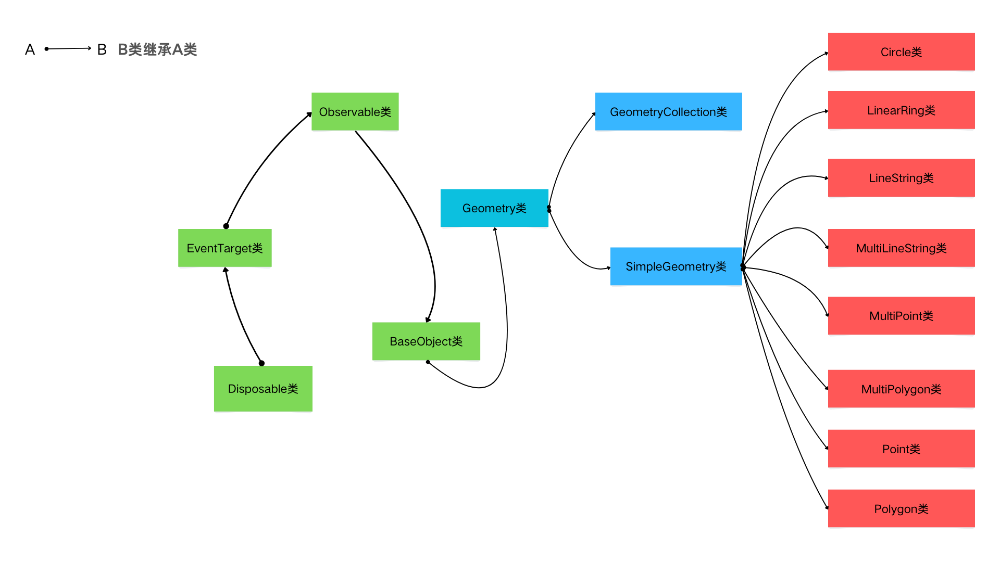

## 概述

在 Openlayers 中,或者说在二维地图中,各个要素的组成无非就是由点线面这些基础图形组合而成.在现实世界中也是如此.在 Openlayers 中,地图要素的表示基础,我们称之为几何图形,也叫矢量几何图形.这些几何图形有一个共同的基类,名为`Geometry`,而`Geometry`类又继承于`BaseObject`类.关于`BaseObject`类,可以参考这篇文章[BaseObject类](https://jinuss.github.io/blog/pages/f0659f/)

Openlayers 中`Geom`几何图形相关类的继承关系如下:

由上可知`Geom`几何图形有以下几种:

- `Circle`类:圆
- `LinearRing`类:线性环
- `LineString`类:线几何
- `MultiLineString`类:多线段几何
- `Point`类:点
- `MultiPoint`类:多点
- `Polygon`类:多边形
- `MultiPolygon`类:多个多边形几何
