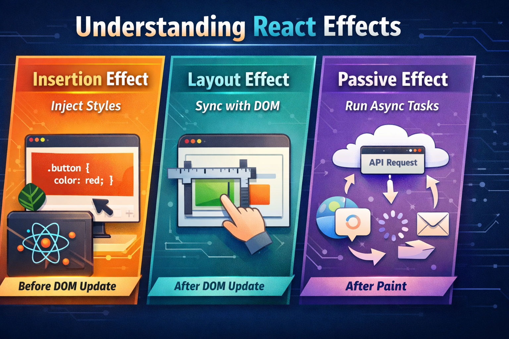
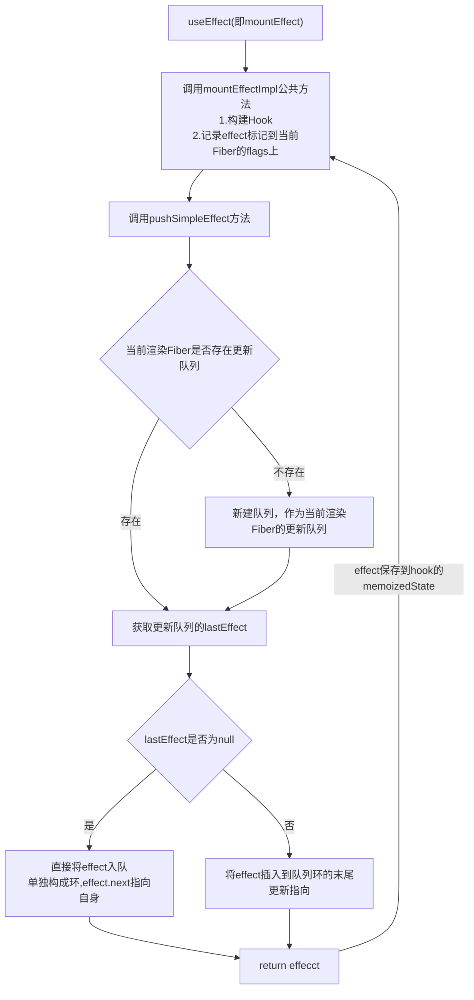
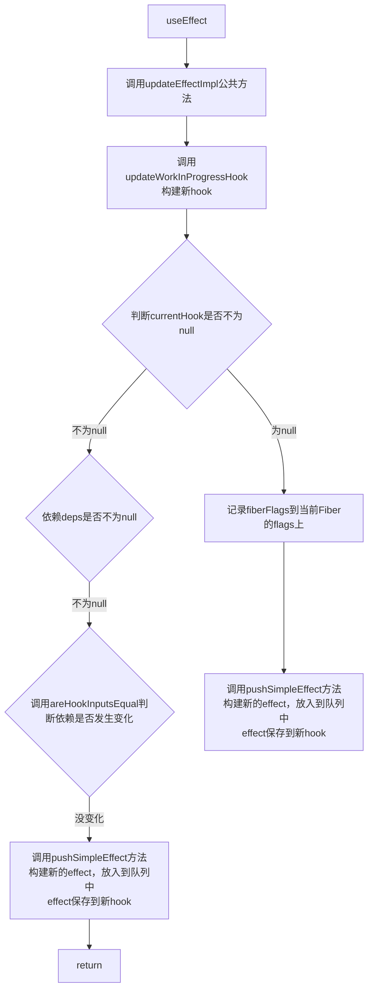
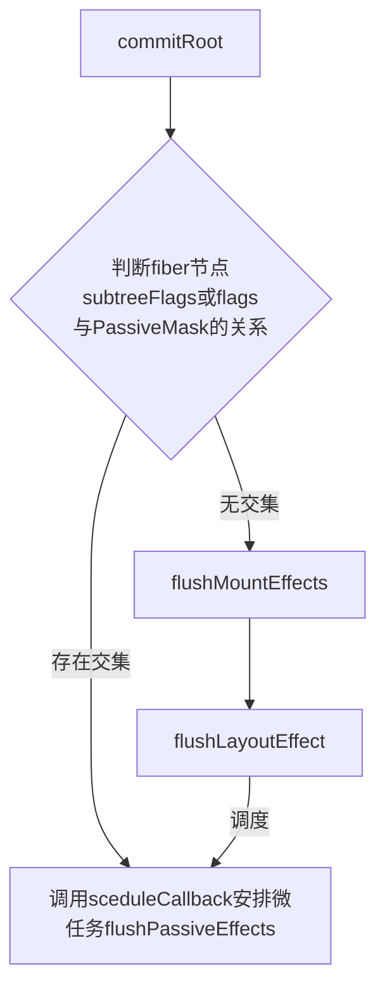
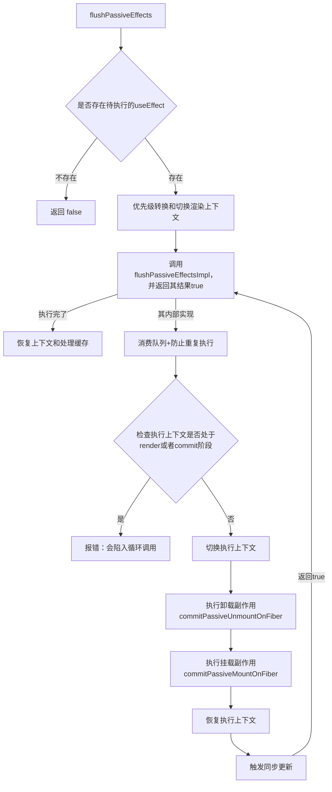
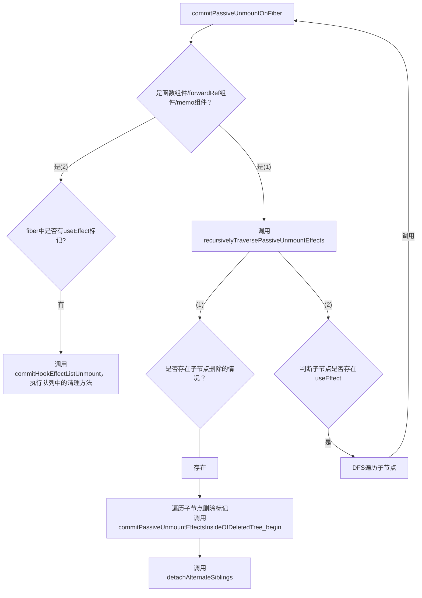
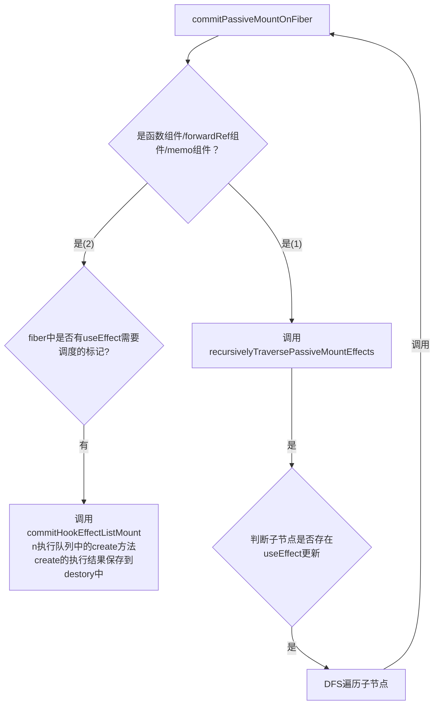

## 概述

React将副作用分为三层：**`Insertion → Layout → Passive`**

这三个副作用的作用如下：
| 阶段            | Hook                 | 解决的核心问题                 |用途|
| ------------- | -------------------- | ------------------------- |---|
| **Insertion** | `useInsertionEffect` | **样式必须在 DOM 读取前就存在（防闪烁）** |1.css-in-JS 2.动态样式注入|
| **Layout**    | `useLayoutEffect`    | **需要同步读取/修改 DOM 布局**   |   1.读取布局（宽高、位置）2.同步调整DOM（scroll，动画起点）|
| **Passive**   | `useEffect`          | **非阻塞副作用（请求、订阅等）**        |不影响UI布局，若异步请求，订阅事件、日志上报|


## 流程分析


### 一、`EffectMount`过程

`Effect Mount`是指函数组件在首次渲染挂载时，`effect`副作用首次会被调用执行。这发生在组件渲染的*beginWork*阶段，会先切换hooks分发器*dispatcher*。以`useEffect`hooks为例，在函数组件首次执行时，`useEffect`会在函数内部调用，此时`useEffect`本质上就是调用执行`mountEffect`函数。这一过程主要就是收集`useEffect`的标记保存到函数组件对应的`fiber.flags`中，以便在后续*commit*阶段中调用`useEffect`的`create`即第一个参数（函数）。

#### 1.1`EffectMount`架构图



#### 1.2`EffectMount`阶段相关方法的源码解析

##### 1.2.1`mountEffect`方法

`useEffect`在`mount`时的入口函数。接受两个参数：`create`方法和 `deps`依赖数组

```javascript
function mountEffect(create, deps) {
    mountEffectImpl(
        PassiveEffect | PassiveStaticEffect, // 用于Fiber上的标记
        HookPassive,// 用于在UpdateQueue链表中标识effect的类别
        create,// 回调函数
        deps) // 依赖数组
}
```

##### 1.2.2`mountEffectImpl`方法

`mountEffectImpl`是一个副作用的公共方法，`useEffect`、`useLayout`和`useInsertionEffect`都会调用，只是传参不同。

`mountEffectImpl`方法内部会调用`mountWorkInProgressHook`构建*hook*，调用`pushSimpleEffect`方法构建`effect`，并且会将`fiberFlags`标记保存到渲染`fiber`的`flags`上，以及`effect`绑定到`fiber`的`memoizedState`的单向链表上。

```javascript
function mountEffectImpl(fiberFlags, hooksFlags, create, deps) {
    // 构建hook
    const hook = mountWorkInProgressHook();
    const nextDeps = deps === undefined ? null : deps;
    currentlyRenderingFiber.flags |= fiberFlags;
    const instance = { destroy: undefined };
    // effect ->fiber.memoizedState链表上
    hook.memoizedState = pushSimpleEffect(
        HookHasEffect | hooksFlag,
        instance,
        create,
        nextDeps,
    )
}
```

##### 1.2.3`pushSimpleEffect`方法

`pushSimpleEffect`同样是一个公共的方法，主要就是构建`effect`，并将其推入到`fiber`的`updateQueue`环状队列的末尾，最后返回`effect`。

`pushSimpleEffect`方法在`mount`和`update`阶段中都会调用。

```javascript
function pushSimpleEffect(tag, inst, create, deps) {
   // 构建effect数据结构
    const effect = {
        tag, // 副作用标记
        create, // 回调方法
        deps, // 依赖数组
        inst, // 保存副作用的清理函数 {destory}
        next: null // 指向下一个effect
    }
    // 获取当前fiber的updateQueue更新队列
    let componentUpdateQueue = currentlyRenderingFiber.updateQueue;
    // 若更新队列为null
    if (componentUpdateQueue === null) {
        // 创建更新队列
        componentUpdateQueue = {
            lastEffect: null,//最后一个effect
            events: null,
            stores: null,
            memoCache: null,
        };
        // 将更新队列保存到fiber的updateQueue
        currentlyRenderingFiber.updateQueue = componentUpdateQueue;
    }
    // 获取更新队列的末尾effect
    const lastEffect = componentUpdateQueue.lastEffect;
    // 若lastEffect为null
    if (lastEffect === null) {
        // 将effect赋值到更新队列的lastEffect，并且effect.next指向自身，构成一个环
        componentUpdateQueue.lastEffect = effect.next = effect;
    } else {
       // 若lastEffect不为null，则说明前面就存在副作用，需要将effect插入到环队列的末尾
       
       // 保存第一个effect，lastEffect.next始终指向第一个节点
        const firstEffect = lastEffect.next;
        // 将lastEffect.next指向effect
        lastEffect.next = effect;
        // 将effect.next指向第一个effect
        effect.next = firstEffect;
        // 将更新队列的lastEffect指向effect
        componentUpdateQueue.lastEffect = effect;
    }

    // 返回 effect
    return effect
}
```

#### 1.3 挂载`useEffect`/`useLayoutEffect`/`useInsertionEffect`区别

`useLayoutEffect`和`useInsertionEffect`与`useEffect`的区别就是入口函数不同，它们对应的`tag`标记不同，以及在`fiber`上的标记也不同;`tag`标记用于区分`updateQueue`上的`effect`类别，方便后续从`updateQueue`上读取正确的`effect`；而在`fiber.flag`上的不同，可以用于在最后的`commitRoot`阶段实现不同类型的副作用调用不同的方法。以下是`mout`阶段它们的区别

| effect种类     | `useEffect`                                                        | `useLayoutEffect`          | `useInsertionEffect`           |
| ------------ | ------------------------------------------------------------------ | -------------------------- | ------------------------------ |
| 入口函数 | `mountEffect`                                                      | `mountLayoutEffect`        | `mountInsertionEffect`         |
| `tag`标记      | `HasEffect与Passive`                                        | `HasEffect与Layout` | `HasEffect与 Insertion` |
| 在`fiber`上标记  | `fiber.flag与PassiveEffect 与 PassiveStaticEffect`  | `fiber.flag与UpdateEffect与 LayoutStaticEffect`| `fiber.flag与UpdateEffect`  |

### 二、`EffectUpdate`过程

`Effect Update`表示函数组件在更新时，`effect`也会检测更新，同样地，它也发生在组件渲染的 *beginWork*阶段。函数组件在执行更新前，hooks的分发器*dispatcher*会切换，此时的`useEffect`就不再是`mount`阶段的`mountEffect`，而是`updateEffect`。

#### 2.1.`EffectUpdate`架构图



#### 2.2`Effect Update`阶段相关方法的源码解析

##### 2.2.1`updateEffect`方法

`useEffect`在更新时实际执行的是`updateEffect`方法,是一个入口函数，其内部就是调用`updateEffectImpl`方法。

```javascript
function updateEffect(create,deps){
    // Passive和HookPassive都是useEffect在更新阶段的标记
    updateEffectImpl(Passive,HookPassive,create,deps);
}
```

##### 2.2.2`updateEffectImpl`方法

`updateEffectImpl`方法会被`useEffect`/`useLayoutEffect`/`useInsertionEffect`副作用在更新阶段的入口函数调用，只是参数不同。

`updateEffectImpl`方法内部会判断副作用的依赖是否发生改变，若发生了改变，则需要在`fiber`上打上标记。

```javascript
function updateEffectImpl(fiberFlags,hookFlags,create,deps){
    // 调用updateWorkInProgressHook获取当前的新hook
    const hook = updateWorkInProgressHook();
    const nexDeps = deps === undefined ? null : deps;
    // 复用effct的inst
    const effect = hook.memoizedState;
    const inst= effect.inst;
    // 若存在旧hook
    if(currentHook !== null){
      // 新依赖不为null
      if(nextDeps!== null){
        // 从旧 hook上获取旧的依赖prevDeps
        const prevEffect = currentHook.meoizedState;
        const prevDeps = prevEffect.deps;
        
        // 调用areHookInputsEqual判断依赖是否发生变化
        if(areHookInputsEqual(nextDeps,prevDeps)){
         // 若无变化，则调用pushSimpleEffect方法创建新effect，插入到当前Fiber的updateQueue末尾
         // 将新effect 保存到新hook的memoizedState上
          hook.memoizedState = pushSimpleEffect(hookFlags,inst,create,nextDeps);
          // 直接返回，后续就在commit阶段就不会触发
          return;
        }
      }         
    }
    
    // 上述任一条件不满足：不存在旧 hook，新的nextDeps为null或者依赖发生了变化，则说明需要向Fiber.flags上标记
    currentlyRenderingFiber.flags |= fiberFlags;
    // 调用pushSimpleEffect创建新effect，和上面不同的是标记不同，这里标记加上了HookHasEffect，表示在commitRoot阶段需要执行create方法
    hook.memoizedState = pushSimpleEffect(HookHasEffect|hookFlags,inst,create,nextDeps);
}
```

#### 2.3 `useEffect`/`useLayoutEffect`/`useInsertionEffect` 

在函数组件更新时，这三者也是同挂载阶段一样，入口函数不同，标记不同;只有当依赖`deps`发生改变时，才会在`fiber`上更新`flag`,但是无论是否需要更新，都需要生成新的`effect`以保持`updateQueue`的顺序连贯性。以下是它们的区别：

| 更新阶段 | `useEffect`| `useLayoutEffect` | `useInsertionEffect` |
| --- | --- | --- | --- |
| 不需要更新的`tag` | `Passive` | `Layout` | `Insertion` |
| 需要更新时的`tag` | `HookHasEffect与Passive` | `HookHasEffect与Layout` | `HookHasEffect与Insertion` |
| `fiber.flag` | `Passive` | `UpdateEffect` | `UpdateEffect` |


### 三、`EffectRun`过程

`useEffect`副作用的执行发生在*commitRoot* 阶段，其相关的流程图如下：



`PassiveMask`掩码与`Passive`的关系如下：

```javascript
const PassiveMask = Passive | ChildDeletion
```

即在*commitRoot* 阶段，若`fiber`节点中的标记`flags`或者是子节点的标记`subFlags`中记录了存在`useEffect`（`Passive`标记）或者子节点删除(`ChildDeletion`标记)，则通过调度器`scheduler`的`scheduleCallback`方法进行调度**异步执行**`flushPassiveEffects`,优先级为`NormalSchedulerPriority`，`flushPassiveEffects`方法就是执行`useEffect`副作用；后续就是同步调用`flushLayoutEffect`方法，执行`useLayouteffect`副作用；这点正好可以解释在同一个函数组件内，`useLayoutEffect`比`useEffect`先执行。

#### 3.1.`useEffect`调度

##### 3.1.1 `flushPassiveEffects`方法

*   `flushPassiveEffect`流程图



```javascript
function flushPassiveEffects() {
  // pengdingEffectsstatus表示当前effects的状态
  // 若当前没有待执行的useEffect，则直接返回
  if (pendingEffectsStatus !== PENDING_PASSIVE_PHASE) {
    return false;
  }
  // 取出当前root和useEffect的剩余优先级 
  const root = pendingEffectsRoot;
  const remainingLanes = pendingEffectsRemainingLanes;
  // 清空effect优先级
  pendingEffectsRemainingLanes = NoLanes;
  // 将effect对应的lanes转为调度的优先级
  const renderPriority = lanesToEventPriority(pendingEffectsLanes);
  // 保存当前调度的上下文
  const prevTransition = ReactSharedInternals.T;
  const previousPriority = ReactSharedInternals.p;
  try {
    // 设置执行effect的上下文，将优先级提升到至少DefaultLane
    // 清空transition （effect不属于transition）
    ReactSharedInternals.p = DefaultLane > renderPriority ? DefaultLane : renderPriority;
    ReactSharedInternals.T = null;
    // 实际执行useEffect
    return flushPassiveEffectsImpl();
  } finally {
    // 恢复上下文
    ReactSharedInternals.p = previousPriority;
    ReactSharedInternals.T = prevTransition;
    // 释放缓存
    releaseRootPooledCache(root, remainingLanes);
  }
}

function flushPassiveEffectsImpl() {
  // 清空全局状态
  // 将所有待执行effect的上下文全部取出，然后立即清空全局变量
  // 这是典型的“消费队列+防止重复执行”
  const transitions = pendingPassiveTransitions;
  pendingPassiveTransitions = null;
  const root = pendingEffectsRoot;
  const lanes = pendingEffectsLanes;
  pendingEffectsStatus = NO_PENDING_EFFECTS;
  pendingEffectsRoot = null;
  pendingFinishedWork = null;
  pendingEffectsLanes = NoLanes;

  // 检查当前执行的上下文是否是render或者commit阶段，若是，则报错，
  // 因为useEffect中可能调用setState，导致无限渲染
  if ((executionContext & (RenderContext | CommitContext)) !== NoContext) {
    throw new Error('Cannot flush passive effects while already rendering.');
  }
  
  // 切换上下文
  const prevExecutionContext = executionContext;
  executionContext |= CommitContext;
  // 执行卸载副作用
  commitPassiveUnmountOnFiber(root.current);
  // 执行挂载副作用
  commitPassiveMountEffects(
    root,
    root.current,
    lanes,
    transitions,
    pendingEffectsRenderEndTime,
  );
  //恢复上下文 
  executionContext = prevExecutionContext;
  
  //触发同步更新
  flushSyncWorkOnAllRoots();
  
  //返回true
  return true;
}
```

由上可知，在更新阶段，先卸载副作用（执行上一次的清理函数`destroy`），再挂载副作用(执行此次的`create`方法)

##### 3.1.2 卸载副作用

流程图如下



###### 3.1.2.1 `commitPassiveUnmountOnFiber`方法

`commitPassiveUnmountOnFiber`方法会根据`fiber`的`tag`类型进行操作，当`fiber`是函数组件/`ForwardRef`组件/`SimpleMemoComponent`组件之一时，则调用`recursivelyTraversePassiveUnmountEffects`先进行子节点的副作用挂载，再进行自身副作用的执行，即*先子后父*。

```javascript
function commitPassiveUnmountOnFiber(finishedWork){
  switch (finishedWork.tag) {
    case FunctionComponent:
    case ForwardRef:
    case SimpleMemoComponent: {
      recursivelyTraversePassiveUnmountEffects(finishedWork);
      // 判断当前fiber上是否有useEffect，若有，则执行commitHookEffectListUnmount方法
      if (finishedWork.flags & Passive) {
        commitHookEffectListUnmount(
          HookPassive | HookHasEffect,
          finishedWork,
          finishedWork.return,
        );
      }
      break;
    }
} 
```

###### 3.1.2.2 `recursivelyTraversePassiveUnmountEffects`方法

```javascript
function recursivelyTraversePassiveUnmountEffects(parentFiber) {
  // useEffect在组件卸载时也会执行，因此先判断fiber中是否有子组件删除的标记，若有，则进行遍历，调用commitPassiveUnmountEffectsInsideOfDeletedTree_begin方法，这里不展开
  const deletions = parentFiber.deletions;
  if ((parentFiber.flags & ChildDeletion) !== NoFlags) {
    if (deletions !== null) {
      for (let i = 0; i < deletions.length; i++) {
        const childToDelete = deletions[i];
        nextEffect = childToDelete;
        commitPassiveUnmountEffectsInsideOfDeletedTree_begin(
          childToDelete,
          parentFiber,
        );
      }
    }
    detachAlternateSiblings(parentFiber);
  }

  // 判断子组件中是否存在useEffect，若有则对其进行遍历，即DFS
  if (parentFiber.subtreeFlags & PassiveMask) {
    let child = parentFiber.child;
    while (child !== null) {
      // 调用commitPassiveUnmountOnFiber，
      commitPassiveUnmountOnFiber(child);
      // 在遍历兄弟节点
      child = child.sibling;
    }
  }
}
```

###### 3.1.2.3  `commitHookEffectListUnmount`方法

`commitHookEffectListUnmount`方法是一个公共方法，本质上就是遍历`fiber.updateQueue`，执行队列中的`effect`的清理函数，具体执行`updatQueue`中的哪些`effect`，由参数`flags`决定。

```javascript
export function commitHookEffectListUnmount(
  flags,
  finishedWork,
  nearestMountedAncestor,
) {
  try {
    // 从函数队列中取出更新队列 
    const updateQueue = finishedWork.updateQueue;
    // 判断队列是否存在最后一个useEffect节点
    const lastEffect = updateQueue !== null ? updateQueue.lastEffect : null;
    // 判断最后一个节点是否存在
    if (lastEffect !== null) {
      // 通过最后一个effect，找到第一个effect
      const firstEffect = lastEffect.next;
      let effect = firstEffect;
      // 从第一个effect按顺序遍历
      do {
        // 判断传入的flags是否时effect.tag的子集
        if ((effect.tag & flags) === flags) {
          // 获取清理函数destroy
          const inst = effect.inst;
          const destroy = inst.destroy;
          // 判断destroy方法是否存在
          if (destroy !== undefined) {
          // 若存在，则先清空effect副作用中的清理函数
            inst.destroy = undefined;
            // 再执行
            destroy();
          }
        }
        // 遍历下一个effect
        effect = effect.next;
      } while (effect !== firstEffect);
    }
  } catch (error) {
    // 报错
  }
}
```

##### 3.1.3  挂载副作用

流程图如下



###### 3.1.3.1  `commitPassiveMountOnFiber`方法

挂载副作用的入口函数是`commitPassiveMountOnFiber`，它和`commitPassiveMountOnFiber`类似，也是根据`finishedRWork.tag`来决定下一步。

```javascript
function commitPassiveMountOnFiber(finishedRoot, finishedWork, committedLanes, committedTransitions) {
    const flags = finishedWork.flags;
    switch (finishedWork.tag) {
        case FunctionComponent:
        case ForwardRef:
        case SimpleMemoComponent: {
            recursivelyTraversePassiveMountEffects(
                finishedRoot,
                finishedWork,
                committedLanes,
                committedTransitions,
                endTime,
            );
            if (flags & Passive) {
                commitHookPassiveMountEffects(
                    finishedWork,
                    HookPassive | HookHasEffect,
                );
            }
        }
    }
}
```

###### 3.1.3.2 `recursivelyTraversePassiveMountEffects`方法

`recursivelyTraversePassiveMountEffects`就是判断子节点上是否存在子节点的`effect`需要调度，若是，则进行DFS遍历调用`commitPassiveMountOnFiber`方法

```javascript
function recursivelyTraversePassiveMountEffects(
    root,
    parentFiber,
    committedLanes,
    committedTransitions
) {
    if (
        parentFiber.subtreeFlags & PassiveMask
    ) {
        let child = parentFiber.child;
        while (child !== null) {
            commitPassiveMountOnFiber(
                root,
                child,
                committedLanes,
                committedTransitions,
                0,
            );
            child = child.sibling;
        }
    }
}
```

###### 3.1.3.3 `commitHookEffectListMount`方法

`commitHookEffectListMount`方法也是一个公共方法，本质上就是调度队列上的`effect`,执行满足条件的`effect`的`create`方法，并将其返回结果保存，作为下一次调度的清理函数。其实现如下：

```javascript
function commitHookEffectListMount(flags, finishedWork) {
    try {
        const updateQueue = finishedWork.updateQueue;
        const lastEffect = updateQueue !== null ? updateQueue.lastEffect : null;
        if (lastEffect !== null) {
            const firstEffect = lastEffect.next;
            let effect = firstEffect;
            do {
                if ((effect.tag & flags) === flags) {
                    let destroy;
                    const create = effect.create;
                    const inst = effect.inst;
                    destroy = create();
                    inst.destroy = destroy;
                }
                effect = effect.next;
            } while (effect !== firstEffect)
        }
    } catch () {
    // < !--报错-->
}

}
```

#### 3.2 `useLayoutEffect`调度

`useLayoutEffect`的调度会在DOM变更后，渲染前调度，其入口函数是`flushLayoutEffects`方法。


##### 3.2.1 `flushLayoutEffects`方法

`flushLayotEffect`方法和`flushPassiveEffects`方法类似，会涉及到`fiber.flag`以及`fiber.subtreeFlags`与`useLayoutEffect`的标记判断，满足条件则说明`fiber`或其子节点中存在需要执行的`useLayout`，还有上下文的切换与恢复等。其核心是调用`commitLayoutEffectOnFiber`方法。

```javascript
function flushLayoutEffects(){
 // 判断shi fou是否到了执行useLayoutEffect阶段
 if (pendingEffectsStatus !== PENDING_LAYOUT_PHASE) {
    return;
  }
  // 
  pendingEffectsStatus = NO_PENDING_EFFECTS;

  const root = pendingEffectsRoot;
  const finishedWork = pendingFinishedWork;
  const lanes = pendingEffectsLanes;

  const subtreeHasLayoutEffects =
    (finishedWork.subtreeFlags & LayoutMask) !== NoFlags;
  const rootHasLayoutEffect = (finishedWork.flags & LayoutMask) !== NoFlags;
  if (subtreeHasLayoutEffects || rootHasLayoutEffect) {
    const prevTransition = ReactSharedInternals.T;
    ReactSharedInternals.T = null;
      var previousPriority = ReactDOMSharedInternals.p;
      ReactDOMSharedInternals.p = DiscreteEventPriority;
    const prevExecutionContext = executionContext;
    executionContext |= CommitContext;
    try {
       const current=finishedWork.alternate;
     commitLayoutEffectOnFiber(root,current,finishedWork,committedLanes)
    } finally {
      executionContext = prevExecutionContext;
     ReactDOMSharedInternals.p = previousPriority
      ReactSharedInternals.T = prevTransition;
    }
  }    
}
```

##### 3.2.2 `commitLayoutEffectOnFiber`方法

`commitLayoutEffectOnFiber`方法会根据`finishedWork.tag`类型来决定下一步，和`useEffect`中也很类似，先执行子节点的`useLayoutEffect`（若满足条件），再执行父节点调用`commitHookLayoutEffects`方法。而`commitHookLayoutEffects`方法实质上就是调用`commitHookLayoutEffects`方法，该方法在`useEffect`调度中也讲过。

```js
function commitLayoutEffectOnFiber(finishedRoot, current, finishedWork, committedLanes) {
    const flags = finishedWork.flags;
    switch (finishedWork.tag) {
        case FunctionComponent:
        case ForwardRef:
        case SimpleMemoComponent: {
            recursivelyTraverseLayoutEffects(
                finishedRoot,
                finishedWork,
                committedLanes,
            );
            if (flags & Update) {
                commitHookLayoutEffects(finishedWork, HookLayout | HookHasEffect);
            }
            break;
        }
    }
}

function recursivelyTraverseLayoutEffects(
  root,
  parentFiber,
  lanes,
) {
  if (parentFiber.subtreeFlags & LayoutMask) {
    let child = parentFiber.child;
    while (child !== null) {
      const current = child.alternate;
      commitLayoutEffectOnFiber(root, current, child, lanes);
      child = child.sibling;
    }
  }
}

function commitHookLayoutEffects(finishedWork,hookFlags){
 commitHookEffectListMount(hookFlags, finishedWork);
}
```

#### 3.3`useInsertionEffect`调度

`useInsertionEffect`副作用就是在`flushMuationEffects`方法中调用，该方法就是会进行DOM的增删改显隐等操作。

大体流程和`useEffect`/`useLayoutEffect`的流程类似，但是在`commitMutationEffectsOnFiber`的实现中有如下代码：
```js
function commitMutationEffectsOnFiber(finishedWork,root,lanes){
    switch (finishedWork.tag) {
    case FunctionComponent:
    case ForwardRef:
    case MemoComponent:
    case SimpleMemoComponent: {
      // DFS 递归子树
      recursivelyTraverseMutationEffects(root, finishedWork, lanes);
      if (flags & Update) {
        commitHookEffectListUnmount(
          HookInsertion | HookHasEffect,
          finishedWork,
          finishedWork.return,
        );
        commitHookEffectListMount(HookInsertion | HookHasEffect, finishedWork);
        commitHookLayoutUnmountEffects(
          finishedWork,
          finishedWork.return,
          HookLayout | HookHasEffect,
        );
      }
      break;
    }
}
```

在上述阶段中，先进行`useInsertionEffect`副作用的清理，再执行`useInserttionEffect`副作用，然后清理`useLayout`副作用清理。

#### 3.4 `useEffect`/`useLayoutEffect`/`useInsertionEffect`调度

这三者副作用的清理(`destroy`)和执行(`create`)最后的实现是相同的逻辑，不过就是各自的`tag`不同，执行的时机不同。

| Hook               | 执行时机       | 阶段       | 是否阻塞渲染 |
| ------------------ | ---------- | -------- | ------ |
| useInsertionEffect | 最早         | mutation | ✅ 阻塞   |
| useLayoutEffect    | commit 后   | layout   | ✅ 阻塞   |
| useEffect          | commit 后异步 | passive  | ❌ 不阻塞 （scheduler调度） |


## 通用方法

#### `mountWorkInProgressHook`方法

`mountWorkInProgress`方法用于获取创建副作用的*hook*，并返回当前的*hook*，即`workInProgress`。

```javascript
function mountWorkInProgressHook(){
  const hook = {
    memoizedState: null, // 保存hook
    baseState: null, //  
    baseQueue: null,
    queue: null,
    next: null, // 指向下一个hook
  }
  // 判断当前hooks是否为null，
  // 若在mount阶段，当前副作用是第一个，在其为null，否则为上一个副作用
  if(workInProgressHook === null){
     // 将组件内的第一个hook保存到当前fiber的memoizedState上
     currentlyRenderingFiber.memoizedState = workInProgressHook = hook; 
  }else{
     // 将新建的hook链接到当前hook的next上，构成一个单向链表
     // 将新建的hook赋值给当前hook
     workInProgressHook = workInProgressHook.next = hook  
  }
  
  // 返回当前hook，即新建的hook
  return workInProgressHook;
}

```

#### `updateWorkInProgressHook`方法

`updateWorkInProgressHook`方法在函数组件更新阶段会被调用，其作用就是：

1.  找到上一次渲染的旧*hook*
2.  找到/创建本次渲染的新*hook*
3.  将新旧*hook*关联起来，一一对应，复用旧数据，串联成新的*hook*链表
4.  返回当前处理的新*hook*

```javascript
function updateWorkInProgressHook() {
  
    let nextCurrentHook; //表示下一个旧 Hook
    
    // 判断currentHook是否为null，currentHook指向旧 Fiber 节点上的当前 Hook（组件上一次渲染的 Hook）
    if (currentHook === null) {
       // 拿到旧的Fiber节点 当前fiber的alternate指向旧的Fiber节点
        const current = currentlyRenderingFiber.alternate;
        if (current !== null) {
        // 旧Fiber节点存在，则第一个旧hook就是memoizedState
            nextCurrentHook = current.memoizedState;
        } else {
        // 没有旧Fiber节点，首次渲染
            nextCurrentHook = null;
        }
    } else {
      // 不是第一个hook，则通过当前旧 hook的next当前hook的旧 hook
        nextCurrentHook = currentHook.next;
    }

    let nextWorkInProgressHook;// 表示下一个新hook
    
    // 当前 hook是null，说明是第一个hook
    if (workInProgressHook === null) {
       // 将当前Fiber的memoizedState赋值给下一个新hook
        nextWorkInProgressHook = currentlyRenderingFiber.memoizedState;
    } else {
       // 当前hook不为null，则通过next拿到下一个新hook
        nextWorkInProgressHook = workInProgressHook.next;
    }

    // 若下一个新hook不为null，则直接复用  
    if (nextWorkInProgressHook !== null) {
       // 将当前新 hook指向下一个新hook
        workInProgressHook = nextWorkInProgressHook;
        // 将下一个新hook指向下下个新hook
        nextWorkInProgressHook = workInProgressHook.next;
        // 同步移动旧 hook的指针
        currentHook = nextCurrentHook;
    } else {
        // 若旧hook不存在，则说明hooks调用顺序乱了
        if (nextCurrentHook === null) {
            const currentFiber = currentlyRenderingFiber.alternate;
            if (currentFiber === null) {
             // 首次渲染没有旧hook报错
            } else {
             // 更新阶段 hooks数量/顺序变了报错 可能是条件调用hook，这会被react禁止
            }
        }
        // 移动旧hook
        currentHook = nextCurrentHook;
        
        // 基于旧hook 创建全新的hook
        const newHook = {
            memoizedState: currentHook.memoizedState,
            baseState: currentHook.baseState,
            baseQueue: currentHook.baseQueue,
            queue: currentHook.queue,
            next: null,
        };
        
        // 判断当前 hook是否是第一个，第一个则为null
        if (workInProgressHook === null) {
           // 将新 hook挂载到当前Fiber的根 hook，并且将当前hook的指向新hook
            currentlyRenderingFiber.memoizedState = workInProgressHook = newHook;
        } else {
           // 非第一个hook，将新hook追加到链表尾，并且将其赋值给当前hook
            workInProgressHook = workInProgressHook.next = newHook;
        }
    }
    
    // 返回当前hook
    return workInProgressHook;
}
```