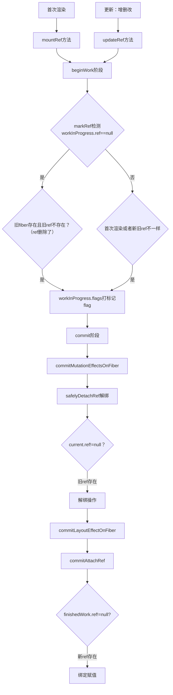

## useRef源码解析

## 流程分析

### `useRef`架构图

`useRef`的流程架构图如下：



### 相关方法解析

#### `mountRef`方法

在首次渲染挂载时，`useRef`调用的是`mountRef`。
```js
function mountRef(initialValue) {
  // 创建hook，将hook绑定fiber的updateQueue上并返回
  const hook = mountWorkInProgressHook();
  // 包装ref值
  const ref = { current: initialValue };
  // 将值保存到hook.memoizedState上
  hook.memoizedState = ref;
  return ref;
}
```

#### `updateRef`

```js
function updateRef(initialValue) {
  // 获取fiber上的新hook，新hook来自于旧fiber上的旧hook 
  const hook = updateWorkInProgressHook();
  // 返回新hook的memoizedState
  return hook.memoizedState;
}
```

通过`mountRef`和`updateRef`可知，`userRef`的`hook`在`updateQueue`上就是一个赋值/取值的操作。


#### `markRef`方法

`useRef`的标记发生在*beginWork*阶段，会调用`markRef`方法，在组件更新时，检查`ref`是否发生变化，并给`Fiber`节点打上“需要更新ref”的标记。

```js
function markRef(current, workInProgress) {
  // 取出新fiber上的ref
  const ref = workInProgress.ref;
  // 若新fiber上没有ref
  if (ref === null) {
    // 旧fiber存在，且存在ref
    if (current !== null && current.ref !== null) {
     // 则说明ref被删除了，打上标记，后续需要清空旧ref
      workInProgress.flags |= Ref | RefStatic;
    }
  } else {
    // 判断ref的类型是否是函数或对象，若不是，则报错
    if (typeof ref !== 'function' && typeof ref !== 'object') {
      throw new Error(
        'Expected ref to be a function, an object returned by React.createRef(), or undefined/null.',
      );
    }
    // 组件首次渲染时，或者是新旧ref不同，则也需要打上标记
    if (current === null || current.ref !== ref) {
      workInProgress.flags |= Ref | RefStatic;
    }
  }
}
```
首次渲染或者新旧`fiber`的`ref`不等，以及`ref`被删除，在`fiber.flags`上的标记都是一样。

#### `safelyDetachRef`方法

在`commitMutationEffectsOnFiber`中调用`safelyDetachRef`方法，清理`ref`。

```js
function safelyDetachRef(
  current
) {
// current是指当前UI展示的fiber
  const ref = current.ref;
  const refCleanup = current.refCleanup;
// 若ref存在，且fiber.flags上标记了需要更新，则先进行ref的清理
  if (ref !== null) {
   // 先判断清理方法是否是函数
    if (typeof refCleanup === 'function') {
      try {
      // 执行清理函数
        refCleanup();
      } catch (error) {
        // 报错
      } finally {
        // 重置新fiber、旧fiber上的ref清理函数 
        current.refCleanup = null;
        const finishedWork = current.alternate;
        if (finishedWork != null) {
          finishedWork.refCleanup = null;
        }
      }
    } else if (typeof ref === 'function') {
    // 判断 ref是否是函数
      try {
      // 是函数，则再调用一遍
        ref(null);
      } catch (error) {
        // 报错
      }
    } else {
    // 若ref不是函数，则将ref.current重置
      ref.current = null;
    }
  }
}
```

#### 绑定赋值

一般在`commitLayoutEffectOnFiber`中调用，此时已经可以拿到*DOM*了。

```js
function commitLayoutEffectLayoutOnFiber(
  finishedRoot,
  current,
  finishedWork,
  committedLanes,
) {
  const flags = finishedWork.flags;
  switch (finishedWork.tag) {
    case ClassComponent: {
      //...
      if (flags & Ref) {
        safelyAttachRef(finishedWork, finishedWork.return);
      }
    }
    case HostHoistable:
    case HostComponent: {
      if (flags & Ref) {
        safelyAttachRef(finishedWork, finishedWork.return);
      }
    }
  }
}
```

如下的`safelyAttachRef`本质上就是调用`commitAttachRef`方法

```js
function commitAttachRef(finishedWork) {
  const ref = finishedWork.ref;
  if (ref !== null) {
    let instanceToUse;
    switch (finishedWork.tag) {
      case HostHoistable:
      case HostSingleton:
      case HostComponent:
        instanceToUse = finishedWork.stateNode;
        break;
      case ViewTransitionComponent: {
       
        instanceToUse = finishedWork.stateNode;
        break;
      }
      default:
        instanceToUse = finishedWork.stateNode;
    }
    // 判断ref的类型
    if (typeof ref === 'function') {
      // 只有ref为函数且有返回值，返回值需要是函数，才可以在后续执行ref清理  
      finishedWork.refCleanup = ref(instanceToUse);
    } else {
      ref.current = instanceToUse;
    }
  }
}
```

#### 注意事项

在`safelyDetachRef`和`commitAttachRef`方法中操作的都是`fiber.ref`，它与`hook.memoizedState`实际上是同一个引用地址，如下：

```js
function FC()=>{
    const divRef=useRef();
    return <div ref={divRef}>Hello word</div>    
}
```

`ref={divRef}`就是将`hook.memoziedState`和`fiber.ref`关联起来。