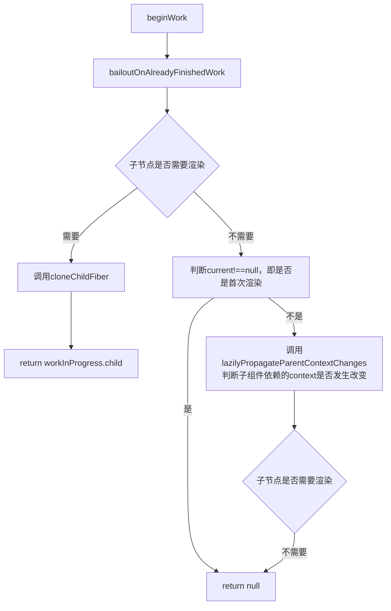

## 概述

在React中，`createContext`和`useContext`用于嵌套组件之间的数据通信。

- 常见示例

```js
const MapContext = React.createContext();
function Parent(){
    return <MapContext.Provider value={name:'Blob'}><Child1 /></MapContext.Provider>
    // return <MapContext.Provider value={name:'Blob'}><Child2 /></MapContext.Provider>
}

function Child1(){
  const {name} = React.useContext(MapContext);
  return <div>{name}</div>
}

function Child2(){
  return <MapContext.Consumer>
    {({ name }) => <div>{name}</div>}
  </Mapcontext.Consumer>
}
```

## 源码分析

### 挂载全流程

#### `createContext`方法

`createContext`方法会返回一个`context`对象，在上述示例中`MapContext.Provider`就是`context`对象自身。

```js
function createContext(defaultValue){
  const context = {
      $$typeof:Symbol.for('react.context'), // 标识是一个context对象
      _currentValue:defaultValue, // 存放state
      _currentValue2:defaultValue, // 并发模式下会用到
      _threadCount:0, // 计数器
      Provider:null, // 提供context
      Consumer:null // 消费context
  }    
  context.Provider = context;
  context.Consumer = {
    $$typeof: Symbol.for('react.consumer'),// 标识是一个消费者
    _context: context,
  };
  
  return context
}
```

#### `createFiberFromTypeAndProps`方法

当React在渲染上述组件生成对应*fiber*时会调用`createFiberFromAndProps`方法。

```js
function createFiberFromTypeAndProps(
  type, // 对应就是MapContext.Provider
  key,
  pendingProps, // {value:{name:'Blob'}}
  owner,
  mode,
  lanes,
) {
  // 根据$$typeof生成对应fiberTag
  switch (type.$$typeof) {
    case REACT_CONTEXT_TYPE:
      fiberTag = ContextProvider;
    case REACT_CONSUMER_TYPE:
      fiberTag = ContextConsumer;
  }
  // 生成fiber
  const fiber = createFiber(fiberTag, pendingProps, key, mode);
  return fiber;
}
```

在*beginWork*阶段，就会根据`workInProgress.tag`即*fiberTag*去识别`fiber`的类型，进而调用不同方法。对于`context`提供者调用`updateContextProvider`方法，消费者调用`updateContextConsumer`方法。

```js
function beginWork(current, workInProgress, renderLanes) {
  switch (workInProgress.tag) {
    case ContextProvider:
      return updateContextProvider(current, workInProgress, renderLanes);
    case ContextConsumer:
      return updateContextConsumer(current, workInProgress, renderLanes);
  }
}
```

#### `updateContextProvider`方法

`updateContextProvider`方法最终会返回其`child`。

```js
function updateContextProvider(current,workInProgress,renderLane){
    const context = workInProgress.type;
    const newProps = workInProgress.pengdingProps;
    // 读取value值
    const newValue = newProps.value;
    // 调用pushProvider方法
    pushProvider(workInProgress,context,newValue);
    
    const newChildren = newProps.children;
    // 子组件遍历生成fiber
    reconcileChildren(current, workInProgress, newChildren, renderLanes);
    
    return workInProgress.child;
}
```

调用`pushProvider`方法本质上是一个栈操作。在React中`context`数据是临时保存一个栈中，这是为了解决`context`嵌套的问题。相关的方法如下：

```js
const valueStack = [];//栈
let index = -1; //索引

function createCusor(defaultValue){
    return {current:defaultValue}
}

const valueCursor = createCusor(null)

function pop(cursor){
  // 判断索引，若index<0,说明是一个空栈，无须进行出栈
  if(index < 0){
    return;  
  }    
  // 清理操作
  cursor.current = valueStack[index];
  valueStack[index] = null;
  index--;
}

function push(cursor,value){
 index++; // 索引递增
 valueStack[index] = cursor.current;// 旧值存入栈中
 cursor.current = value; //context的旧值存在cursor上
}


function pushProvider(providerFiber,context,nextValue){
    // pushProvider方法就是把旧数据压入valueStack中
    push(valueCursor, context._currentValue, providerFiber);
    // 修改context对象中的值
    context._currentValue = nextValue;
}

// 出栈
function popProvider(context,providerFiber){
    // 将valueCusor.current的旧值赋值给context._currentValue,恢复其值
    const currentValue = valueCusor.current;
    context._currentValue = currentValue;
    // 调用pop方法
    pop(valueCursor,providerFiber)
}
```

在*completeWork*阶段会调用`popProvider`,进行出栈相当于是一个清理操作，因为此时context及其子节点已经完成*beginWork*.


#### `updateContextConsumer`方法

`updateContextConsumer`方法对应示例中的组件`Child2`，使用函数方式消费`Context`，在 *beginWork* 阶段会调用`updatecontextConsumer`方法

```js
function updateContextConsumer(current, workInProgress, renderLans) {
  // 获取context对象
  const consumerType = workInProgress.type;
  const context = consumerType._context;
  // 获取Consumer的child
  const newProps = workInProgress.pendingProps;
  // render对应Child2 return中的函数
  const render = newProps.children;
   
  prepareToReadContext(workInProgress, renderLanes);
  // 获取context对象中的新值
  const newValue = readContext(context);

  let newChildren;
  // 将新值作为参数传递给子节点
  newChildren = render(newValue);

  workInProgress.flags |= PerformedWork;
  reconcileChildren(current, workInProgress, newChildren, renderLanes);
  return workInProgress.child;
}
```

#### `prepareToReadContext`方法

读取*context* 对象的准备工作
```js
function prepareToReadContext(
  workInProgress,
  renderLanes,
) {
  // 将当前构建的fiber赋值给context的上下文fiber
  currentlyRenderingFiber = workInProgress;
  // 将context的最后一个context置null
  lastContextDependency = null;
  const dependencies = workInProgress.dependencies;
  if (dependencies !== null) {
  // 若当前fiber的依赖不为空，则将其置null
    dependencies.firstContext = null;
  }
}
```

#### `readContext`方法

`readContext`方法内部实质上就是调用的`readContextForConsumer`方法，并返回其值，不过是将当前正在渲染的`fiber`作为第一个参数。

示例中的`Child1`是`hooks`消费*context*的写法，其实际上就是调用的`readContext`。函数组件在renderWithHooks`时会调用，对应的`currentlyRenderingFiber`就是函数组件在渲染时对应的`fiber`。

```js
function readContext(context) {
  return readContextForConsumer(currentlyRenderingFiber, context);
}
```

#### `readContextForConsumer`方法

`readContextForConsumer`方法就做了两件事：
- 从`Context`对象中获取值，并返回
- 在`fiber.dependencies`上记录依赖,即`context`提供者

```js
function readContextForConsumer(consumer, context) {
  // 读取context对象上的值
  const value = context._currentValue;
  
  // 构建contextItem
  const contextItem = {
    context: context,//保存context对象
    memoizedValue: value, // 记录当前值，
    next: null, // 指向下一个contextItem,形成链表
  };

  // 若lastContextDependcy为null，则说明，当前是函数组件内部第一次消费context
  if (lastContextDependency === null) {
   // 若fiber为null，就报错，因为只能在函数组件内部消费context
    if (consumer === null) {
      //   报错
    }
    // 将当前contextItem作为最后一个lastContextDependency
    lastContextDependency = contextItem;
    // 在fiber上标记依赖，即context提供者，当前contextItem作为第一个
    consumer.dependencies = {
      lanes: NoLanes,
      firstContext: contextItem,
    };
    // 标记fiber上的flags
    consumer.flags |= NeedsPropagation;
  } else {
    // 若当前函数组件之前就消费过context，则将当前contextItem作为链表的最后一项
    lastContextDependency = lastContextDependency.next = contextItem;
  }
  // 最后返回 value，即Provider提供的值
  return value;
}
```

### 更新全流程

在React 19之前,`Provider`的`value`发生改变时，会在`updateContextProvider`中去比较新旧的值，然后遍历子树，属于是`Provider`的主动广播推送。而在React 19中，就引入了新的机制：**延迟更新**，当`Provider`的`props`变化时，在触发更新，而子组件在*beginWork*阶段若无其它更新情况，调用`bailoutOnAlreadyFinishedWork`方法。

#### 通信机制
上层组件`Provider`的`value`发生改变，消费过*context*对象的子组件会更新，其流程图如下：



#### `resetContextDependencies`方法

在渲染前，会调用`resetContextDependencies`方法，重置变量。

```js
function resetContextDependencies() {
  currentlyRenderingFiber = null;
  lastContextDependency = null;
}
```

#### `lazilyPropagateParentContextChanges`

`lazilyPropagateParentContextChanges`方法就是用于告诉子组件，*context*发生了改变。其内部就是调用`propagateParentContextChanges`方法。

```js
function lazilyPropagateParentContextChanges(current,workInProgress,renderLanes) {
 // 用于表示是否需要告诉所有的子树
  const forcePropagateEntireTree = false;
  propagateParentContextChanges(
    current,
    workInProgress,
    renderLanes,
    forcePropagateEntireTree,
  );
}
```

#### `propagateParentContextChanges`方法


```js
function propagateParentContextChanges(
  current,
  workInProgress,
  renderLanes,
  forcePropagateEntireTree,
) {
  // 收集发生变化的context
  let contexts = null; 
  let parent = workInProgress;
  // 是否进入传播优化模式
  let isInsidePropagationBailout = false;
  // 向上遍历
  while (parent !== null) {
    // 若不是 
    if (!isInsidePropagationBailout) {
     // 若fiber存在依赖context,表示需要传播，就将isInsidePRopagationBailout置true，表示必须完整扫描
      if ((parent.flags & NeedsPropagation) !== NoFlags) {
        isInsidePropagationBailout = true;
      // 已经传播过了，就不再往上查找        
      } else if ((parent.flags & DidPropagateContext) !== NoFlags) {
        break;
      }
    }
    // 若当前的fiber类型是ContextProvider
    if (parent.tag === ContextProvider) {
      // 获取UI显示的fiber
      const currentParent = parent.alternate;
      
      if (currentParent === null) {
        throw new Error('Should have a current fiber. This is a bug in React.');
      }
      // 获取旧值
      const oldProps = currentParent.memoizedProps;
      if (oldProps !== null) {
        const context = parent.type;
        // 读取新值
        const newProps = parent.pendingProps;
        const newValue = newProps.value;

        const oldValue = oldProps.value;
        // 判断新旧值是否相等
        if (!is(newValue, oldValue)) {
          if (contexts !== null) {
            contexts.push(context);
          } else {
            contexts = [context];
          }
        }
      }
    } 
    // 切换fiber
    parent = parent.return;
  }

  // 若存在变化的context
  if (contexts !== null) {
   // 则调用propagateContextChanges方法，向子树中传播打标
    propagateContextChanges(
      workInProgress,
      contexts,
      renderLanes,
      forcePropagateEntireTree,
    );
  }
  // 将当前fiber的flags标记为已经传播过了
  workInProgress.flags |= DidPropagateContext;
}
```

#### `propagateContextChanges`方法

`propagateContextChanges`方法就是向下遍历*Fiber* 树，找到所有用到这个*context* 的组件，给它们打上需要更新的标记，并向上通知父组件调度更新。

```js
function propagateContextChanges(
  workInProgress,//fiber树
  contexts, // 发生变化的context数组
  renderLanes, //渲染优先级
  forcePropagateEntireTree, // 前面传值是false
) {
  // 从第一个子节点开始
  let fiber = workInProgress.child;
  if (fiber !== null) {
    // 若子节点存在，则建立父子指向
    fiber.return = workInProgress;
  }
  // 当fiber存在时，开始向下遍历fiber树
  while (fiber !== null) {
    let nextFiber;
    // 获取组件的依赖
    const list = fiber.dependencies;
    if (list !== null) {
     // 若依赖存在，切换nextFiber，待会继续向下遍历
      nextFiber = fiber.child;
      // 获取依赖的第一个context
      let dep = list.firstContext;
       // 开始遍历依赖这个链表，是一个双层循环，链表+contexts
      findChangedDep: while (dep !== null) {
        // 
        const dependency = dep;
        const consumer = fiber;
        // 遍历contexts
        findContext: for (let i = 0; i < contexts.length; i++) {
          const context = contexts[i];
          // 判断 依赖的context与contexts中的某项是否是同一个，若命中了
          if (dependency.context === context) {
            // 给当前fiber打上需要更新的标记
            consumer.lanes = mergeLanes(consumer.lanes, renderLanes);
            // 获取旧fiber，也打上标记
            const alternate = consumer.alternate;
            if (alternate !== null) {
              alternate.lanes = mergeLanes(alternate.lanes, renderLanes);
            }
            // 调用scheduleContextWorkOnParentPath方法，向上通知父组件路径，这里需要更新调度
            scheduleContextWorkOnParentPath(
              consumer.return,
              renderLanes,
              workInProgress,
            );
            // 不再向下继续遍历    
            if (!forcePropagateEntireTree) {
              nextFiber = null;
            }
            // 跳出，不再检查其他Context
            break findChangedDep;
          }
        }
        // 移动指针，获取下一个context
        dep = dependency.next;
      }
    }  else {
    // 若组件不存在依赖，则继续向下查找
      nextFiber = fiber.child;
    }
    
    // 若子节点存在
    if (nextFiber !== null) {
     // 保持指向
      nextFiber.return = fiber;
    } else {
    // 若子节点不存在->开始往上找兄弟节点
      nextFiber = fiber;
     
      while (nextFiber !== null) {
       // 若已经找完了，则终止循环
        if (nextFiber === workInProgress) {
          nextFiber = null;
          break;
        }
        // 获取兄弟节点
        const sibling = nextFiber.sibling;
        // 若兄弟节点不为null
        if (sibling !== null) {
          // 则保持兄弟节点的return指向
          sibling.return = nextFiber.return;
          // 将兄弟节点赋值给nexFiber，终止本次循环，开启外层的循环
          nextFiber = sibling;
          // 终止本次循环
          break;
        }
        // 若不存在兄弟节点，则继续向上查找
        nextFiber = nextFiber.return;
      }
    }
    // 移动指针，继续循环
    fiber = nextFiber; 
  }
}
```

#### `scheduleContextWorkOnParentPath`方法

`scheduleContextWorkOnParentPath`方法就是用于向上查找，更新父组件的`childLanes`，以及父组件对应的旧*fiber*的`childLanes`，直到查找的父组件为`propagationRoot`停止。

```js
 function scheduleContextWorkOnParentPath(
  parent,
  renderLanes,
  propagationRoot,
) {
  let node = parent;
  while (node !== null) {
    const alternate = node.alternate;
    if (!isSubsetOfLanes(node.childLanes, renderLanes)) {
      node.childLanes = mergeLanes(node.childLanes, renderLanes);
      if (alternate !== null) {
        alternate.childLanes = mergeLanes(alternate.childLanes, renderLanes);
      }
    } else if (
      alternate !== null &&
      !isSubsetOfLanes(alternate.childLanes, renderLanes)
    ) {
      alternate.childLanes = mergeLanes(alternate.childLanes, renderLanes);
    } 
    if (node === propagationRoot) {
      break;
    }
    node = node.return;
  }
}
```

### 更新流程总结

`Provider value` 变化 → `Provider` 只更新 `context._currentValue` → 子节点进入 *beginWork* → 无自身更新 → 进入 `bailoutOnAlreadyFinishedWork` → 调用 `lazilyPropagateParentContextChanges` → 检测 `Context` 变化 → 触发 `propagateContextChange` 标记 `Consumer` → 取消 `bailout`，继续更新。

