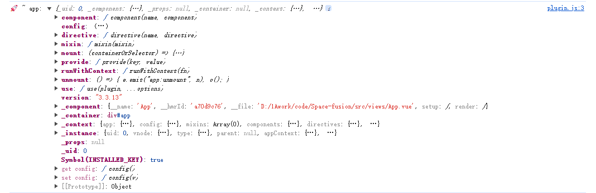

## 概览

`vue3`的生态圈提供了许多方便的插件或者工具，比如`pinia`、`vue-router`和`Element Plus`等待，使用插件的写法一般如下:

```js
const app = createApp(App);

app.use(pinia);
app.use(router);
app.use(ElementPlus, { locale }); // 第二个参数:{locale} 为传给插件的参数
```

## 源码分析

### `vue3`中`use`方法的实现

打印`createApp`的返回值`app`,如下图所示，


其实现如下:

```js
        use(plugin, ...options) {
          if (installedPlugins.has(plugin)) {
            warn2(`Plugin has already been applied to target app.`);
          } else if (plugin && isFunction(plugin.install)) {
            installedPlugins.add(plugin);
            plugin.install(app, ...options);
          } else if (isFunction(plugin)) {
            installedPlugins.add(plugin);
            plugin(app, ...options);
          } else if (true) {
            warn2(
              `A plugin must either be a function or an object with an "install" function.`
            );
          }
          return app;
        },
```

实现的源码中,`installedPlugins`是个`WeakSet`类型的局部变量，先是判断插件`plugin`是否被安装过，插件只需要安装一次，不能重复安装；然后判断插件是否存在`install`方法，若存在就调用`plugin.add`方法，并将`console.log`打印出来的`app`变量的值会作为参数传给`plugin`;若`plugin`不存在`install`方法，且其自身就是个函数类型，就调用`plugin(app)`，否则报错;最后返回`app`。

`vue3`中接受插件的就这段代码，可以说理解起来非常简单，基于此，就可以在插件`plugin`中拿到`app`这个实例对象了。

### 插件中的`install`

在[Pinia 部分源码浅析](!https://blog.csdn.net/m0_46281382/article/details/141384499?spm=1001.2014.3001.5502)一文中有提到 `Pinia`相关的实现

我们可以自己写个 `Plugin` 测试下,其本质上就是一个包含`install`属性方法的一个对象而已。

如下：
```js
const plugin = {
  install: (app) => {
    console.log("🚀 ~ app:", app);
  },
};
export default plugin;
```

打印出来如下：
