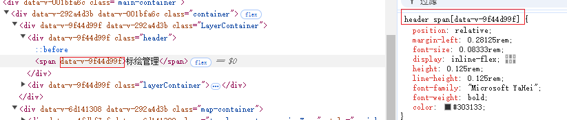

## 概述

`scoped`的作用就是样式模块化（`CSS Module`），即给组件每一个元素（以及非动态添加的子组件的根元素）加上一个`data-v-xxxx`的属性，样式选择器也会格式化成`选择器[data-v-xxxx]`,这样就做到了样式隔离，每个组件内定义的样式只对该组件生效，避免了不同组件或页面的样式（选择器）冲突。本文将以`vue3`为例，深入了解`scoped`原理。

## `scoped`实践

- `vue3`组件是如下定义样式：

```vue
<template>
  <div class="header">
    <span>标绘管理</span>
  </div>
</template>
<style scoped>
.header span {
  position: relative;
  margin-left: 54px;
  font-size: 16px;
  display: inline-flex;
  height: 24px;
  line-height: 24px;
  font-family: "Microsoft YaHei";
  font-weight: bold;
  color: #303133;
}
</style>
```

- 效果如下：



## `scoped`源码分析

### `compiler-sfc`模块

`vue3`中有个模块`@vue/compiler-sfc`,这个模块是单独拎出来，不会被打包到`vue.global.js`。`compiler-sfc`主要作用就是用来编译单文件组件，就是`.vue`。因为`scoped`的实现是在`compiler-sfc`模块中，所以本文的所有的讨论也是基于`SFC`。

### `vite`与`plugin-vue`

`vue3`如果是通过`vite`搭建的，那么`compiler-sfc`会通过`vite`的`plugin-vue`调用，这在[script 标签的 setup 实现原理](https://jinuss.github.io/blog/pages/a924dx93/)中有讲解,可以简短回顾。

### Style 样式选择器中的处理

在 `plugin-vue`中会读取`.vue`组件，并识别`<style></style>`部分，如下

```js
if (query.type === "style") {
  return transformStyle(
    code,
    descriptor,
    Number(query.index || 0),
    options.value,
    this,
    filename
  );
}
```

`transformStyle`函数会将`<style></style>`的 code 传给`compiler.compileStyleAsync`，并返回编译的结果，其中参数包含`id`和`scoped`。

- `id`的生成

  `id`包含于`descriptor`中，其生成过程如下所示：

```js
descriptor.id = getHash(normalizedPath + (isProduction ? source : "")); // normalizedPath:序列化文件路径后的字符串，如果是生产环境，还会加上源码

function getHash(text) {
  return node_crypto
    .createHash("sha256")
    .update(text)
    .digest("hex")
    .substring(0, 8);
}
```

#### `compileStyleAsync`

`compileStyleAsync`会返回一个函数`doCompileStyle`,该函数会加载一些`css`插件对样式进行编译。

上面图中的`data-v-xxxx`就是在这个函数中根据参数`id`先用正则匹配前缀`data-v-`替换再加上`data-v-`。

如果参数`scoped`为`true`,就会执行`plugins.push(scopedPlugin(longId))`,`plugins`是一个数组，后面调用`post-css`库对这些`plugin`进行处理。如下：

```js
postcss(plugins).process(source, postCSSOptions); // source：源代码，
```

而`scoped`的核心实现就是在`scopedPlugin`中。

#### `scopedPlugin`

`scopedPlugin`是`vue3`封装的`post-css`插件，其实现如下：

```js
const scopedPlugin = (id = "") => {
  const keyframes = /* @__PURE__ */ Object.create(null);
  const shortId = id.replace(/^data-v-/, "");
  return {
    postcssPlugin: "vue-sfc-scoped",
    Rule(rule) {
      processRule(id, rule);
    },
    AtRule(node) {
      if (
        /-?keyframes$/.test(node.name) &&
        !node.params.endsWith(`-${shortId}`)
      ) {
        keyframes[node.params] = node.params = node.params + "-" + shortId;
      }
    },
    OnceExit(root) {
      if (Object.keys(keyframes).length) {
        root.walkDecls((decl) => {
          if (animationNameRE.test(decl.prop)) {
            decl.value = decl.value
              .split(",")
              .map((v) => keyframes[v.trim()] || v.trim())
              .join(",");
          }
          if (animationRE.test(decl.prop)) {
            decl.value = decl.value
              .split(",")
              .map((v) => {
                const vals = v.trim().split(/\s+/);
                const i = vals.findIndex((val) => keyframes[val]);
                if (i !== -1) {
                  vals.splice(i, 1, keyframes[vals[i]]);
                  return vals.join(" ");
                } else {
                  return v;
                }
              })
              .join(",");
          }
        });
      }
    },
  };
};
```

`scopedPlugin`就是一个对象，包含三个方法：`Rule`、`AtRule`和`OnceExit`,这是`post-css`插件的里面的概念。

- `Rule`：表示`CSS`里的普通规则，比如选择器和申明。
- `AtRule`:表示`CSS`中的@规则
- `OnceExit`:用于在整个`CSS`文件的解析完成后执行一次操作

##### `processRule`

`processRule`主要就是处理一般规则。定义了一个`WeakSet`用于避免重复操作，过滤@规则还有`keyframes`。

下面这段代码就是遍历了选择器中的每个部分，并通过 `rewriteSelector` 函数进行修改，最后将修改后的选择器转换回字符串并赋值给 `rule.selector`

```js
const processedRules = /* @__PURE__ */ new WeakSet();
function processRule(id, rule) {
  if (
    processedRules.has(rule) ||
    (rule.parent &&
      rule.parent.type === "atrule" &&
      /-?keyframes$/.test(rule.parent.name))
  ) {
    return;
  }
  processedRules.add(rule);
  rule.selector = selectorParser$2((selectorRoot) => {
    selectorRoot.each((selector) => {
      rewriteSelector(id, selector, selectorRoot);
    });
  }).processSync(rule.selector); // selectorParser$2就是`postcss-selector-parser`插件
}
```

##### `rewriteSelector`

`rewriteSelector`顾名思义就是重写选择器`selector`，`scoped`的`data-v-xxxx`是只加在选择器的最后一个，作为它的属性。而且还要考虑一些伪类选择器`::after`、`::before`等等，最后就是插入属性`data-v-xxxx`，操作如下

```js
selector.insertAfter(
      node as any,
      selectorParser.attribute({
        attribute: idToAdd,
        value: idToAdd,
        raws: {},
        quoteMark: `"`,
      }),
    )`
```

### template 元素处理

`scoped`在元素中的处理其实就是给元素加一个属性，同一个`.vue`中的元素`data-v-xxxx`是一样的，和`style`的属性选择器`data-v-xxxx`也是一致。

在`plugin-vue`中就生成了`id`,这个`id`不仅会给`style`用，元素也是用的这个相同的`id`。

对于`template`和`style`部分是调用不同的解析器进行解析的。元素的属性是在`@vue/compiler-dom`、`@vue/compiler-core`这两个模块中属性，本质上就是解析语法树，生成 DOM 节点时判断`scopeId`是否为`true`

```js
if (context.scopeId) {
  res += ` ${context.scopeId}`;
}
```
