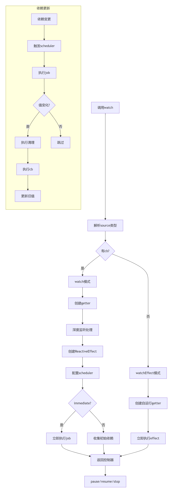

## 概览

在vue3中，响应式数据的变化会触发`watch`和`watchEffect`中的参数函数，而二者都是基于`reactivity`包中的`watch`方法实现，其实现路径为`packages\reactivity\src\watch.ts`。这两个`watch`不是一回事。`watch`和`watchEffect`是基于本文的`watch`实现的，是vue3导出给用户使用的API接口，而本文中的`watch`是在`reactivity`中定义的，在整个vue3中，其命名为`watch$1`,vue3在`packages\runtime-core\src\apiWatch.ts`中引入了`watch$1`封装了一个`doWatch`方法，`watch`和`watchEffect`就是在`doWatch`上进一步封装实现的。


## 源码解析

`watch`的作用就是主动监听响应式数据`source`，当`source`发生变化时，便会触发`cb`函数，`cb`函数的参数就是响应式数据`source`的新值`newValue`和旧值`oldValue`，而第三个参数`options`就是一些配置项，决定了监听的方式、时机等。

### `watch`

`watch`的源码实现如下：

```js
let activeWatcher= void 0;

function watch(source, cb, options = {}) {
    // source : 可以是ref、reactive对象、数组或getter函数
    // cb : 回调函数，source发生变化时被调用
    const { immediate, deep, once, scheduler, augmentJob, call } = options;
    /* immediate:是否立即执行回调
       deep:是否深度监听
       once:是否只执行一次
       scheduler：调度函数，用于控制回调的执行时机
       augmentJob：用于增强job函数
       call：可选的调用函数，用于调用getter和cb
    */
    const reactiveGetter = (source2) => {
        if (deep) return source2;
        if (isShallow(source2) || deep === false || deep === 0) {
            return traverse(source2, 1)
        }
        return traverse(source2)
    }

    let effect; // 定义副作用
    let getter; // getter函数
    let cleanup; // 清理函数
    let boundCleanup;
    let forceTrigger = false; // 是否强制触发
    let isMultiSource = false; // 是否包含多个监听对象
    if (isRef(source)) {
        // Ref处理
        getter = () => source.value;
        forceTrigger = isShallow(source); // 若是浅层响应，则强制触发，反之
    } else if (isReactive(source)) {
        // Reactive处理
        getter = () => reactiveGetter(source); // 深度遍历控制
        forceTrigger = true; // 强制触发
    } else if (shared.isArray(source)) {
        // 数组处理：遍历每项，处理各种类型
        isMultiSource = true;
        forceTrigger = source.some((s) => isReactive(s) || isShallow(s));
        getter = () => source.map((s) => {
            if (isRef(s)) {
                return s.value;
            } else if (isReactive(s)) {
                return reactiveGetter(s);
            } else if (shared.isFunction(s)) {
                return call ? call(s, 2) : s()
            }
        })
    } else if (shared.isFunction(source)) {
        // 函数处理
        if (cb) {
            // watch 模式
            getter = call ? () => call(source, 2) : source;
        } else {
            // watchEffect 模式
            getter = () => {
                // 执行上次清理
                if (cleanup) {
                    pauseTracking();
                    try {
                        cleanup()
                    } finally {
                        resetTracking();
                    }
                }
                // 设置当前活跃watcher
                const currentEffect = activeWatcher;
                activeWatcher = effect;
                try {
                    // 传入清理函数
                    return call ? call(source, 3, [boundCleanup]) : source(boundCleanup);
                } finally {
                    activeWatcher = currentEffect;
                }
            }
        }
    } else {
        getter = shared.NOOP;
    }
    
    // 深度监听处理：traverse函数会递归访问所有属性，确保收集完整依赖
    if (cb && deep) {
        const baseGetter = getter;
        const depth = deep == true ? Infinity : deep;
        getter = () => traverse(baseGetter(), depth);
    }
    
    // 获取当前副作用域
    const scope = getCurrentScope();

    // 定义watchHandle函数，用于清理副作用effect
    const watchHandle = () => {
        effect.stop();
        if (scope && scope.active) {
            shared.remove(scope.effects, effect);
        }
    }
    
    // 若是一次性监听
    if (once && cb) {
        // 回调函数cb存在，则对cb进行二次封装
        const _cb = cb;
        cb = (...args) => {
            //在cb执行完后，调用watchHandle清理副作用effect
            _cb(...args);
            watchHandle();
        }
    }

    // 初始化 oldValue， INITIAL_WATCHER_VALUE实际上就是一个空对象
    let oldValue = isMultiSource ? new Array(source.length).fill(INITIAL_WATCHER_VALUE) : INITIAL_WATCHER_VALUE;
    
    // 核心调度任务 job
    const job = (immediateFirstRun) => {
        // immediateFirstRun 表示是否立即执行

        if (!(effect.flags & 1) || !effect.dirty && !immediateFirstRun) {
            return;
        }
        if (cb) {
            // 执行回调，effect会返回新值
            const newValue = effect.run();
            // 变化检测，若deep或者强制触发为true，或者source的值发生变化，若是多源，只要其中一个值发生了变化，则都满足条件
            if (deep || forceTrigger || (isMultiSource ? newValue.some((v, i) => shared.hasChanged(v, oldValue[i])) : shared.hasChanged(newValue, oldValue))) {
                // 执行清理
                if (cleanup) {
                    cleanup();
                }
                // 设置当前watcher上下文
                const currentWatcher = activeWatcher;
                activeWatcher = effect;
                try {
                    // 构造回调参数
                    const args = [newValue, oldValue === INITIAL_WATCHER_VALUE ? void 0 : isMultiSource && oldValue[0] === INITIAL_WATCHER_VALUE ? [] : oldValue, boundCleanup]
                    oldValue = newValue;
                    // 执行回调
                    call ? call(cb, 3, args) : (cb(...args))
                } finally {
                    activeWatcher = currentWatcher;
                }
            }
        } else {
            // watcherEffect模式直接运行
            effect.run();
        }
    }
    // 是否增强job 
    if (augmentJob) {
        augmentJob(job)
    }

    // 定义副作用，实例化ReactiveEffect，参数为定义的getter函数，即对source进行参数归一化处理后的方法
    effect = new ReactiveEffect(getter);
    
    // 定义副作用的调度器，若配置项scheduler存在，则对job进行调度；否则调度器就是job
    effect.scheduler = scheduler ? () => scheduler(job, false) : job;

    //注册清理函数:清理函数在cleanupMap中维护
    boundCleanup = (fn) => onWatcherCleanup(fn, false, effect);
    cleanup = effect.onStop = () => {
       const cleanups =cleanupMap.get(effect);
       if(cleanups){
         if(call){
           call(cleanups,4)   
         }else{
           for(const cleanup2 of cleanups) cleanup2()
         }
         cleanupMap.delete(effect)
       }
    }
    
    // 若cb回调函数存在
    if (cb) {
        if (immediate) {
            // 若是立即执行，则调用job方法，该方法会执行cb回调
            job(true);
        } else {
            // 若不是立即执行，则调用effect.run，获取旧值oldValue
            oldValue = effect.run();
        }
    // 若存在调度器配置项    
    } else if (scheduler) {
        // 则执行调度器方法，传入job 
        scheduler(job.bind(null, true), true)
    } else {
        // 否则运行effect.run
        effect.run();
    }

    // 定义 watcherHandle的暂停/恢复/停止方法，暂停和恢复就是对effect状态的一个控制
    watchHandle.pause = effect.pause.bind(effect);
    watchHandle.resume = effect.resume.bind(effect);
    watchHandle.stop = watchHandle;
    // 最后返回watcherHandle
    return watchHandle;
}
```

vue3中定义了一个全局的`activeWatcher`，可以调用`getCurrentWatcher`获取当前激活的`watcher`；`watcher`方法内部就是对监听对象`source`进行了参数归一化的处理，由此得到一个`getter`函数，然后通过将`getter`参数传给，`ReactiveEffect`实例化一个副作用`effect`，当执行`effect.run`时就会运行`getter`，由此完成对响应式的依赖进行收集，当这些响应式数据发生变化时，就会触发在`watch`方法中定义的`effect`副作用这个依赖，即会触发`effect.trigger`方法，进而触发其调度器，而`watcher`中定义的`job`就会在该调度器中运行，进而执行回调函数`cb`.

#### `watcher`的流程处理




### 辅助方法

`watch`的辅助方法包括`onWatcherCleanup`和`traverse`。


#### `onWatcherCleanup`

vue3定义了一个全局的`cleanupMap`，该对象中会存储注册清理函数，该清理函数可以右用户自定义，其实现如下：

```js
const cleanupMap = new WeakMap();
function onWatcherCleanup(cleanupFn, failSilently = false, owner = activeWatcher) {
  if (owner) {
    let cleanups = cleanupMap.get(owner);
    if (!cleanups) cleanupMap.set(owner, cleanups = []);
    cleanups.push(cleanupFn);
  }
}
```

#### `traverse`

`traverse`方法就是对响应式对象`value`进行深度递归遍历。

```js
function traverse(value, depth = Infinity, seen) {
    // 若depth小于1 或者 value不是一个对象，或者value的__v_skip属性为true，则返回value
    if (depth <= 0 || !shared.isObject(value) || value('__v_skip')) {
        return value;
    }
    seen = seen || new Set(); // 定义一个 Set
    if(seen.has(value)){ // 若seen存在value，则返回value
       return value  
    }
    seen.add(value); // 向seen中添加value
    depth--; // 深度自减
    // 对value的各类型进行判断，以及递归处理
    if (isRef(value)) {
        traverse(value.value, depth, seen)
    } else if (shared.isArray(value)) {
        for (let i = 0; i < value.length; i++) {
            traverse(value[i], depth, seen);
        }
    } else if (shared.isSet(value) || shared.isMap(value)) {
        value.forEach((v) => {
            traverse(v, depth, seen)
        })
    } else if (shared.isPlainObject(value)) {
        for (const key in value) {
            traverse(value[key], depth, seen)
        }

        for (const key of Object.getOwnPropertySymbols(value)) {
            if (Object.prototype.propertyIsEnumerable.call(value, key)) {
                traverse(value[key], depth, seen)
            }
        }
    }
    
    // 最后返回value;
    return value
}
```