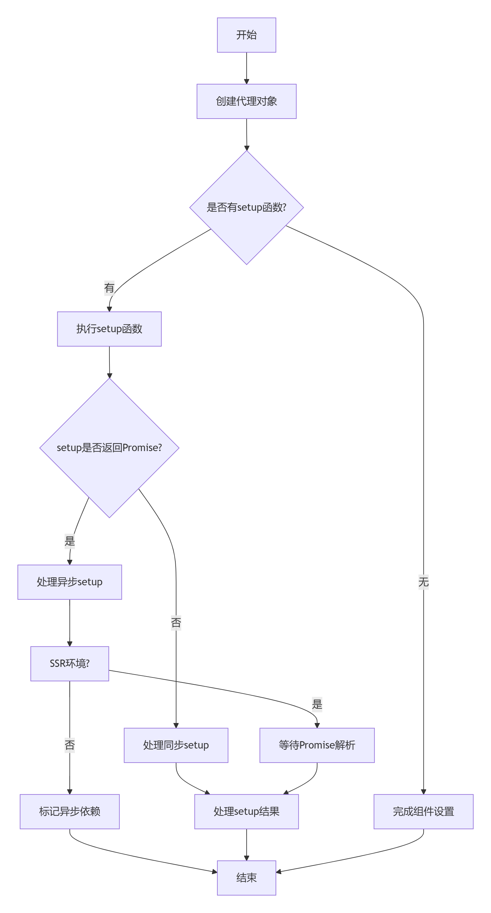
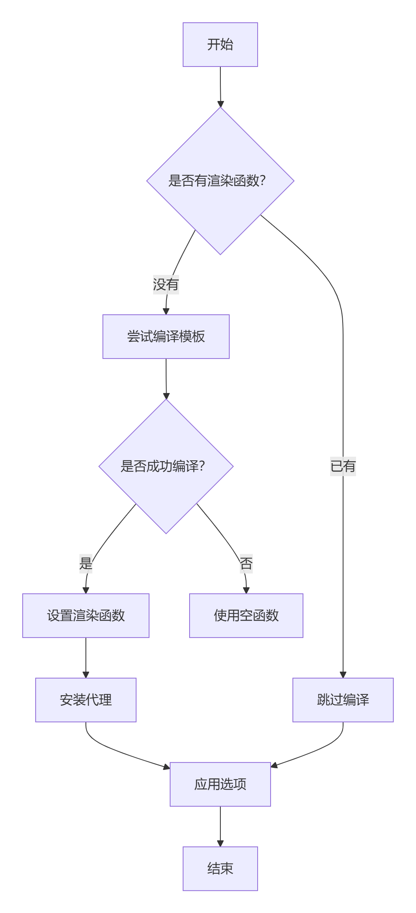
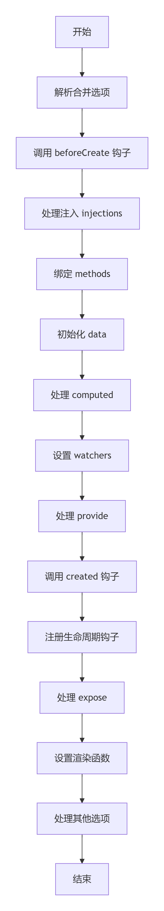
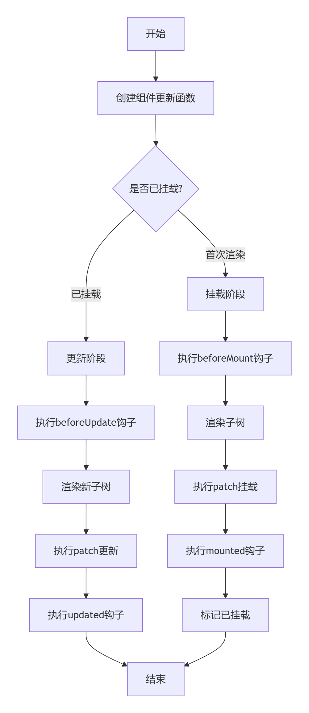

## 概览

`patch`中处理组件时，会调用`processComponent`方法，在`processComponent`中，若旧节点`n1`为`null`，且新节点`n2`的`shapeFlag`判断不为`keepAlive`，则会调用`mountComponent`方法挂载节点`n2`，`mountComponent`方法在组件初始化时就会被调用。

## 源码解析

### `mountComponent`组件挂载

`mountComponent`方法的参数说明如下：
- `initialVNode`：初始虚拟节点`n2`
- `container`：容器元素
- `anchor`：锚点
- `parentComponent`：父组件
- `parentSuspense`：异步父组件
- `namespace`：命名空间
- `optimized`：是否优化标志

`mountComponent`源码如下：

```js
const mountComponent = (initialVNode, container, anchor, parentComponent, parentSuspense, namespace, optimized) => {
    // 调用createComponentInstance创建组件实例instance
    const instance = (initialVNode.component = createComponentInstance(initialVNode, parentComponent, parentSuspense));
    // 判断节点是否是keepAlive组件
    if (isKeepAlive(initialVNode)) {
        // 若是，则设置组件实例上下文的渲染器renderer方法
        instance.ctx.renderer = internals;
    }
    // 设置组件实例
    setupComponent(instance, false, optimized);
    // 处理异步组件
    if (instance.asyncDep) {
        // 若组件实例有异步依赖，且存在父级异步，则调用registerDep注册依赖
        parentSuspense && parentSuspense.registerDep(instance, setupRenderEffect, optimized);
        if (!initialVNode.el) {
           // 若虚拟节点的el不存在在，则创建注释节点用以占位
            const placeholder = instance.subTree = createVNode(Comment);
            processCommentNode(null, placeholder, container, anchor);
            initialVNode.placeholder = placeholder.el;
        }
    } else {
        // 如果没有异步依赖，则调用setupRenderEffect设置渲染效果
        setupRenderEffect(instance, initialVNode, container, anchor, parentSuspense, namespace, optimized);
    }
}
```

`mountComponent`方法会先调用`createComponentInstance`创建组件实例，并将其关联到虚拟节点（`initialVNode.component`），然后判断是否是`KeepAlive`组件，若是，则设置组件实例上下文的渲染器方法。再就是调用`setupComponent`初始化组件状态，最后判断组件是否是异步的，若是异步组件，则向父级`Suspense`注册依赖，回调为`setupRenderEffect`，并创建注释节点作为占位符；若不存在异步依赖，则就是调用`setupRenderEffect`进行同步渲染。


## 辅助方法

### `createComponentInstance`

`createComponentInstance`用于创建并返回组件实例对象，该实例对象包含组件运行所需的所有状态和方法，是 Vue 组件系统的核心数据结构。

```js
function createComponentInstance(vnode, parent, suspense) {
  const type = vnode.type; //虚拟节点类型
  // 应用上下文
  const appContext = (parent ? parent.appContext : vnode.appContext) || emptyAppContext;
  const instance = {
    uid: uid++,// 唯一标识，
    vnode, // 关联的虚拟节点 
    type, // 组件类型，用以区分是组件选项对象或函数组件
    parent,// 父组件实例
    appContext,// 应用上下文，继承自父组件或使用vnode上的appContext
    root: null, // 根组件实例，如果当前是根组件，则指向自身；否则指向父组件的根
    next: null,// 新的组件实例（用于更新）
    subTree: null, // 组件的子树（即render函数返回的VNode树）
    effect: null,// 响应式effect（用于组件的渲染和更新）
    update: null,// 组件的更新函数，会在setupRenderEffect中设置
    job: null,// 在调度器中的任务（用于调度更新）
    scope: new reactivity.EffectScope(
      true
    ), // EffectScope实例，用于管理该组件内的响应式effect（如计算属性、watch等），当组件卸载时会自动停止这些副作用effect
    render: null,// 组件的渲染函数
    proxy: null,// 组件实例的代理对象，（用于模版访问，如this.xxx）
    exposed: null,// 通过expose暴露的公共属性
    exposeProxy: null,// 暴露的代理对象，即expose的代理
    withProxy: null,//在with块中使用的代理（用于编译模式）
    provides: parent ? parent.provides : Object.create(appContext.provides),// 依赖注入，继承父组件的provides，或者从appContext中获取（根组件）
    ids: parent ? parent.ids : ["", 0, 0],// 用于开发环境跟踪组件
    accessCache: null, // 访问缓存（用于优化属性访问）
    renderCache: [],// 渲染缓存 （用于优化渲染，如静态节点）
    components: null, // 局部注册的组件
    directives: null, // 局部注册的指令
    propsOptions: normalizePropsOptions(type, appContext),//规范化后的props选项，用于校验和转换
    emitsOptions: normalizeEmitsOptions(type, appContext),//规范化后的emits选项，用于校验 
    emit: null,//事件触发函数
    emitted: null,// 记录已触发的事件
    propsDefaults: shared.EMPTY_OBJ,//props的默认值
    inheritAttrs: type.inheritAttrs,//是否继承非props的属性（组件选项）
    ctx: shared.EMPTY_OBJ,// 上下文对象
    data: shared.EMPTY_OBJ,// 组件的数据对象（Options API中的data返回的对象）
    props: shared.EMPTY_OBJ,// 组件的props对象
    attrs: shared.EMPTY_OBJ,// 非props的属性
    slots: shared.EMPTY_OBJ,// 插槽对象
    refs: shared.EMPTY_OBJ,// 模版refs对象
    setupState: shared.EMPTY_OBJ,// Composition API中setup函数返回的状态对象
    setupContext: null,// setup函数的上下文（包含attrs、slots、emit等）
    // suspense related
    suspense,// 关联的Suspense实例
    suspenseId: suspense ? suspense.pendingId : 0, //Suspense的pendingId，用于跟踪异步状态
    asyncDep: null, //异步依赖
    asyncResolved: false,// 表示异步依赖是否已解析
    isMounted: false, // 是否已挂载
    isUnmounted: false, // 是否已卸载
    isDeactivated: false, //是否已停用
    // 以下用于存储用户定义的生命周期钩子，数组形式
    bc: null,// beforeCreate
    c: null, // created
    bm: null, // beforeMount
    m: null, // mounted
    bu: null, // beforeUpdate
    u: null, // updated
    um: null, // unmounted
    bum: null, // beforeUnmounted
    da: null, // deactivated
    a: null, // activated
    rtg: null, // beforeRouteUpdate，Vue Router 钩子
    rtc: null, // beforeRouteLeave， Vue Router 钩子
    ec: null, // errorCaptured
    sp: null // serverPrefetch SSR
  };
  {
    instance.ctx = { _: instance };
  }
  instance.root = parent ? parent.root : instance;
  instance.emit = emit.bind(null, instance);
  if (vnode.ce) {
    vnode.ce(instance);
  }
  return instance;
}
```

`createComponentInstance`方法如上定义实例对象，并将`ctx._`指向实例自身，设置`root`属性，以及将`emit`函数绑定到当前实例；如果`vnode`有`ce`（即`custom element`回调），则调用，最后返回实例对象`instance`。

### `setupComponent`

`setupComponent`方法用于初始化组件状态，其核心初始化操作如下：
- 解析`props`/`attrs`
- 初始化`slots`
- 执行`Composition API`的`setup()`函数
- 建立响应式状态(`reactive`/`ref`)等

`setupComponent`的源码实现如下：

```js
function setupComponent(instance, isSSR = false, optimized = false) {
    isSSR && setInSSRSetupState(isSSR);
    // 从虚拟节点中解构出props和children
    const { props, children } = instance.vnode;
    // 判断当前组件是否是有状态组件
    const isStateful = isStatefulComponent(instance);
    // 调用initProps初始化组件的props
    initProps(instance, props, isStateful, isSSR);
    // 调用initSlots初始化组件的子节点
    initSlots(instance, children, optimized || isSSR);
    const setupResult = isStateful ? setupStatefulComponent(instance, isSSR) : void 0;
    isSSR && setInSSRSetupState(false);
    return setupResult;
}
```
这里不展开讲`initProps`和`initSlots`和服务端渲染的情况。`setupComponent`中会调用`setupStatefulComponent`设置状态组件。

### `setupStatefulComponent`

`setupStatefulComponent`顾名思义就是设置状态组件。主要处理组件的`setup`函数，并设置组件的实例代理。

`setupStatefulComponent`的源码实现如下：

```js
function setupStatefulComponent(instance, isSSR) {
    // 获取组件选项
    const Component = instance.type;
    //  设置组件的属性访问值
    instance.accessCache = Object.create(null);
    // 创建组件的代理对象，用于在模版和setup中访问组件实例的属性如props、data等
    instance.proxy = new Proxy(instance.ctx, PublicInstanceProxyHandlers);
    // 解构setup函数
    const { setup } = Component;
     // 若setup存在    
    if (setup) {
        // 暂停依赖收集
        reactivity.pauseTracking();
        // 设置setup函数的上下文，若setup函数的参数个数大于1，则调用createSetupContext创建上下文
        const setupContext = instance.setupContext = setup.length > 1 ? createSetupContext(instance) : null;
        // 设置当前实例
        const reset = setCurrentInstance(instance);
        // 通过callWithErrorHandling调用setup函数
        const setupResult = callWithErrorHandling(
            setup,
            instance,
            0,
            [
                instance.props,
                setupContext
            ] // setup的参数
        );
        // 判断setup的返回结果是否是异步的
        const isAsyncSetup = shared.isPromise(setupResult);
        // 恢复依赖收集
        reactivity.resetTracking();
        // 重置当前实例
        reset();
        // 如果是异步setup或者有serverPrefetch并且不是异步包装组件，则标记为异步边界
        if ((isAsyncSetup || instance.sp) && !isAsyncWrapper(instance)) {
            markAsyncBoundary(instance);
        }
        // 处理异步setup
        if (isAsyncSetup) {
            setupResult.then(unsetCurrentInstance, unsetCurrentInstance);
            if (isSSR) {
                // 在ssr中，等待Promise完成再处理结果
                return setupResult.then((resolvedResult) => {
                    handleSetupResult(instance, resolvedResult, isSSR);
                }).catch((e) => {
                    handleError(e, instance, 0);
                });
            } else {
                // 将结果存储在asyncDep中，后续由Suspense或异步组件处理
                instance.asyncDep = setupResult;
            }
        } else {
            // 处理同步setup，直接调用handleSetupResult方法
            handleSetupResult(instance, setupResult, isSSR);
        }
    } else {
       // 若setup函数不存在，则调用finishComponentSetup完成组件设置 
        finishComponentSetup(instance, isSSR);
    }
}
```

**函数流程**




### `handleSetupResult`

在`setupStatefulComponent`方法中，若组件存在`setup`函数，则会执行`setup`函数，并且调用`handleSetupResult`方法处理`setup`的返回值。

```js
function handleSetupResult(instance, setupResult, isSSR) {
    // 若setupResult是一个函数
    if (shared.isFunction(setupResult)) {
        // 判断组件选项是否存在__ssrInlineRender
        if (instance.type.__ssrInlineRender) {
            // 若存在，则将setupResult赋给组件实例的ssrRender
            instance.ssrRender = setupResult;
        } else {
            // 若不存在，则将其赋给实例的render属性
            instance.render = setupResult
        }
    } else if (shared.isObject(setupResult)) {
        // 若 setupResult是一个对象，则通过响应式系统将其包装为包含ref的代理对象，并且赋值给实例的setupState属性
        instance.setupState = reactivity.proxyRefs(setupResult);
    }
    // 最后调用finishComponentSetup方法完成实例的设置
    finishComponentSetup(instance, isSSR);
}
```

### `finishComponentSetup`

`finishComponentSetup`方法用于完成组件的设置，特别是处理选项式API的组件。

```js
function finishComponentSetup(instance, isSSR) {
    // 获取组件选项
    const Component = instance.type;
    if (!instance.render) {
        // 若组件实例没有render函数
        if (!isSSR && compile && !Component.render) {
            // 若在非ssr环境，且编译器函数存在，组件选项中没有定义render函数
            const template = Component.template || resolveMergedOptions(instance).template;
            // 获取模版
            if (template) {
                // 若模版存在，则合并编译器选项
                const { isCustomElement, compilerOptions } = instance.appContext.config;
                const { delimiters, compilerOptions: componentCompilerOptions } = Component;
                const finalCompilerOptions = shared.extend(shared.extend({ isCustomElement, delimiters }, compilerOptions), componentCompilerOptions)
                
                // 编译模版为渲染函数 
                Component.render = compile(template, finalCompilerOptions)
            }
        }
        // 设置实例的渲染函数
        instance.render = Component.render || shared.NOOP;

        // 开发环境安装代理
        if (installWithProxy) {
            installWithProxy(instance);
        }
    }
    // 设置当前实例
    const reset = setCurrentInstance(instance);
    // 暂停依赖收集
    reactivity.pauseTracking();
    try {
        // 处理选项式API
        applyOptions(instance);
    } finally {
        // 恢复依赖收集
        reactivity.resetTracking();
        // 重置实例
        reset();
    }
}
```


**处理流程**


### `applyOptions`

`applyOptions`主要是处理选项式API的核心函数，负责将传统的组件选项式转换为组合式API的实现。

```js
function applyOptions(instance) {
  // 解析合并选项，主要是合并全局混入、组件继承和自身选项，生成最终的组件选项对象  
  const options = resolveMergedOptions(instance);
  // 组件的代理对象
  const publicThis = instance.proxy;
  // 组件实例的上下文
  const ctx = instance.ctx;
  shouldCacheAccess = false;
  // 调用beforeCreate，此时实例尚未完全初始化
  if (options.beforeCreate) {
    callHook(options.beforeCreate, instance, "bc");
  }
  // 解构选项
  const {
    // state
    data: dataOptions,
    computed: computedOptions,
    methods,
    watch: watchOptions,
    provide: provideOptions,
    inject: injectOptions,
    // lifecycle
    created,
    beforeMount,
    mounted,
    beforeUpdate,
    updated,
    activated,
    deactivated,
    beforeDestroy,
    beforeUnmount,
    destroyed,
    unmounted,
    render,
    renderTracked,
    renderTriggered,
    errorCaptured,
    serverPrefetch,
    // public API
    expose,
    inheritAttrs,
    // assets
    components,
    directives,
    filters
  } = options;
  const checkDuplicateProperties = null;
  // 处理依赖注入，从祖先组件的provide中获取值，然后注入到组件上下文
  if (injectOptions) {
    resolveInjections(injectOptions, ctx, checkDuplicateProperties);
  }
  // 处理绑定方法
  if (methods) {
    // 遍历，然后将methods中的函数绑定到组件上下文中，并且通过bind绑定方法内的this指向组件代理
    for (const key in methods) {
      const methodHandler = methods[key];
      if (shared.isFunction(methodHandler)) {
        {
          ctx[key] = methodHandler.bind(publicThis);
        }
      }
    }
  }
  // 处理初始化数据
  if (dataOptions) {
    // 调用data函数获取原始数据，通过reactive将其转为响应式对象，存储到instance.data中
    const data = dataOptions.call(publicThis, publicThis);
    if (!shared.isObject(data)); else {
      instance.data = reactivity.reactive(data);
    }
  }
  shouldCacheAccess = true;
  // 处理计算属性
  if (computedOptions) {
    for (const key in computedOptions) {
      const opt = computedOptions[key];
      const get = shared.isFunction(opt) ? opt.bind(publicThis, publicThis) : shared.isFunction(opt.get) ? opt.get.bind(publicThis, publicThis) : shared.NOOP;
      const set = !shared.isFunction(opt) && shared.isFunction(opt.set) ? opt.set.bind(publicThis) : shared.NOOP;
      // 创建计算属性
      const c = computed({
        get,
        set
      });
      // 在上下文上定义访问器
      Object.defineProperty(ctx, key, {
        enumerable: true,
        configurable: true,
        get: () => c.value,
        set: (v) => c.value = v
      });
    }
  }
  // 处理watch
  if (watchOptions) {
    for (const key in watchOptions) {
      createWatcher(watchOptions[key], ctx, publicThis, key);
    }
  }
  // 处理依赖
  if (provideOptions) {
    const provides = shared.isFunction(provideOptions) ? provideOptions.call(publicThis) : provideOptions;
    Reflect.ownKeys(provides).forEach((key) => {
      provide(key, provides[key]);
    });
  }
  // 调用created钩子函数，此时状态初始化完成
  if (created) {
    callHook(created, instance, "c");
  }
  function registerLifecycleHook(register, hook) {
    if (shared.isArray(hook)) {
      hook.forEach((_hook) => register(_hook.bind(publicThis)));
    } else if (hook) {
      register(hook.bind(publicThis));
    }
  }
  // 注册生命周期钩子
  registerLifecycleHook(onBeforeMount, beforeMount);
  registerLifecycleHook(onMounted, mounted);
  registerLifecycleHook(onBeforeUpdate, beforeUpdate);
  registerLifecycleHook(onUpdated, updated);
  registerLifecycleHook(onActivated, activated);
  registerLifecycleHook(onDeactivated, deactivated);
  registerLifecycleHook(onErrorCaptured, errorCaptured);
  registerLifecycleHook(onRenderTracked, renderTracked);
  registerLifecycleHook(onRenderTriggered, renderTriggered);
  registerLifecycleHook(onBeforeUnmount, beforeUnmount);
  registerLifecycleHook(onUnmounted, unmounted);
  registerLifecycleHook(onServerPrefetch, serverPrefetch);

  // 处理expose，控制组件对外暴露的公共接口
  if (shared.isArray(expose)) {
    if (expose.length) {
      const exposed = instance.exposed || (instance.exposed = {});
      expose.forEach((key) => {
        Object.defineProperty(exposed, key, {
          get: () => publicThis[key],
          set: (val) => publicThis[key] = val,
          enumerable: true
        });
      });
    } else if (!instance.exposed) {
      instance.exposed = {};
    }
  }
  // 设置组件的渲染函数
  if (render && instance.render === shared.NOOP) {
    instance.render = render;
  }
  // 设置属性继承行为
  if (inheritAttrs != null) {
    instance.inheritAttrs = inheritAttrs;
  }
  // 注册局部组件
  if (components) instance.components = components;
  // 注册局部指令
  if (directives) instance.directives = directives;
  if (serverPrefetch) {
    markAsyncBoundary(instance);
  }
}
```

`applyOptions`主要就是兼容选项式API的核心，其流程图如下




### `setupRenderEffect`

上述的辅助方法均是`setupComponent`的后续操作，都和状态数据相关，而组件的渲染则是由`setupRenderEffect`完成。


```js
const setupRenderEffect = (instance, initialVNode, container, anchor, parentSuspense, namespace, optimized) => {
    const componentUpdateFn = () => {
        if (!instance.isMounted) {
        // 首次挂载逻辑    
            // 解构虚拟节点中的el和props
            const { el, props } = initialVNode;
            // 获取beforeMount和mounted
            const { bm, m, parent, root, type } = instance;
            // 判断是否是异步的虚拟节点
            const isAsyncWrapperVNode = isAsyncWrapper(initialVNode);
            // 暂停递归追踪
            toggleRecurse(instance, false);
            if (bm) {
            // 若存在beforeMount钩子函数,则调用    
                shared.invokeArrayFns(bm);
            }
            // 若不是异步节点，且存在onVnodeBeforeMount钩子，则调用
            if (!isAsyncWrapperVNode && (vnodeHook = props && props.onVnodeBeforeMount)) {
                invokeVNodeHook(vnodeHook, parent, initialVNode);
            }
            // 恢复递归追踪
            toggleRecurse(instance, true);
            // 若el和水合节点函数都存在，
            if (el && hydrateNode) {
                // 定义水合子树
                const hydrateSubTree = () => {
                    instance.subTree = renderComponentRoot(instance);
                    hydrateNode(
                        el,
                        instance.subTree,
                        instance,
                        parentSuspense,
                        null
                    );
                };
                // 若是异步组件且需要水合，则进行异步水合
                if (isAsyncWrapperVNode && type.__asyncHydrate) {
                    type.__asyncHydrate(
                        el,
                        instance,
                        hydrateSubTree
                    );
                } else {
                    hydrateSubTree();
                }
            } else {
                if (root.ce && // @ts-expect-error _def is private
                    root.ce._def.shadowRoot !== false) {
                    root.ce._injectChildStyle(type);
                }
                // 调用renderComponentRoot生成子树
                const subTree = instance.subTree = renderComponentRoot(instance);
                // 调用patch进行子树挂载
                patch(
                    null,
                    subTree,
                    container,
                    anchor,
                    instance,
                    parentSuspense,
                    namespace
                );
                // 将子树的el设置为初始节点的el
                initialVNode.el = subTree.el;
            }
            // 若存在mounted钩子，则将其通过queuePostRenderEffect延迟执行
            if (m) {
                queuePostRenderEffect(m, parentSuspense);
            }
            // 若是同步节点，且存在onVnodeMounted钩子，则将其推入到队列中国等待执行
            if (!isAsyncWrapperVNode && (vnodeHook = props && props.onVnodeMounted)) {
                const scopedInitialVNode = initialVNode;
                queuePostRenderEffect(
                    () => invokeVNodeHook(vnodeHook, parent, scopedInitialVNode),
                    parentSuspense
                );
            }
            // 如果是异步包装器或者父组件是异步包装器且实例存在activated钩子，则将该钩子推入到队列中等待执行 
            if (initialVNode.shapeFlag & 256 || parent && isAsyncWrapper(parent.vnode) && parent.vnode.shapeFlag & 256) {
                instance.a && queuePostRenderEffect(instance.a, parentSuspense);
            }
            //标记组件已经挂载
            instance.isMounted = true;
            // 重置几个属性
            initialVNode = container = anchor = null;
        } else {
        // 更新逻辑 
            // 从实例中解构出新组件，beforeUpdate,updated钩子，父组件，虚拟组件   
            let { next, bu, u, parent, vnode } = instance;
            // 从当前组件实例向上查找，找到尚未完成水合的异步根组件
            const nonHydratedAsyncRoot = locateNonHydratedAsyncRoot(instance);
            if (nonHydratedAsyncRoot) {
            // 若存在尚未水合的异步根组件
                if (next) {
                // 若存在新节点    
                    next.el = vnode.el;//保持DOM元素引用
                    // 调用updateComponentPreRender进行预渲染
                    updateComponentPreRender(instance, next, optimized);
                }
                nonHydratedAsyncRoot.asyncDep.then(() => {
                    // 等待异步根组件的依赖解析完成，然后重新执行组件更新
                    if (!instance.isUnmounted) {
                        componentUpdateFn();
                    }
                });
                return
            }
            // 准备更新
            let originNext = next;
            let vnodeHook;
            // 暂停递归依赖收集
            toggleRecurse(instance, false);
            if (next) {
                // 若新节点存在，
                next.el = vnode.el;//保持DOM元素引用
                // 进行与渲染
                updateComponentPreRender(instance, next, optimized);
            } else {
                // 若没有新VNode，则使用当前vnode
                next = vnode;
            }
            // 若存在beforeUpdate钩子，则调用
            if (bu) {
                shared.invokeArrayFns(bu);
            }
            // 若存在onVnodeBeforeUpdate,则调用
            if (vnodeHook = next.props && next.props.onVnodeBeforeUpdate) {
                invokeVNodeHook(vnodeHook, parent, next, vnode);
            }
            // 恢复递归依赖收集
            toggleRecurse(instance, true);
            // 调用renderComponentRoot渲染新子树
            const nextTree = renderComponentRoot(instance);
            const prevTree = instance.subTree;// 保存旧子树
            instance.subTree = nextTree;//更新子树引用
            // 调用patch进行DOM更新
            patch(
                prevTree, // 旧子树
                nextTree, // 新子树
                // parent may have changed if it's in a teleport
                hostParentNode(prevTree.el),//父节点
                // anchor may have changed if it's in a fragment
                getNextHostNode(prevTree), //锚点
                instance,
                parentSuspense,
                namespace
            );
            next.el = nextTree.el; // 更新新VNode的DOM引用
            if (originNext === null) {
                // 更新高阶组件的宿主元素
                updateHOCHostEl(instance, nextTree.el);
            }
            // 若存在updated钩子，则将其推入到队列中等待执行
            if (u) {
                queuePostRenderEffect(u, parentSuspense);
            }
            // 若存在onVnodeUpdated钩子，则将其推入到队列中更新
            if (vnodeHook = next.props && next.props.onVnodeUpdated) {
                queuePostRenderEffect(
                    () => invokeVNodeHook(vnodeHook, parent, next, vnode),
                    parentSuspense
                );
            }
        }
    };
    // 开启实例的scope
    instance.scope.on();
    // 创建响应式effect
    const effect = instance.effect = new reactivity.ReactiveEffect(componentUpdateFn);
    // 关闭实例的scope
    instance.scope.off();
    // 将更新方法保存到实例的update上，并且赋值给update，用于立即运行
    const update = instance.update = effect.run.bind(effect);
    // 定义job任务，放入队列中，用于在调度器中运行
    const job = instance.job = effect.runIfDirty.bind(effect);
    job.i = instance;
    job.id = instance.uid;
    // 设置调度器
    effect.scheduler = () => queueJob(job);
    // 执行渲染
    update();
}
```

`setupRenderEffect`的流程图如下：


### `updateComponentPreRender`

`updateComponentPreRender`方法就是组件更新时进行与渲染，本质上就是调用`updateProps`和`updateSlots`进行属性更新和插槽更新，以及调用`flushPreFlushCbs`执行队列中属于同一实例中的前置任务。

```js
 const updateComponentPreRender = (instance, nextVNode, optimized) => {
    // 更新新节点的component属性值为instance 
    nextVNode.component = instance;
    const prevProps = instance.vnode.props;
    // 更新实例的vnode属性
    instance.vnode = nextVNode;
    // 清空next属性避免重复更新
    instance.next = null;
    // 更新属性
    updateProps(instance, nextVNode.props, prevProps, optimized);
    // 更新插槽
    updateSlots(instance, nextVNode.children, optimized);
    reactivity.pauseTracking();
    flushPreFlushCbs(instance);
    reactivity.resetTracking();
  };
```